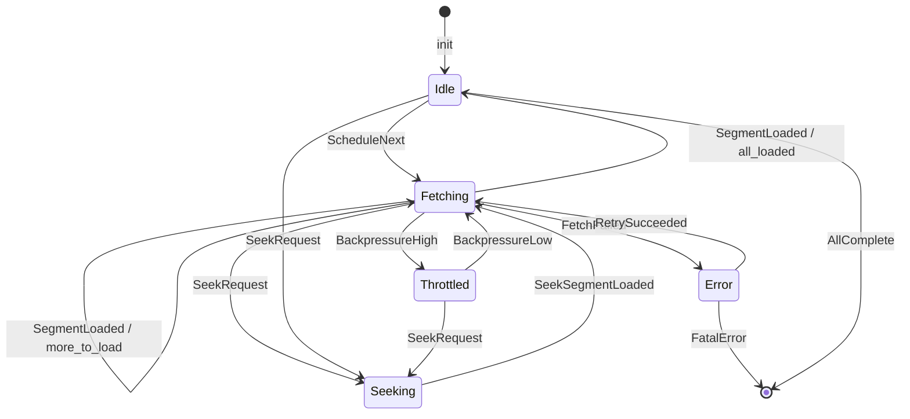
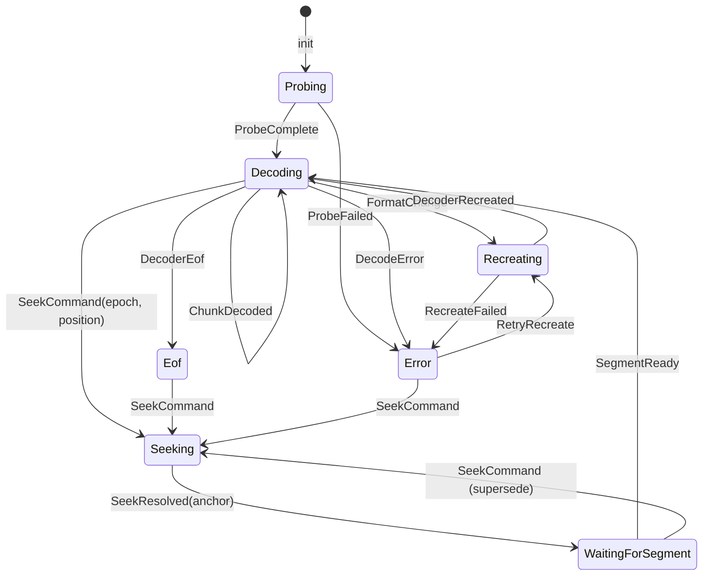
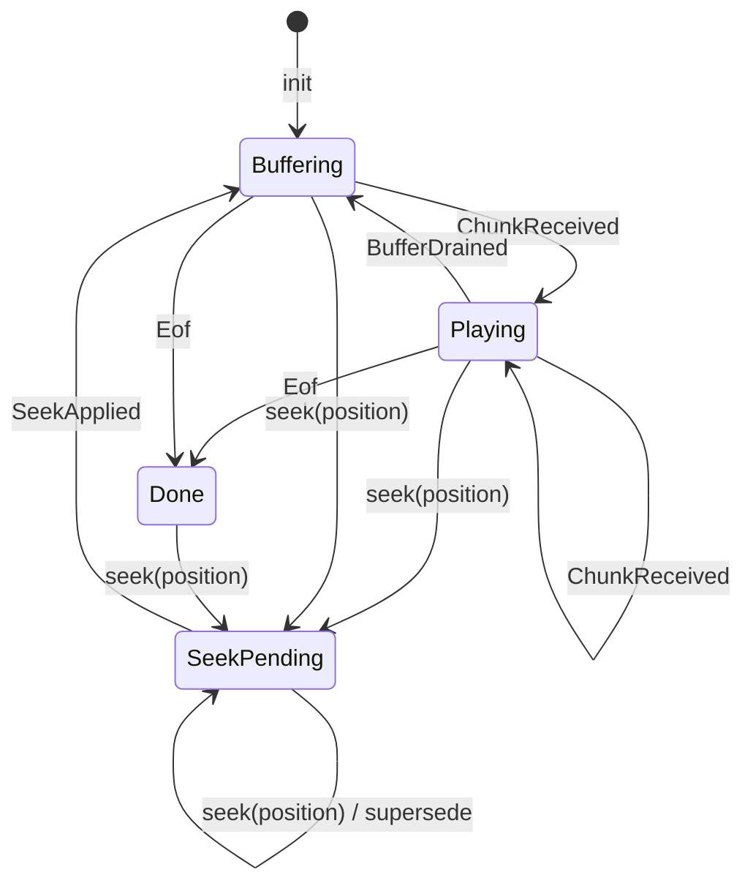
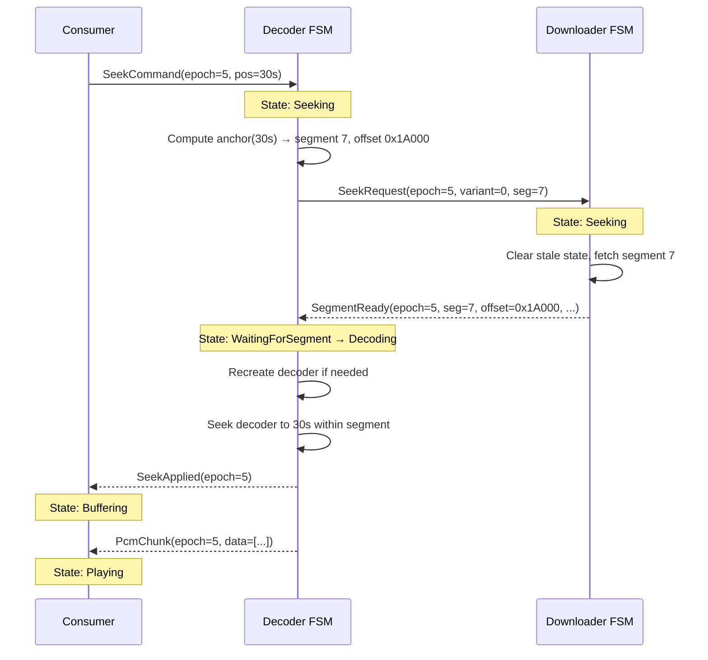

# Kithara Seek Architecture: Deep Analysis and FSM Redesign Proposal

## Table of Contents

1. [Phase 1: Current Architecture Map](#phase-1-current-architecture-map)
2. [Phase 2: Shared Mutable State During Seek](#phase-2-shared-mutable-state-during-seek)
3. [Phase 3: FSM Architecture Proposal](#phase-3-fsm-architecture-proposal)
4. [Phase 4: How the Seek Bug Becomes Trivial](#phase-4-how-the-seek-bug-becomes-trivial)
5. [Phase 5: Migration Path](#phase-5-migration-path)

---

## Phase 1: Current Architecture Map

### Layer Overview

The seek path crosses four layers, each running on a different thread/task:

```
Consumer thread (cpal/rodio)     Audio::read() → Audio::seek()
                                        ↓ (ringbuf)
Worker thread (OS thread)        AudioWorkerHandle → TrackSlot::step()
                                        ↓ (SharedStream<T> mutex)
Decoder thread (same OS thread)  StreamAudioSource::fetch_next() → Symphonia
                                        ↓ (Stream::read → Source::wait_range/read_at)
Downloader thread (tokio)        Backend::run_downloader → HlsDownloader
```

### Layer 1: Stream/Download

#### Files
- `crates/kithara-stream/src/source.rs` — `Source` trait
- `crates/kithara-stream/src/stream.rs` — `Stream<T>` wrapper
- `crates/kithara-stream/src/timeline.rs` — `Timeline` (shared atomics)
- `crates/kithara-stream/src/backend.rs` — `Backend` (downloader lifecycle)
- `crates/kithara-hls/src/source.rs` — `HlsSource` implements `Source`
- `crates/kithara-hls/src/source_wait_range.rs` — wait_range decision logic
- `crates/kithara-hls/src/downloader.rs` — `HlsDownloader` implements `Downloader`
- `crates/kithara-hls/src/download_state.rs` — `DownloadState` (BTreeMap index)

#### States (implicit, not enumerated anywhere)

**HlsSource** has no explicit state enum. Its implicit states are:
| State | How it's determined | Who sets it |
|-------|-------------------|-------------|
| Waiting for data | Inside `wait_range` condvar loop | condvar timeout / notify |
| Ready to read | `wait_range` returned `Ready` | `DownloadState` has segment |
| Variant fenced | `variant_fence.is_some()` and segment.variant != fence | `read_at` auto-detects |
| Flushing (seek active) | `timeline.is_flushing()` | `Timeline::initiate_seek()` |
| EOF | `timeline.eof()` && range past total | Downloader sets `timeline.set_eof(true)` |
| Cancelled | `cancel.is_cancelled()` | `CancellationToken` |

**HlsDownloader** has no explicit state enum. Its implicit states are:
| State | How it's determined | Who sets it |
|-------|-------------------|-------------|
| Sequential download | `plan()` returns `Batch` | Default after init or seek |
| Idle (all loaded) | `plan()` returns `Idle` | When all segments loaded |
| Processing demand | `poll_demand()` returns `Some` | Reader pushes `SegmentRequest` |
| Throttled | `should_throttle()` returns true | Backpressure from reader lag |
| Seek reset | `active_seek_epoch` changes | `reset_for_seek_epoch()` |
| Complete | `plan()` returns `Complete` | All segments in all phases done |

**DownloadState** is pure data (BTreeMap of `LoadedSegment`). Not stateful per se, but its mutation during seek (`.clear()` or preserve) is a critical coordination point.

#### Transitions and Triggers

**Seek initiation in HlsSource:**
1. `set_seek_epoch()` — drains `segment_requests`, clears `eof`, clears `had_midstream_switch`
2. `seek_time_anchor()` — resolves anchor via `PlaylistState`, classifies seek (Preserve/Reset), applies plan
3. If Reset: `DownloadState::clear()`, `download_position = 0`
4. If Preserve: keeps `DownloadState`, keeps `download_position`
5. Pushes new `SegmentRequest` for target segment

**Seek in HlsDownloader:**
1. `poll_demand()` pops `SegmentRequest` from `SegQueue`
2. Compares `request.seek_epoch` with `active_seek_epoch`
3. If newer epoch: calls `reset_for_seek_epoch()` — updates `current_segment_index`, `download_position`, `total_bytes`, `last_committed_variant`
4. Fetches the requested segment via `HlsIo::fetch()`
5. `commit()` pushes `LoadedSegment` into `DownloadState`, updates `download_position`, notifies condvar

#### Assumptions about other layers

- **HlsSource assumes** the downloader will eventually load the segment matching a `SegmentRequest`. If the downloader is stuck in `step()` (streaming download), the demand signal must interrupt it (tested in `demand_must_not_wait_for_step`).
- **HlsDownloader assumes** `DownloadState` entries are authoritative — if a segment is in the BTreeMap, its bytes are readable from the `AssetStore`. This fails when LRU eviction removes bytes but metadata remains (`ReadOutcome::Retry` path).
- **Stream::read assumes** `wait_range` will eventually return. The hang watchdog catches infinite loops. But during seek, `is_flushing()` must be detected to return `Interrupted`.

### Layer 2: Audio Pipeline

#### Files
- `crates/kithara-audio/src/pipeline/source.rs` — `StreamAudioSource<T>`
- `crates/kithara-audio/src/pipeline/audio.rs` — `Audio<S>` (consumer API)
- `crates/kithara-audio/src/pipeline/audio_worker.rs` — `AudioWorkerHandle`, `TrackSlot`

#### States

**TrackSlot** (in audio_worker.rs) has an explicit `TrackPhase` enum:
```
TrackPhase::Decoding      — normal operation, decode one chunk per step
TrackPhase::PendingReset  — seek detected, waiting for apply_pending_seek()
TrackPhase::AtEof         — decoder returned EOF
TrackPhase::Failed        — track panicked, will be removed
```

**StreamAudioSource** has no explicit state enum. Its implicit states are:
| State | How it's determined |
|-------|-------------------|
| Normal decoding | `pending_format_change.is_none()`, `pending_seek_skip.is_none()` |
| Format change pending | `pending_format_change.is_some()` |
| Post-seek skip | `pending_seek_skip.is_some()` |
| Post-seek recovery | `pending_seek_recover_target.is_some()` |
| Seek applied but awaiting first chunk | `pending_decode_started_epoch.is_some()` |

**Audio<S>** (consumer side) implicit states:
| State | How it's determined |
|-------|-------------------|
| Reading | `!eof`, `current_chunk` available |
| Buffering | `!eof`, `current_chunk` is None, blocking in `recv_valid_chunk` |
| Preloaded | `preloaded = true`, non-blocking recv |
| Seeking | After `seek()`, before first valid chunk at new epoch |
| EOF | `eof = true` |

#### Transitions and Triggers

**Seek flow (Audio → Worker → Source):**

1. `Audio::seek(position)` — sets `timeline.initiate_seek(position)`, bumps epoch, drains pcm_rx, calls `notify_waiting()` and `worker.wake()`
2. Worker loop: `TrackSlot::step()` detects `timeline.is_flushing()` → phase = `PendingReset`, drops `pending_fetch`
3. Worker loop: on next step, `phase == PendingReset` + `source.is_ready()` → calls `source.apply_pending_seek()`
4. `StreamAudioSource::apply_pending_seek()`:
   a. Reads `timeline.seek_target()` and `timeline.seek_epoch()`
   b. Calls `shared_stream.set_seek_epoch(epoch)` — drains HLS segment requests
   c. Calls `shared_stream.seek_time_anchor(position)` — resolves HLS anchor
   d. If anchor found: `apply_anchor_seek_with_fallback()` — may recreate decoder
   e. If no anchor: `apply_seek_from_decoder()` — direct Symphonia seek
   f. Calls `timeline.complete_seek(epoch)` — clears flushing
   g. Calls `timeline.clear_seek_pending(epoch)`
   h. Returns true/false

5. If seek applied successfully, worker transitions to `Decoding`, resumes `fetch_next()`

#### Assumptions about other layers

- **StreamAudioSource assumes** `seek_time_anchor()` will resolve the position to a valid byte offset. For HLS, this requires `PlaylistState` to have segment metadata.
- **StreamAudioSource assumes** after `set_seek_epoch()` + `seek_time_anchor()`, the downloader will have loaded (or will load) the target segment before `Stream::read()` is called.
- **The worker assumes** `is_ready()` accurately reflects whether `fetch_next()` can proceed without blocking the shared worker thread. `is_ready()` checks `is_range_ready()` which locks `SharedSegments` mutex.

### Layer 3: Decode

#### Files
- `crates/kithara-decode/src/symphonia.rs` — Symphonia wrapper
- `crates/kithara-decode/src/factory.rs` — `DecoderFactory`
- `crates/kithara-decode/src/traits.rs` — `InnerDecoder`, `AudioDecoder` traits

#### States (Symphonia is a black box)

Symphonia's `IsoMp4Reader` maintains internal state:
- Parsed `moov` atom with track tables, sample-to-chunk mappings
- Seek index built from `moof`/`tfhd`/`trun` atoms
- Current read position within the `MediaSourceStream`

**The critical problem:** When Symphonia's `IsoMp4Reader` receives a seek request, it uses its internal seek index to compute a **byte position** in the underlying stream. But for HLS fMP4:
- The "stream" is a **virtual byte layout** — concatenated (init + media) segments
- `IsoMp4Reader` parsed only the portion of the stream that existed when the decoder was created
- After seek, the stream position and content may have changed
- The byte length reported via `MediaSource::byte_len()` may not match what `IsoMp4Reader` expects

Symphonia has **no concept of segments** — it sees a flat byte stream. The seek index maps time to byte offsets within that flat stream. If the flat stream changes (segments cleared/reloaded), the seek index is stale.

### Cross-Cutting: Timeline (the coordination hub)

`Timeline` is the central coordination mechanism. It uses 10 atomics:

```
byte_position          — current reader position (read by Source, written by Stream::read)
committed_position_ns  — playback position for UI (CAS-updated by Audio::read)
download_position      — downloader watermark (written by HlsDownloader::commit)
eof                    — end of stream flag (written by downloader)
pending_seek_epoch     — epoch for output-side seek completion
total_bytes            — total stream size (written by downloader)
total_duration_ns      — total duration (set once from decoder)
seek_epoch             — monotonic seek counter (incremented by initiate_seek)
flushing               — flush gate for I/O (set by initiate_seek, cleared by complete_seek)
seek_target_ns         — seek target position (written by initiate_seek)
seek_pending           — seek not yet applied by decoder (set by initiate_seek, cleared by clear_seek_pending)
```

---

## Phase 2: Shared Mutable State During Seek

### Complete inventory of mutable state touched during a seek

#### Timeline atomics

| Field | Writers | Readers | Invariant | Enforced? |
|-------|---------|---------|-----------|-----------|
| `seek_epoch` | `initiate_seek()` (consumer) | Everyone | Monotonically increasing | Yes (fetch_add) |
| `flushing` | `initiate_seek()` sets, `complete_seek()` clears | `Stream::read`, `wait_range`, `TrackSlot::step` | Only cleared by matching epoch | Double-check in `complete_seek` |
| `seek_target_ns` | `initiate_seek()` | `apply_pending_seek()` | Valid when `flushing` or `seek_pending` is true | No — stale targets are "harmless" by convention |
| `seek_pending` | `initiate_seek()` sets, `clear_seek_pending()` clears | `TrackSlot::step()`, UI | Only cleared by matching epoch | Yes (epoch compare) |
| `byte_position` | `set_byte_position()` from: Stream::read, seek_time_anchor, apply_seek_plan | `Stream::read`, `HlsSource::read_at`, `wait_range`, throttle | Must match actual stream position | **No** — set from multiple places |
| `download_position` | `HlsDownloader::commit`, `apply_seek_plan` (Reset case) | `should_throttle()`, `wait_range` | Must be >= all committed segment end offsets | Weak — Reset sets to 0 |
| `eof` | `HlsDownloader::commit` (when all done), `set_seek_epoch` clears | `wait_range`, `TrackSlot::step` | True only when all segments loaded | Cleared on seek, but race with concurrent commit |
| `committed_position_ns` | `initiate_seek()` (sets to target), `advance_committed_samples` (CAS) | UI, `position()` | Reflects output position | CAS prevents lost updates |
| `total_bytes` | `HlsDownloader::reset_for_seek_epoch`, build_pair | `Stream::seek` (for bounds check), `wait_range` | Must match current variant's total size | **Fragile** — may be stale during variant switch |

#### SharedSegments (HLS shared state)

| Field | Writers | Readers | Invariant | Enforced? |
|-------|---------|---------|-----------|-----------|
| `segments` (Mutex<DownloadState>) | `HlsDownloader::commit`, `apply_seek_plan` (clear on Reset) | `HlsSource::read_at`, `wait_range`, `media_info`, `format_change_segment_range` | Entries map byte offsets to actual segment data | **No** — LRU eviction can invalidate |
| `segment_requests` (SegQueue) | `push_segment_request` (Source), `apply_seek_plan` | `HlsDownloader::poll_demand` | Requests are for current epoch | **No** — stale requests drained by epoch check |
| `condvar` | `notify_all()` from many places | `wait_range` (condvar.wait_sync_timeout) | Wake-up means data may be available | Spurious wakes handled by loop |
| `had_midstream_switch` (AtomicBool) | Downloader sets on variant switch | `wait_range` (swaps to false) | True means segment_requests may be stale | **Weak** — consumed by swap |
| `current_segment_index` (AtomicU32) | `read_at`, `apply_seek_plan` | Downloader (for sequential download), `wait_range` fallback | Approximate — "hint" not authoritative | Not enforced |
| `abr_variant_index` (AtomicUsize) | `AbrController` | `HlsSource::resolve_current_variant`, `media_info` | Current ABR-selected variant | Not enforced |
| `stopped` (AtomicBool) | Downloader on exit | `wait_range` | Downloader has exited | One-way flag |

#### HlsSource instance state

| Field | Writers | Readers | Invariant | Enforced? |
|-------|---------|---------|-----------|-----------|
| `variant_fence` | `read_at` (auto-detect), `clear_variant_fence` | `read_at` (fence check), `resolve_current_variant` | Prevents cross-variant reads until decoder recreation | **Manual** — caller must call `clear_variant_fence` |

#### HlsDownloader instance state

| Field | Writers | Readers | Invariant | Enforced? |
|-------|---------|---------|-----------|-----------|
| `active_seek_epoch` | `reset_for_seek_epoch()` | `commit()` (stale check) | Matches latest seek epoch | Set by demand processing |
| `last_committed_variant` | `commit()`, `reset_for_seek_epoch()` | `classify_variant_transition` | Last variant with committed data | Reset on seek |
| `force_init_for_seek` | `reset_for_seek_epoch()` | `plan()` | Cross-codec seek needs init segment | Set correctly |
| `current_segment_index` | `reset_for_seek_epoch()`, `commit()` | `plan()` sequential logic | Next segment to download | Jumps on seek |

#### StreamAudioSource instance state

| Field | Writers | Readers | Invariant | Enforced? |
|-------|---------|---------|-----------|-----------|
| `cached_media_info` | `detect_format_change`, `recreate_decoder` | `detect_format_change`, `align_decoder_with_seek_anchor` | Matches decoder's actual format | **No** — stale after failed recreate |
| `base_offset` | `recreate_decoder` | `update_decoder_len_for_seek`, `decoder_recreate_offset` | Offset where current decoder's data starts | Set on recreate |
| `pending_format_change` | `detect_format_change` | `handle_decode_eof`, `try_recover_at_boundary` | Present when codec changed but decoder not yet recreated | Cleared on apply or seek |
| `pending_seek_skip` | `apply_time_anchor_seek` | `apply_seek_skip` (in fetch_next) | Duration to skip after seek for sub-segment accuracy | Cleared after skip or epoch mismatch |
| `pending_seek_recover_target` | `apply_seek_applied` | `retry_decode_failure_after_seek` | Position to retry if first decode after seek fails | Cleared after use |
| `seek_retry_count` | `apply_pending_seek` | `apply_pending_seek` (abort threshold) | Limits retries | Reset on success or new seek |

### The Fragility Map

The fundamental problem is that seek coordination requires **ordering guarantees** across these pieces of state, but atomics only provide per-field ordering. The seek must happen as:

```
1. initiate_seek() → flushing=true, seek_target set, epoch bumped
2. wait_range detects flushing → returns Interrupted
3. Stream::read returns error → decoder exits to worker loop
4. Worker detects flushing → PendingReset
5. set_seek_epoch() → drain segment_requests, clear eof
6. seek_time_anchor() → resolve anchor, update byte_position, push segment request
7. Downloader receives segment request → download segment
8. Decoder waits (is_ready?) → segment loaded
9. Decoder reads from new position → decode succeeds
10. complete_seek() → flushing=false
11. clear_seek_pending() → seek done
```

**The race windows:**

- Between steps 5 and 6: `byte_position` is stale (still at old position). If `wait_range` is called in this window, it looks for data at the old position.
- Between steps 6 and 7: `byte_position` is updated but segment is not downloaded. `wait_range` will spin until data arrives.
- Between steps 6 and 9: `total_bytes` may not match the target variant. `Stream::seek()` bounds-checks against `total_bytes`, potentially rejecting valid positions as "seek past EOF".
- Between steps 1 and 4: The worker may still be in `fetch_next()` which calls `Stream::read()`, which is inside `wait_range`. The `Interrupted` return path must propagate through Symphonia cleanly — but Symphonia retries `io::ErrorKind::Interrupted` silently, so we use `ErrorKind::Other` with message "seek pending".

**The specific seek-past-EOF bug:**

The error "seek past EOF: 1.16GB in 1.86MB file" happens because:
1. Symphonia's `IsoMp4Reader` built a seek index from an initial fMP4 stream
2. The initial stream had total_bytes = X (e.g., full AAC variant, ~1.16GB virtual layout)
3. After ABR switch, total_bytes changes to Y (e.g., FLAC variant, ~1.86MB per segment)
4. `ReadSeekAdapter::byte_len()` reports Y
5. Symphonia tries to seek using the old seek index, computing a byte offset based on the old layout
6. `Stream::seek()` sees `new_pos > len` and returns "seek past EOF"

This is a **stale decoder state** problem. The decoder's seek index belongs to a different variant's byte layout.

---

## Phase 3: FSM Architecture Proposal

### Design Principles

1. **Each layer owns its state exclusively** — no shared mutexes between layers
2. **Communication via typed message channels** — not shared atomics
3. **Seek is a message that flows through layers in order** — not a broadcast flag
4. **Each FSM is independently testable** — inject mock channels, verify transitions

### Downloader FSM



**States:**
- `Idle` — all currently needed segments loaded, waiting for reader progress or seek
- `Fetching(variant, segment_index)` — actively downloading one or more segments
- `Seeking(epoch, target_segment)` — received seek message, clearing stale state, fetching target segment
- `Throttled` — too far ahead of reader, pausing
- `Error(retries)` — fetch failed, retrying with backoff

**Messages In:**
- `SeekRequest { epoch, variant, segment_index }` — from Decoder FSM
- `ReaderProgress { byte_position }` — from Decoder FSM (periodic)

**Messages Out:**
- `SegmentReady { epoch, variant, segment_index, byte_offset, init_len, media_len }` — to Decoder FSM
- `DownloadEof { epoch }` — all segments loaded
- `SeekAcknowledged { epoch }` — seek state cleared, target segment being fetched

**Key difference from current:** The Downloader does NOT read `Timeline` atomics. It receives explicit `SeekRequest` messages. It does NOT share `DownloadState` via a mutex — it owns the BTreeMap exclusively and sends `SegmentReady` messages.

### Decoder FSM



**States:**
- `Probing` — initial decoder creation from first bytes
- `Decoding { decoder, base_offset, variant }` — normal operation
- `Seeking { epoch, position }` — received seek, computing anchor
- `WaitingForSegment { epoch, anchor }` — seek anchor resolved, waiting for downloader to load target segment
- `Recreating { new_info, target_offset }` — ABR switch, creating new decoder
- `Eof` — decoder returned None
- `Error { kind, retries }` — decode/IO error

**Messages In:**
- `SeekCommand { epoch, position }` — from Consumer
- `SegmentReady { epoch, variant, segment_index, byte_offset, ... }` — from Downloader FSM
- `CancelSeek { epoch }` — superseded by newer seek

**Messages Out:**
- `PcmChunk { data, epoch, spec }` — to Consumer
- `Eof { epoch }` — to Consumer
- `SeekRequest { epoch, variant, segment_index }` — to Downloader FSM
- `ReaderProgress { byte_position }` — to Downloader FSM
- `SeekApplied { epoch }` — to Consumer (seek complete)
- `FormatChanged { old_spec, new_spec }` — to Consumer

**Key difference from current:** The Decoder FSM does NOT check `timeline.is_flushing()` or `timeline.is_seek_pending()`. It receives `SeekCommand` messages. When it enters `Seeking`, it computes the anchor locally (using segment metadata it received during init), sends `SeekRequest` to the Downloader, and enters `WaitingForSegment`. It does NOT call `wait_range` — instead, the Downloader notifies it when data is ready.

### Consumer FSM



**States:**
- `Buffering` — waiting for first chunk (or post-seek)
- `Playing` — chunks available in ringbuf
- `SeekPending { epoch }` — seek initiated, draining stale chunks, waiting for `SeekApplied`
- `Done` — EOF received

**Messages Out:**
- `SeekCommand { epoch, position }` — to Decoder FSM

**Messages In:**
- `PcmChunk { data, epoch, spec }` — from Decoder FSM
- `Eof { epoch }` — from Decoder FSM
- `SeekApplied { epoch }` — from Decoder FSM

### Message Flow: Seek Sequence



**Key insight:** There is no shared mutable state. Each FSM owns its state. Communication is sequential via channels. A superseding seek (epoch=6 arrives while epoch=5 is in `WaitingForSegment`) simply transitions the Decoder back to `Seeking` — the stale `SegmentReady(epoch=5)` is discarded by epoch check on the channel.

### Data Ownership

```
Downloader FSM owns:
  - DownloadState (BTreeMap of loaded segments)
  - ABR controller
  - Network I/O

Decoder FSM owns:
  - Symphonia decoder instance
  - StreamAudioSource equivalent
  - Variant fence logic
  - Segment metadata (copy from init)

Consumer owns:
  - ringbuf receiver
  - Current chunk + offset
  - Playback position
```

**No shared state crosses FSM boundaries.** `Timeline` is eliminated as a coordination mechanism. Instead:
- Playback position: Consumer sends periodic `ReaderProgress` to Decoder, which forwards to Downloader (for backpressure)
- Seek target: Consumer sends `SeekCommand` to Decoder
- Total duration: Decoder sends `DurationKnown` to Consumer on init
- EOF: Downloader sends `DownloadEof` to Decoder, which sends `Eof` to Consumer

### HLS vs File: Separate StreamType implementations

The current `Source` trait forces HLS and File to share the same interface. In the FSM architecture:

**File Decoder FSM** is simpler:
- No segment concept — just byte ranges
- Symphonia can seek directly (it owns the seek index for a single file)
- No variant fence, no format change detection
- `WaitingForSegment` state is replaced by `WaitingForRange` (downloader fills a byte range)

**HLS Decoder FSM** handles segments explicitly:
- Maintains segment metadata from playlist
- Computes seek anchors from segment boundaries
- Manages decoder recreation on variant switch
- Tracks `base_offset` for `OffsetReader`

This is a **simplification**: HLS and File don't need to pretend they're the same. The `StreamType` trait can provide a `DecoderFsm` associated type that handles protocol-specific seek logic.

---

## Phase 4: How the Seek Bug Becomes Trivial

### Current bug: "seek past EOF: 1.16GB in 1.86MB file"

**Root cause chain in current architecture:**
1. ABR switch changes variant → `total_bytes` updates to new variant's size
2. Old decoder has seek index for old variant's byte layout
3. `apply_pending_seek` calls `decoder.seek(position)`
4. Symphonia computes byte offset from old seek index → 1.16GB
5. This goes through `OffsetReader` → `SharedStream` → `Stream::seek()`
6. `Stream::seek()` checks `new_pos > len` where `len = total_bytes` (1.86MB)
7. Returns "seek past EOF"

**Why it's hard to fix in the current architecture:**
- `total_bytes` is shared (Timeline atomic), written by downloader, read by Stream::seek
- Decoder doesn't know when `total_bytes` changed
- Decoder's seek index is stale but there's no notification
- The `base_offset` workaround (set byte_len to 0 after switch) causes other problems

### In the FSM architecture, this bug cannot occur:

1. `SeekCommand(epoch=5, pos=30s)` arrives at Decoder FSM
2. Decoder FSM enters `Seeking` state
3. Decoder FSM computes anchor: "segment 7 of variant 0, byte offset 0x1A000, segment_start=28s"
4. **Before seeking the decoder**, the FSM checks: does the current decoder match this anchor's variant?
   - If yes: call `decoder.seek(28s)` — safe because seek index matches variant
   - If no: enter `Recreating` — destroy old decoder, create new one at anchor's `byte_offset`
5. The new decoder is created from the **new variant's data**, so its seek index is correct
6. `Stream::seek()` is never called by Symphonia in the new FSM — the Decoder FSM explicitly positions the reader at `anchor.byte_offset` before creating the decoder

**The check in step 4 is a simple comparison** — it's part of the state machine's explicit transition logic, not a flag race across threads. The Decoder FSM **always** knows which variant the current decoder was built for (it's part of the `Decoding { variant }` state).

**The `total_bytes` check is eliminated.** `Stream::seek()` no longer bounds-checks against a shared atomic. Instead:
- For HLS, the Decoder FSM positions the reader explicitly by sending byte offset to the data layer
- For File, Symphonia seeks within a single file where byte_len is stable

### More generally: every seek failure mode maps to a state transition

| Current failure | Current symptom | FSM handling |
|----------------|-----------------|-------------|
| Stale seek index | "seek past EOF" | Decoder FSM checks variant match before seeking |
| Data not ready at seek target | Hang in wait_range | Decoder FSM enters `WaitingForSegment`, no blocking |
| Flushing race (seek during read) | "seek pending" IO error → Symphonia confusion | No shared flushing flag; Decoder FSM receives `SeekCommand` and stops decoding |
| Double seek (epoch mismatch) | Stale complete_seek clears new flushing | Superseding `SeekCommand` transitions FSM from `Seeking` back to `Seeking` |
| Variant fence not cleared | `VariantChange` return blocks reads forever | Fence is local to Decoder FSM, cleared as part of `Recreating` transition |
| DownloadState cleared during read | Metadata says ready, bytes missing | Downloader FSM owns DownloadState exclusively, sends `SegmentReady` only after bytes are committed |

---

## Phase 5: Migration Path

### Principles

1. **Inside-out**: Start from the Downloader (most isolated), work toward Consumer
2. **Keep existing tests green**: Each step adds the new path alongside the old one
3. **Feature-flag the FSM path**: `#[cfg(feature = "fsm")]` allows parallel development
4. **One layer at a time**: Never change two layers simultaneously

### Step 1: Extract Downloader FSM (2-3 days)

**Goal:** Replace `HlsDownloader` + `SharedSegments` mutex with message-passing downloader.

1. Define `DownloaderMsg` enum: `SeekRequest`, `ReaderProgress`, `Shutdown`
2. Define `DownloaderEvent` enum: `SegmentReady`, `DownloadEof`, `SeekAcknowledged`
3. Create `DownloaderFsm` struct that owns `DownloadState` and `AbrController`
4. `DownloaderFsm::step(msg) -> Vec<DownloaderEvent>` — pure function, testable
5. Wrap in `DownloaderActor` that reads from `mpsc::Receiver<DownloaderMsg>` and sends to `mpsc::Sender<DownloaderEvent>`

**Adapter:** Create a `FsmHlsSource` that implements the existing `Source` trait but internally translates to/from FSM messages. This keeps `Stream<T>`, `Audio<Stream<T>>` working unchanged.

**Tests:** Port existing downloader tests to use `DownloaderFsm::step()` directly. Add seek-specific tests:
- `seek_to_unloaded_segment_sends_request`
- `seek_supersede_discards_old_segment_ready`
- `variant_switch_during_seek_triggers_init_fetch`

### Step 2: Extract Decoder FSM (3-4 days)

**Goal:** Replace `StreamAudioSource` implicit states with explicit `DecoderPhase` enum.

1. Define `DecoderPhase` enum: `Probing`, `Decoding`, `Seeking`, `WaitingForSegment`, `Recreating`, `Eof`, `Error`
2. Refactor `StreamAudioSource` to store `phase: DecoderPhase` and dispatch on it
3. Replace `pending_format_change`, `pending_seek_skip`, `pending_seek_recover_target` with phase variants
4. `apply_pending_seek()` becomes a state transition: `Decoding → Seeking → WaitingForSegment → Decoding`

**This is the hardest step** because `StreamAudioSource` touches both the shared stream (for I/O) and the decoder (for decode). The key insight: the "shared stream" becomes a **data provider interface** that the Decoder FSM calls, not a shared mutex.

**Tests:** The existing `StreamAudioSource` tests remain. Add explicit state transition tests:
- `seek_from_decoding_enters_seeking`
- `seek_from_eof_enters_seeking`
- `segment_ready_from_waiting_enters_decoding`
- `format_change_during_decoding_enters_recreating`

### Step 3: Replace Timeline Coordination (2-3 days)

**Goal:** Replace Timeline atomics with typed channels for seek coordination.

1. Create `SeekChannel`: `(Sender<SeekCommand>, Receiver<SeekCommand>)`
2. `Audio::seek()` sends `SeekCommand` to channel instead of `timeline.initiate_seek()`
3. Worker reads `SeekCommand` from channel instead of checking `timeline.is_flushing()`
4. Remove `flushing`, `seek_target_ns`, `seek_pending` from Timeline
5. Keep `committed_position_ns`, `total_duration_ns` in Timeline (these are output-only, no coordination)

**Tests:** Seek integration tests continue to work. Add:
- `rapid_seeks_only_last_applied`
- `seek_during_buffering_transitions_correctly`

### Step 4: Connect Downloader FSM to Decoder FSM (2-3 days)

**Goal:** Replace `SharedSegments` mutex with channels between FSMs.

1. Decoder FSM sends `SeekRequest` to Downloader FSM (via channel, not SegQueue)
2. Downloader FSM sends `SegmentReady` to Decoder FSM (via channel, not condvar)
3. Remove `SharedSegments` struct entirely
4. Remove `condvar`, `segment_requests`, `had_midstream_switch` from shared state

**Tests:** Full integration tests with mock channels:
- `seek_flow_consumer_to_decoder_to_downloader_and_back`
- `abr_switch_during_seek`
- `lru_eviction_triggers_retry`

### Step 5: Cleanup (1-2 days)

1. Remove `Source::notify_waiting()`, `Source::make_notify_fn()` — no condvars to wake
2. Remove `Source::set_seek_epoch()` — seek flows through channels
3. Simplify `Stream::read()` — no flushing check, no `io::Error::other("seek pending")`
4. Remove `Timeline::initiate_seek()`, `Timeline::complete_seek()` — seek is a message
5. Remove `WaitRangeState`, `WaitRangeDecision` — no wait_range spin loop

### Risk Mitigation

- **Feature flag**: `cargo test --features fsm` runs FSM path, default runs old path
- **Parallel operation**: During migration, both paths exist. Integration tests run both
- **Incremental commits**: Each step is a mergeable PR with passing tests
- **Rollback**: Feature flag can be disabled if FSM path has regressions

### Estimated Timeline

| Step | Duration | Dependencies |
|------|----------|-------------|
| 1. Downloader FSM | 2-3 days | None |
| 2. Decoder FSM | 3-4 days | Step 1 |
| 3. Timeline cleanup | 2-3 days | Step 2 |
| 4. Connect FSMs | 2-3 days | Steps 1-3 |
| 5. Cleanup | 1-2 days | Step 4 |
| **Total** | **10-15 days** | |

---

## Appendix: Key File Reference

| File | Role |
|------|------|
| `crates/kithara-stream/src/source.rs` | `Source` trait — sync random-access interface |
| `crates/kithara-stream/src/stream.rs` | `Stream<T>` — Read+Seek wrapper over Source |
| `crates/kithara-stream/src/timeline.rs` | `Timeline` — 10 atomics for cross-layer coordination |
| `crates/kithara-stream/src/backend.rs` | `Backend` — downloader lifecycle manager |
| `crates/kithara-stream/src/downloader.rs` | `Downloader` trait — plan/fetch/commit |
| `crates/kithara-hls/src/source.rs` | `HlsSource` — HLS Source impl + SharedSegments |
| `crates/kithara-hls/src/source_wait_range.rs` | wait_range decision logic |
| `crates/kithara-hls/src/downloader.rs` | `HlsDownloader` — segment fetch + ABR |
| `crates/kithara-hls/src/download_state.rs` | `DownloadState` — BTreeMap segment index |
| `crates/kithara-audio/src/pipeline/source.rs` | `StreamAudioSource` — format change + seek |
| `crates/kithara-audio/src/pipeline/audio.rs` | `Audio<S>` — consumer API |
| `crates/kithara-audio/src/pipeline/audio_worker.rs` | Shared worker with TrackPhase FSM |
| `crates/kithara-decode/src/symphonia.rs` | Symphonia decoder + ReadSeekAdapter |
| `crates/kithara-decode/src/factory.rs` | DecoderFactory — runtime codec selection |
| `crates/kithara-stream/src/media.rs` | MediaInfo, AudioCodec, ContainerFormat |
