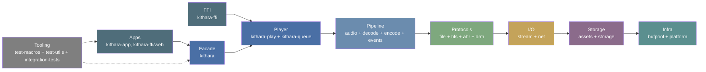

# Architecture

kithara is a set of independent crates layered from the public player API down
to storage and platform primitives. Each crate can be used standalone or
composed into the full player. Dependencies point downward only.

```mermaid
%%{init: {"flowchart": {"curve": "linear"}} }%%
flowchart LR
    apps["Apps<br/>kithara-app, kithara-ffi/web"]
    ffi["FFI<br/>kithara-ffi"]
    facade["Facade<br/>kithara"]
    player["Player<br/>kithara-play + kithara-queue"]
    pipeline["Pipeline<br/>audio + decode + encode + events"]
    protocols["Protocols<br/>file + hls + abr + drm"]
    io["I/O<br/>stream + net"]
    storage["Storage<br/>assets + storage"]
    infra["Infra<br/>bufpool + platform"]
    tooling["Tooling<br/>test-macros + test-utils + integration-tests"]

    apps --> facade
    ffi --> player
    facade --> player --> pipeline --> protocols --> io --> storage --> infra
    tooling -.-> facade
    tooling -.-> apps

    style apps fill:#4f6d7a,color:#fff
    style ffi fill:#4f6d7a,color:#fff
    style facade fill:#4a6fa5,color:#fff
    style player fill:#4a6fa5,color:#fff
    style pipeline fill:#6b8cae,color:#fff
    style protocols fill:#7ea87e,color:#fff
    style io fill:#c4a35a,color:#fff
    style storage fill:#8b6b8b,color:#fff
    style infra fill:#5b8f8f,color:#fff
    style tooling fill:#7f7f7f,color:#fff
```

## Crate map

<table>
<tr><th>Layer</th><th>Crates</th><th>Role</th></tr>
<tr><td><b>Facade</b></td><td><a href="crates/kithara/README.md"><code>kithara</code></a></td><td>Unified <code>Resource</code> API with auto-detection (file / HLS)</td></tr>
<tr><td><b>Player</b></td><td><a href="crates/kithara-play/README.md"><code>kithara-play</code></a> <a href="crates/kithara-queue/README.md"><code>kithara-queue</code></a></td><td>AVPlayer-style traits (<code>Engine</code>, <code>Player</code>, <code>QueuePlayer</code>, <code>Equalizer</code>) with multi-slot crossfade; AVQueuePlayer-analogue queue layer</td></tr>
<tr><td><b>Pipeline</b></td><td><a href="crates/kithara-audio/README.md"><code>kithara-audio</code></a> <a href="crates/kithara-decode/README.md"><code>kithara-decode</code></a> <a href="crates/kithara-encode/README.md"><code>kithara-encode</code></a> <a href="crates/kithara-events/README.md"><code>kithara-events</code></a></td><td>Threaded decode + encode + effects + resampling, event bus</td></tr>
<tr><td><b>Protocols</b></td><td><a href="crates/kithara-file/README.md"><code>kithara-file</code></a> <a href="crates/kithara-hls/README.md"><code>kithara-hls</code></a> <a href="crates/kithara-abr/README.md"><code>kithara-abr</code></a> <a href="crates/kithara-drm/README.md"><code>kithara-drm</code></a></td><td>HTTP progressive, HLS VOD with ABR, AES-128 decryption</td></tr>
<tr><td><b>I/O</b></td><td><a href="crates/kithara-stream/README.md"><code>kithara-stream</code></a> <a href="crates/kithara-net/README.md"><code>kithara-net</code></a></td><td>Async-to-sync bridge (<code>Read + Seek</code>), HTTP with retry</td></tr>
<tr><td><b>Storage</b></td><td><a href="crates/kithara-assets/README.md"><code>kithara-assets</code></a> <a href="crates/kithara-storage/README.md"><code>kithara-storage</code></a></td><td>Disk cache with eviction, mmap/mem resources</td></tr>
<tr><td><b>Primitives</b></td><td><a href="crates/kithara-bufpool/README.md"><code>kithara-bufpool</code></a> <a href="crates/kithara-platform/README.md"><code>kithara-platform</code></a></td><td>Zero-alloc buffer pool, cross-platform sync types</td></tr>
<tr><td><b>FFI</b></td><td><a href="crates/kithara-ffi/README.md"><code>kithara-ffi</code></a></td><td>Cross-platform FFI adapter (Swift, Kotlin, WASM) consumed by the Apple, Android, and browser build flows</td></tr>
<tr><td><b>Applications</b></td><td><a href="crates/kithara-app/README.md"><code>kithara-app</code></a></td><td>Native demo player (TUI + iced GUI); the WASM browser player ships through <code>kithara-ffi</code>'s web module</td></tr>
<tr><td><b>Testing</b></td><td><a href="crates/kithara-test-macros/README.md"><code>kithara-test-macros</code></a> <a href="crates/kithara-test-utils/README.md"><code>kithara-test-utils</code></a></td><td>Proc-macro test support (native + WASM), shared fixtures and helpers</td></tr>
</table>

## Data flow

A consumer holds a `Resource` (from the `kithara` facade) or drives the engine
directly through `kithara-play`. PCM is pulled synchronously:

1. **Decode pull** — the audio worker thread reads PCM from a `Decoder`
   (`kithara-decode`), which reads bytes through a sync `Source`
   (`kithara-stream`).
2. **Async fetch** — when bytes are missing, the `Source` waits on a byte range
   while a pull-driven `Downloader` (`kithara-stream` + `kithara-net`) fetches
   segments and writes them into a shared `StorageResource`
   (`kithara-storage`), cached per asset by `kithara-assets`.
3. **Protocol policy** — `kithara-hls` adds playlist parsing, adaptive bitrate
   (`kithara-abr`), variant switching, and AES-128 decryption (`kithara-drm`);
   `kithara-file` handles progressive single-file sources.
4. **Output** — decoded PCM flows over lock-free ring buffers to the caller's
   real-time audio callback. The `EventBus` (`kithara-events`) is a parallel
   side-channel for progress, buffering, and variant-switch events — never the
   PCM path.

Cancellation flows top-down: a single master `CancellationToken` derives child
tokens for every subsystem. See
[`crates/kithara-play/README.md`](crates/kithara-play/README.md) for the full
cancel hierarchy and real-time-safety contract.
