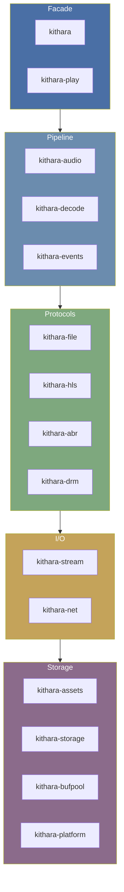

# CLAUDE.md

This file provides guidance to Claude Code (claude.ai/code) when working with code in this repository.

## Coding Rules

All coding rules are in `AGENTS.md`. Key points:
- Workspace-first dependencies (versions only in root `Cargo.toml`)
- No speculative code
- TDD workflow
- No `unwrap()`/`expect()` in prod code
- Use `tracing` for logging, never `println!`/`dbg!`
- No buffer allocations — use `SharedPool` from `kithara-bufpool`
- No error-driven control flow
- Single source of truth for shared types (`AudioCodec`, `ContainerFormat`, `MediaInfo` in `kithara-stream`)

## Commands

### Build and test
```bash
cargo build --workspace
cargo test --workspace
cargo test -p kithara-hls
cargo test -p kithara-hls --test playlist_integration
cargo test -p kithara-hls test_function_name
```

### Code quality
```bash
cargo fmt --all --check
cargo fmt --all
cargo clippy --workspace -- -D warnings
cargo check --workspace
```

### Documentation
```bash
cargo doc --workspace --no-deps --open
```

## Crate Architecture

### Layered architecture


Dependencies flow downward. Each layer depends only on layers below it.

### Crate roles

**`kithara`** — Facade: unified `Resource` API with auto-detection (file / HLS)

**`kithara-play`** — Player engine traits (AVPlayer-style API)
- `Engine`: singleton with arena-based slot management, crossfade delegation
- `Player` / `QueuePlayer`: playback control, time observers
- `Mixer`: per-channel gain/pan/mute/solo, master bus, EQ, crossfader
- DJ subsystem: `CrossfadeController`, `BpmAnalyzer`, `BpmSync`, `Equalizer`, `DjEffect`

**`kithara-audio`** — Audio pipeline: OS thread worker, effects chain, resampling
- `Audio<S>`: threaded decode + effects pipeline with backpressure via `kanal`
- `StreamAudioSource`: format change detection for ABR variant switches

**`kithara-decode`** — Audio decoding via Symphonia
- `Decoder`: synchronous decoder producing `PcmChunk` (pool-backed `Vec<f32>`)
- Backends: Symphonia (cross-platform), Apple AudioToolbox (macOS/iOS)

**`kithara-events`** — Unified event bus
- `EventBus` backed by `tokio::sync::broadcast`
- `Event` enum: `File(FileEvent)`, `Hls(HlsEvent)`, `Audio(AudioEvent)`

**`kithara-file`** — Progressive file download (MP3, AAC, etc.)
- `File` implements `StreamType` for use with `Stream<File>`
- Three-phase download: sequential, gap filling, complete

**`kithara-hls`** — HLS VOD orchestration with ABR, caching, and offline support
- `Hls` implements `StreamType` for use with `Stream<Hls>`
- `FetchManager`: unified fetch layer (network + `AssetsBackend` for disk or in-memory cache)

**`kithara-abr`** — Protocol-agnostic adaptive bitrate algorithm
- `AbrController` with Auto/Manual modes
- Dual-track EWMA throughput estimation

**`kithara-drm`** — AES-128-CBC segment decryption for encrypted HLS

**`kithara-stream`** — Byte-stream orchestration bridging async downloads to sync `Read + Seek`
- `Source` trait, `Downloader` trait, `Writer<E>`, `Backend`, `Stream<T>`
- Canonical types: `AudioCodec`, `ContainerFormat`, `MediaInfo`

**`kithara-net`** — HTTP networking with retry, timeout, and streaming
- `Net` trait + `TimeoutNet` / `RetryNet` decorators

**`kithara-assets`** — Persistent disk cache with lease/pin semantics and eviction
- Decorator chain: `CachedAssets<LeaseAssets<ProcessingAssets<EvictAssets<DiskAssetStore>>>>`

**`kithara-storage`** — Unified `StorageResource` (`Mmap` | `Mem`) with `read_at`/`write_at`/`wait_range`

**`kithara-bufpool`** — Sharded buffer pool for zero-allocation hot paths

**`kithara-platform`** — Platform-aware primitives (`Mutex`, `Condvar`, `MaybeSend`) for native and wasm32

**`kithara-wasm`** — WASM player with AudioWorklet integration for browser playback

## Key design patterns

### StreamType pattern
`File` and `Hls` are marker types implementing `StreamType`. Used as `Stream<File>` or `Stream<Hls>` for unified `Read + Seek` access. `Decoder<Stream<Hls>>` composes decoding on top.

### Decorator pattern (assets)
`AssetStore = CachedAssets<LeaseAssets<ProcessingAssets<EvictAssets<DiskAssetStore>>>>`

### Event-driven architecture
Protocol crates emit events via broadcast channel (`FileEvent`, `HlsEvent`). `DecoderEvent<E>` wraps both stream and decode events.

## Stack alignment

- `tokio` runtime
- `kanal` channels
- `reqwest` with `rustls`
- `symphonia`
- `hls_m3u8`

Versions pinned in root `Cargo.toml`. MSRV is 1.88 (edition 2024).

## Cancellation

All async operations accept `tokio_util::sync::CancellationToken`, forwarded through the entire call chain.

## Linting

- `rustfmt.toml`: max width 100, grouped imports
- `clippy.toml`: `unwrap_used = "deny"`, `allow-unwrap-in-tests = true`

### Style check
```bash
bash scripts/ci/lint-style.sh
```

## Adding new crates

1. Create directory under `crates/`
2. Add to `members` in root `Cargo.toml`
3. Add crate dependency in `[workspace.dependencies]`
4. Create `README.md` with public contract
5. Follow TDD process
