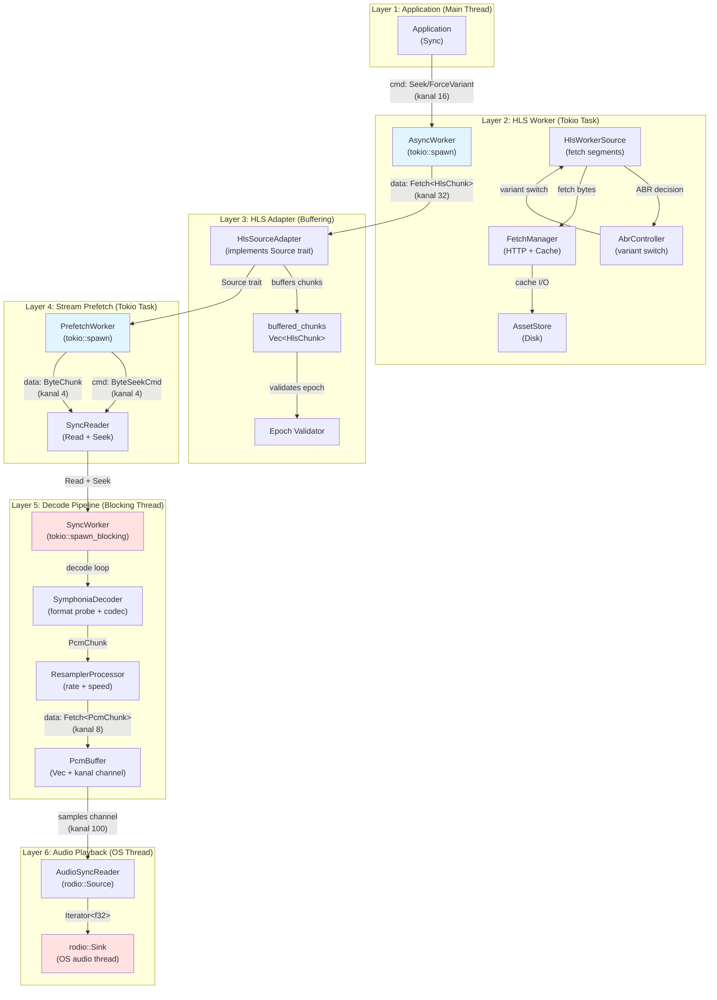

# Kithara - Current Architecture Analysis (2026-01-22)

**Цель**: Зафиксировать текущее состояние архитектуры перед рефакторингом ABR variant switch.

---

## Общая картина потоков и тредов

### Количество тредов в системе

**6 уровней параллелизма:**

1. **Main thread** (sync) - приложение/пользователь
2. **Tokio runtime** (1-4 worker threads) - async операции
3. **HLS Worker Task** (1 tokio task) - фоновая загрузка сегментов
4. **BytePrefetch Worker** (1 tokio task) - предзагрузка байтов для декодера
5. **Decode Blocking Thread** (1 tokio::spawn_blocking) - Symphonia декодирование
6. **rodio Playback Thread** (1 OS thread) - audio output

### Полная диаграмма данных



---

## Детальный анализ по компонентам

### 1. kithara-stream

**Threading:**
- 1 tokio task: `PrefetchWorker<BytePrefetchSource>`
- Spawned in `SyncReader::new()` line 329

**Channels:**
```rust
cmd_tx/cmd_rx:   kanal::bounded(4)  // ByteSeekCmd
data_tx/data_rx: kanal::bounded(4)  // Fetch<ByteChunk>
```

**Data Flow:**
```
Source trait (async wait_range/read_at)
    ↓
BytePrefetchSource::fetch_next() [tokio task]
    ↓
kanal channel → SyncReader [main thread]
    ↓
Read + Seek interface (non-blocking recv_chunk with spin-yield)
```

**Key Insight:**
- Main thread НИКОГДА не блокируется на I/O
- Использует `try_recv()` + `yield_now()` для polling
- Epoch валидация на стороне consumer

---

### 2. kithara-hls

**Threading:**
- 1 tokio task: `AsyncWorker<HlsWorkerSource>`
- Spawned in `source.rs:132`

**Channels:**
```rust
cmd_tx/cmd_rx:   kanal::bounded_async(16)  // HlsCommand (Seek, ForceVariant, Pause, Resume)
chunk_tx/chunk_rx: kanal::bounded_async(32) // Fetch<HlsChunk>
events_tx: tokio::sync::broadcast          // HlsEvent (VariantApplied, etc)
```

**Data Flow:**
```
URL
    ↓
PlaylistManager (master + media playlists)
    ↓
FetchLoader::load_segment() (metadata)
    ↓
FetchManager::open_streaming_resource() (bytes)
    ↓
HlsWorkerSource::fetch_next() [tokio task]
    ├─ Load segment bytes
    ├─ Measure throughput (for ABR)
    ├─ Update BufferTracker
    ├─ AbrController::decide() → variant switch
    └─ Return HlsChunk with metadata
        ↓
kanal channel → HlsSourceAdapter
    ↓
Buffer в Vec<HlsChunk> (epoch validation)
    ↓
Source trait (wait_range/read_at)
```

**ABR Integration:**
```rust
// В HlsWorkerSource::fetch_next() строки 312-365
1. Download time measurement: Instant::now() before/after load
2. Throughput: (bytes * 8.0) / duration_secs
3. Buffer level: BufferTracker.buffer_level_secs()
4. ABR decision: controller.decide(variants, buffer, now)
5. If changed: current_variant = target_variant
6. Emit VariantApplied event
```

**Проблема с variant switch:**
- ❌ При переключении варианта в buffer остаются chunks от ДВУХ вариантов (0 и 3)
- ❌ Init segment нового варианта идет ПОСЛЕ media segments старого
- ❌ Decoder получает init(v3) + media(v0) + media(v3) → audio glitch
- ❌ Epoch НЕ меняется при variant switch (только при seek)

---

### 3. kithara-worker

**Pattern:**
- Generic worker pattern для producer-consumer
- `AsyncWorker` — async I/O (HTTP, disk)
- `SyncWorker` — blocking I/O (codec, disk)

**Epoch-based invalidation:**
```rust
// Producer increment epoch on seek:
self.epoch += 1;

// Consumer validates:
if fetch.epoch != expected_epoch {
    discard(); // stale chunk
}
```

**Command Priority:**
```rust
tokio::select! {
    biased;  // Commands ALWAYS prioritized

    cmd = cmd_rx.recv() => { handle_command() }
    chunk = fetch_next() => { send_item() }
}
```

**Key Insight:**
- Commands interrupt send operations
- Biased select минимизирует latency команд
- Epoch используется ТОЛЬКО для seek, NOT для variant switch

---

### 4. kithara-decode

**Threading:**
- 1 `tokio::spawn_blocking`: `SyncWorker<DecodeSource>`
- 1 OS thread: rodio playback (отдельно от tokio)

**Channels:**
```rust
decoder → pcm: kanal::bounded(8)           // Fetch<PcmChunk>
pcm → audio:   kanal::bounded(100)         // f32 samples
```

**Data Flow:**
```
SourceReader (Read + Seek via block_on) [blocking thread]
    ↓
SymphoniaDecoder::next_chunk() [blocking]
    ↓
ResamplerProcessor::process() [blocking]
    ├─ Speed control (AtomicU32, lock-free)
    └─ Rate conversion (rubato)
        ↓
kanal::send() → PcmBuffer [async consumer]
    ├─ Vec<f32> storage (RwLock, random access)
    └─ kanal channel (streaming)
        ↓
AudioSyncReader::next() [rodio thread]
    └─ Iterator<Item=f32>
        ↓
rodio::Sink (OS audio output)
```

**Backpressure:**
```
rodio slow → AudioSyncReader blocks
    ↓
PcmBuffer channel full
    ↓
Decoder blocks on send()
    ↓
Natural backpressure up the chain
```

---

## Проблемы текущей архитектуры

### Проблема 1: ABR Variant Switch Audio Glitch

**Симптом:**
- При ABR переключении (variant 0 → 3) короткий фрагмент аудио играет в цикле
- Новый вариант не воспроизводится

**Root Cause:**
```
Variant Switch Event:
    1. ABR decides: variant 3 better than variant 0
    2. Worker sends HlsChunk { variant: 3, is_init_segment: true }
    3. BUT buffered_chunks STILL contains media chunks from variant 0
    4. Decoder reads:
       - HlsChunk { variant: 3, init, byte_offset: 50000 }   ✓
       - HlsChunk { variant: 0, media, byte_offset: 627 }    ✗ STALE!
       - HlsChunk { variant: 0, media, byte_offset: 51258 }  ✗ STALE!
       - HlsChunk { variant: 3, media, byte_offset: 102000 } ✓
    5. Symphonia tries to parse variant 0 media with variant 3 init → ERROR
    6. Decoder gets stuck replaying small buffer fragment
```

**Почему очистка buffer не помогла:**
```rust
// Попытка #1: Clear buffer on variant switch
if fetch.data.is_variant_switch {
    self.buffered_chunks.lock().clear();
}

// Результат:
// ❌ Создает GAP в byte_offset
// ❌ Decoder ждет chunk с offset=51258, но все удалены
// ❌ Новые chunks начинаются с offset=102000
// ❌ SyncReader зависает в wait_range(51258..117000)
```

**Почему epoch не используется:**
- Epoch меняется ТОЛЬКО при seek (explicit user action)
- Variant switch — это IMPLICIT change (ABR decision)
- Нельзя менять epoch при variant switch:
  - ❌ Блокирует все pending wait_range() calls
  - ❌ Создает deadlock между BytePrefetchSource и HlsSourceAdapter

### Проблема 2: Множество уровней worker'ов

**Текущая архитектура:**
```
HlsWorkerSource (tokio task)
    ↓ kanal channels
HlsSourceAdapter (Source trait)
    ↓ Source trait
BytePrefetchSource (tokio task)
    ↓ kanal channels
SyncReader (Read + Seek)
    ↓ block_on
DecodeSource (blocking thread)
    ↓ kanal channels
PcmBuffer
```

**Проблемы:**
- 3 уровня buffering (HlsChunks, ByteChunks, PcmChunks)
- 2 epoch systems (HLS epoch, BytePrefetch epoch) — NOT synchronized
- Variant switch information НЕ пробрасывается через уровни
- Source trait НЕ имеет информации о segment boundaries

---

## Ключевые инварианты

### Epoch Rules

| Event | HLS Epoch | BytePrefetch Epoch | Effect |
|-------|-----------|-------------------|--------|
| Seek command | `epoch++` | `epoch++` | Both discard stale data |
| Variant switch | **NO CHANGE** | **NO CHANGE** | ❌ Stale data remains |
| Pause/Resume | no change | no change | - |

### Buffer Invalidation

| Component | Invalidates on Seek? | Invalidates on Variant Switch? |
|-----------|---------------------|------------------------------|
| HlsSourceAdapter.buffered_chunks | ✅ (via epoch) | ❌ NO |
| BytePrefetchSource chunks | ✅ (via epoch) | ❌ NO |
| PcmBuffer | ✅ (seek flushes) | ❌ NO |

### Byte Offset Continuity

```
HlsChunk { byte_offset: 0 }     // init v0
HlsChunk { byte_offset: 627 }   // media v0 seg 0
HlsChunk { byte_offset: 51258 } // media v0 seg 1
---VARIANT SWITCH---
HlsChunk { byte_offset: 51258 } // init v3 (SAME offset!)
HlsChunk { byte_offset: 51885 } // media v3 seg 1 (continues)
```

**Правило:** byte_offset должен быть monotonic, но при variant switch init segment имеет тот же offset что и последний media segment.

---

## Вывод: Что нужно исправить

### Вариант A: Stream-based архитектура (из плана)

**Идея:**
- Заменить `Source` trait (random-access) на Stream (sequential)
- Каждый `HlsChunk` несет полные metadata (codec, container, variant, boundaries)
- Decoder получает chunks sequentially с явной информацией о boundaries

**Преимущества:**
- ✅ Codec safety: decoder знает когда меняется codec
- ✅ Segment boundaries: explicit flags (is_init, is_variant_switch)
- ✅ No random access confusion: decoder читает sequential stream

**Недостатки:**
- ❌ Breaking change: убирает Source trait
- ❌ Symphonia expects Read + Seek (не stream)
- ❌ Сложная миграция existing code

### Вариант B: Event-driven metadata propagation

**Идея:**
- Добавить event channel для metadata changes (VariantSwitch, CodecChange)
- Source trait остается, но decoder подписывается на events
- При получении VariantSwitch event, decoder flush'ит internal state

**Преимущества:**
- ✅ Source trait остается
- ✅ Backward compatible
- ✅ Decoder может реагировать на switch

**Недостатки:**
- ❌ Decoder должен обрабатывать events асинхронно
- ❌ Race condition между bytes и events
- ❌ Symphonia не поддерживает reinitialization

### Вариант C: Epoch для variant switch + reset buffer offset

**Идея:**
- При variant switch INCREMENT epoch (как при seek)
- HlsSourceAdapter сбрасывает buffer
- BytePrefetchSource RESETS byte_offset к новому baseline

**Преимущества:**
- ✅ Использует существующий epoch mechanism
- ✅ Minimal changes

**Недостатки:**
- ❌ Breaks pending wait_range() calls
- ❌ Decoder hang на existing read position

---

**Рекомендация:** Нужно глубокое обсуждение trade-offs перед выбором решения.

---

## Следующие шаги

1. ✅ Зафиксировали текущую архитектуру
2. ⏭️ Определить целевую архитектуру
3. ⏭️ Спланировать миграцию
4. ⏭️ Реализовать исправление
5. ⏭️ Тестирование ABR variant switch

---

**Created**: 2026-01-22
**Purpose**: Architecture snapshot before refactoring
