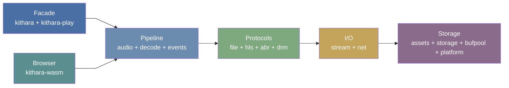

<div align="center">
  
</div>

<div align="center">

[](https://github.com/zvuk/kithara/actions/workflows/ci.yml)
[](https://codecov.io/gh/zvuk/kithara)
[](https://crates.io/crates/kithara)
[](https://crates.io/crates/kithara)
[](https://docs.rs/kithara)
[](LICENSE-MIT)

</div>

# kithara

> Built with AI, tested by a human. Vibe-coded -- but with care.
> Contributions, reviews, and fresh eyes are welcome.

> **Status: early development.** Public API will be kept as stable as possible, but internal architecture is actively being simplified — expect significant refactoring of larger crates. Pin to an exact version if you depend on kithara today.

Modular audio engine in Rust. Streams, decodes, and plays audio from progressive HTTP and HLS sources with persistent caching and offline support. Designed as an open-source alternative to AVPlayer with DJ-grade mixing capabilities — multi-slot playback, crossfading, BPM sync, and per-channel EQ.

Components are independent crates that can be used standalone or composed into a full player.

## Features

- **Player engine** — AVPlayer-style API with multi-slot arena, crossfading, BPM sync, and per-channel EQ (`kithara-play`)
- **Progressive file download** — stream MP3, AAC, FLAC and other formats over HTTP with disk caching and gap filling
- **HLS VOD** — adaptive bitrate streaming with variant switching, encrypted segments (AES-128-CBC), and offline support
- **Multi-backend decoding** — Symphonia (software, cross-platform) and Apple AudioToolbox (hardware, macOS/iOS)
- **Audio pipeline** — sample rate conversion via rubato, effects chain, OS-thread worker with backpressure
- **Persistent disk cache** — lease/pin semantics, LRU eviction, crash-safe writes
- **Zero-allocation hot paths** — sharded buffer pool for decode and I/O loops
- **WASM support** — browser playback via AudioWorklet with shared memory

## Architecture



<table>
<tr><th>Layer</th><th>Crates</th><th>Role</th></tr>
<tr><td><b>Facade</b></td><td><a href="crates/kithara/README.md"><code>kithara</code></a></td><td>Unified <code>Resource</code> API with auto-detection (file / HLS)</td></tr>
<tr><td><b>Player</b></td><td><a href="crates/kithara-play/README.md"><code>kithara-play</code></a></td><td>AVPlayer-style traits: Engine, Player, Mixer, DJ subsystem</td></tr>
<tr><td><b>Pipeline</b></td><td><a href="crates/kithara-audio/README.md"><code>kithara-audio</code></a><br/><a href="crates/kithara-decode/README.md"><code>kithara-decode</code></a><br/><a href="crates/kithara-events/README.md"><code>kithara-events</code></a></td><td>Threaded decode + effects + resampling, event bus</td></tr>
<tr><td><b>Protocols</b></td><td><a href="crates/kithara-file/README.md"><code>kithara-file</code></a><br/><a href="crates/kithara-hls/README.md"><code>kithara-hls</code></a><br/><a href="crates/kithara-abr/README.md"><code>kithara-abr</code></a><br/><a href="crates/kithara-drm/README.md"><code>kithara-drm</code></a></td><td>HTTP progressive, HLS VOD with ABR, AES-128 decryption</td></tr>
<tr><td><b>I/O</b></td><td><a href="crates/kithara-stream/README.md"><code>kithara-stream</code></a><br/><a href="crates/kithara-net/README.md"><code>kithara-net</code></a></td><td>Async-to-sync bridge (<code>Read + Seek</code>), HTTP with retry</td></tr>
<tr><td><b>Storage</b></td><td><a href="crates/kithara-assets/README.md"><code>kithara-assets</code></a><br/><a href="crates/kithara-storage/README.md"><code>kithara-storage</code></a></td><td>Disk cache with eviction, mmap/mem resources</td></tr>
<tr><td><b>Primitives</b></td><td><a href="crates/kithara-bufpool/README.md"><code>kithara-bufpool</code></a><br/><a href="crates/kithara-platform/README.md"><code>kithara-platform</code></a></td><td>Zero-alloc buffer pool, cross-platform sync types</td></tr>
<tr><td><b>Browser</b></td><td><a href="crates/kithara-wasm/README.md"><code>kithara-wasm</code></a></td><td>WASM player with AudioWorklet integration</td></tr>
</table>

## Getting Started

```bash
# Build
cargo build --workspace

# Test
cargo test --workspace

# Lint
cargo fmt --all --check
cargo clippy --workspace -- -D warnings
```

## Examples

```bash
# Play a file with rodio
cargo run -p kithara --example resource_play --features rodio -- <URL_OR_PATH>

# Play a file (audio crate)
cargo run -p kithara-audio --example file_audio --features rodio,memprof -- <URL>

# Play HLS stream
cargo run -p kithara-audio --example hls_audio --features rodio,memprof -- <MASTER_PLAYLIST_URL>

# Play encrypted HLS
cargo run -p kithara-audio --example hls_drm_audio --features rodio,memprof -- <MASTER_PLAYLIST_URL>

# Analyze ABR switch behavior
cargo run -p kithara-decode --example abr_switch_simulator -- <HLS_DATA_DIR>
```

## Contributing

See [CONTRIBUTING.md](CONTRIBUTING.md) for development setup, coding rules, and PR guidelines.

## Rules

See [`AGENTS.md`](AGENTS.md) for coding rules enforced across the workspace.

## Minimum Supported Rust Version (MSRV)

The current MSRV is **1.88** (Rust edition 2024). It is tested in CI and may be bumped in minor releases.

## License

Licensed under either of

- [Apache License, Version 2.0](LICENSE-APACHE)
- [MIT License](LICENSE-MIT)

at your option.
