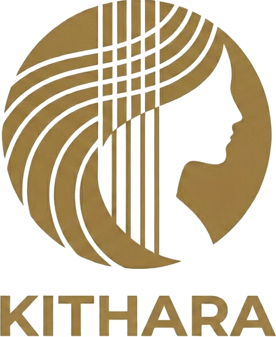
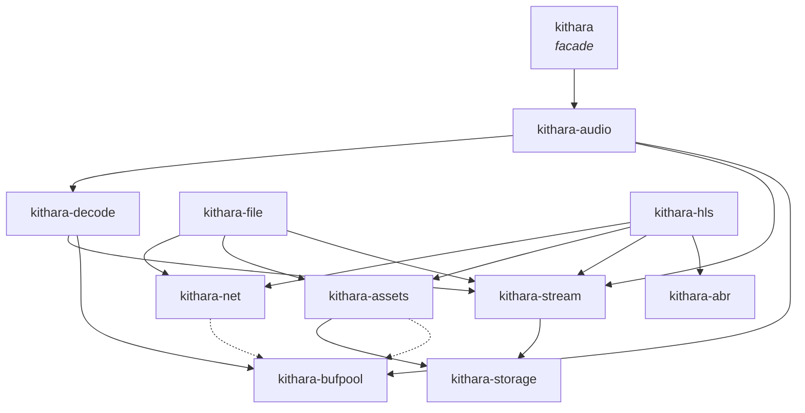

<div align="center">
  
</div>

# kithara

> Built with AI, tested by a human. Vibe-coded -- but with care.
> Contributions, reviews, and fresh eyes are welcome.

Rust library for networking and decoding. Provides transport primitives for progressive HTTP and HLS (VOD), a decoding layer producing PCM, and a persistent disk cache for offline playback.

Design goal: keep components modular so they can be reused independently and composed into a full engine/player.

## Crate Architecture



| Crate | Role |
|-------|------|
| **kithara** | Facade: unified `Resource` API with auto-detection (file / HLS) |
| **kithara-audio** | Audio pipeline: OS thread worker, effects chain, resampling |
| **kithara-decode** | Synchronous audio decoding via Symphonia |
| **kithara-stream** | Async-to-sync byte-stream bridge (`Read + Seek`) |
| **kithara-file** | Progressive file download (MP3, AAC, etc.) |
| **kithara-hls** | HLS VOD orchestration with ABR, caching, and offline support |
| **kithara-abr** | Adaptive bitrate algorithm (protocol-agnostic) |
| **kithara-net** | HTTP networking with retry, timeout, and streaming |
| **kithara-assets** | Persistent disk cache with lease/pin semantics and eviction |
| **kithara-storage** | Unified `StorageResource` backed by `mmap-io` |
| **kithara-bufpool** | Sharded buffer pool for zero-allocation hot paths |

## Getting Started

```bash
# Build
cargo build --workspace

# Test
cargo test --workspace

# Lint
cargo fmt --all --check
cargo clippy --workspace -- -D warnings
```

## Crate Documentation

Each crate has its own `README.md`:

- [`kithara`](crates/kithara/README.md) -- facade
- [`kithara-audio`](crates/kithara-audio/README.md) -- audio pipeline
- [`kithara-decode`](crates/kithara-decode/README.md) -- Symphonia decoder
- [`kithara-stream`](crates/kithara-stream/README.md) -- async-to-sync bridge
- [`kithara-file`](crates/kithara-file/README.md) -- progressive file
- [`kithara-hls`](crates/kithara-hls/README.md) -- HLS VOD
- [`kithara-abr`](crates/kithara-abr/README.md) -- adaptive bitrate
- [`kithara-net`](crates/kithara-net/README.md) -- HTTP networking
- [`kithara-assets`](crates/kithara-assets/README.md) -- disk cache
- [`kithara-storage`](crates/kithara-storage/README.md) -- mmap storage
- [`kithara-bufpool`](crates/kithara-bufpool/README.md) -- buffer pool

## Rules

See [`AGENTS.md`](AGENTS.md) for coding rules enforced across the workspace.
