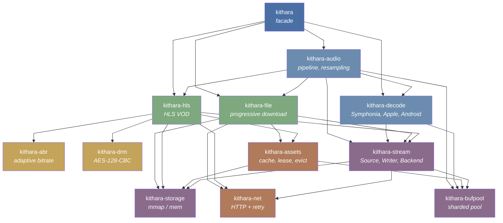

<div align="center">
  
</div>

<div align="center">

[](https://github.com/zvuk/kithara/actions/workflows/ci.yml)
[](https://codecov.io/gh/zvuk/kithara)
[](https://crates.io/crates/kithara)
[](https://crates.io/crates/kithara)
[](https://docs.rs/kithara)
[](LICENSE-MIT)

</div>

# kithara

> Built with AI, tested by a human. Vibe-coded -- but with care.
> Contributions, reviews, and fresh eyes are welcome.

> **Status: early development.** Public API will be kept as stable as possible, but internal architecture is actively being simplified — expect significant refactoring of larger crates. Pin to an exact version if you depend on kithara today.

Rust library for networking and decoding. Provides transport primitives for progressive HTTP and HLS (VOD), a decoding layer producing PCM, and a persistent disk cache for offline playback.

Design goal: keep components modular so they can be reused independently and composed into a full engine/player.

## Features

- **Progressive file download** — stream MP3, AAC, FLAC and other formats over HTTP with disk caching and gap filling
- **HLS VOD** — adaptive bitrate streaming with variant switching, encrypted segments (AES-128-CBC), and offline support
- **Multi-backend decoding** — Symphonia (software, cross-platform) and Apple AudioToolbox (hardware, macOS/iOS)
- **Audio pipeline** — sample rate conversion via rubato, effects chain, OS-thread worker with backpressure
- **Persistent disk cache** — lease/pin semantics, LRU eviction, crash-safe writes
- **Zero-allocation hot paths** — sharded buffer pool (`kithara-bufpool`) for decode and I/O loops
- **Async-to-sync bridge** — `Read + Seek` interface over async HTTP streams for synchronous decoders
- **Modular crate design** — use only what you need: networking, caching, decoding, or the full stack

## Crate Architecture



| Crate | Role |
|-------|------|
| **kithara** | Facade: unified `Resource` API with auto-detection (file / HLS) |
| **kithara-audio** | Audio pipeline: OS thread worker, effects chain, resampling |
| **kithara-decode** | Synchronous audio decoding via Symphonia |
| **kithara-stream** | Async-to-sync byte-stream bridge (`Read + Seek`) |
| **kithara-file** | Progressive file download (MP3, AAC, etc.) |
| **kithara-hls** | HLS VOD orchestration with ABR, caching, and offline support |
| **kithara-abr** | Adaptive bitrate algorithm (protocol-agnostic) |
| **kithara-net** | HTTP networking with retry, timeout, and streaming |
| **kithara-assets** | Persistent disk cache with lease/pin semantics and eviction |
| **kithara-storage** | Unified `StorageResource` backed by `mmap-io` |
| **kithara-drm** | AES-128-CBC segment decryption for encrypted HLS |
| **kithara-bufpool** | Sharded buffer pool for zero-allocation hot paths |

## Getting Started

```bash
# Build
cargo build --workspace

# Test
cargo test --workspace

# Lint
cargo fmt --all --check
cargo clippy --workspace -- -D warnings
```

## Crate Documentation

Each crate has its own `README.md`:

- [`kithara`](crates/kithara/README.md) -- facade
- [`kithara-audio`](crates/kithara-audio/README.md) -- audio pipeline
- [`kithara-decode`](crates/kithara-decode/README.md) -- Symphonia decoder
- [`kithara-stream`](crates/kithara-stream/README.md) -- async-to-sync bridge
- [`kithara-file`](crates/kithara-file/README.md) -- progressive file
- [`kithara-hls`](crates/kithara-hls/README.md) -- HLS VOD
- [`kithara-abr`](crates/kithara-abr/README.md) -- adaptive bitrate
- [`kithara-net`](crates/kithara-net/README.md) -- HTTP networking
- [`kithara-assets`](crates/kithara-assets/README.md) -- disk cache
- [`kithara-storage`](crates/kithara-storage/README.md) -- mmap storage
- [`kithara-bufpool`](crates/kithara-bufpool/README.md) -- buffer pool
- [`kithara-drm`](crates/kithara-drm/README.md) -- AES-128 decryption

## Examples

```bash
# Play a file with rodio
cargo run -p kithara --example resource_play --features rodio -- <URL_OR_PATH>

# Play a file (audio crate)
cargo run -p kithara-audio --example file_audio --features rodio,memprof -- <URL>

# Play HLS stream
cargo run -p kithara-audio --example hls_audio --features rodio,memprof -- <MASTER_PLAYLIST_URL>

# Play encrypted HLS
cargo run -p kithara-audio --example hls_drm_audio --features rodio,memprof -- <MASTER_PLAYLIST_URL>

# Analyze ABR switch behavior
cargo run -p kithara-decode --example abr_switch_simulator -- <HLS_DATA_DIR>
```

## Contributing

See [CONTRIBUTING.md](CONTRIBUTING.md) for development setup, coding rules, and PR guidelines.

## Rules

See [`AGENTS.md`](AGENTS.md) for coding rules enforced across the workspace.

## Minimum Supported Rust Version (MSRV)

The current MSRV is **1.85** (Rust edition 2024). It is tested in CI and may be bumped in minor releases.

## License

Licensed under either of

- [Apache License, Version 2.0](LICENSE-APACHE)
- [MIT License](LICENSE-MIT)

at your option.
