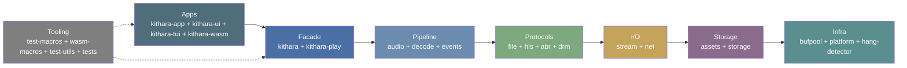

<div align="center">
  
</div>

<div align="center">

[](https://github.com/zvuk/kithara/actions/workflows/ci.yml)
[](https://codecov.io/gh/zvuk/kithara)
[](https://crates.io/crates/kithara)
[](https://docs.rs/kithara)
[](LICENSE-MIT)

</div>

# kithara

> Open-source modular audio engine in Rust.
> Contributions and reviews are welcome.

> **Status: active development.** Public APIs are intended to remain stable within a release line, while internal implementation may evolve. Pin exact versions for production use.

Modular audio engine in Rust. Streams, decodes, and plays audio from progressive HTTP and HLS sources with persistent caching and offline support. Designed as an open-source alternative to AVPlayer with DJ-grade mixing capabilities — multi-slot playback, crossfading, BPM sync, and per-channel EQ.

Components are independent crates that can be used standalone or composed into a full player.

## Features

- **Player engine** — AVPlayer-style API with multi-slot arena, crossfading, BPM sync, and per-channel EQ (`kithara-play`)
- **Progressive file download** — stream MP3, AAC, FLAC and other formats over HTTP with disk caching and gap filling
- **HLS VOD** — adaptive bitrate streaming with variant switching, encrypted segments (AES-128-CBC), and offline support
- **Multi-backend decoding** — Symphonia (software, cross-platform) and Apple AudioToolbox (hardware, macOS/iOS)
- **Audio pipeline** — sample rate conversion via rubato, effects chain, OS-thread worker with backpressure
- **Persistent disk cache** — lease/pin semantics, LRU eviction, crash-safe writes
- **Zero-allocation hot paths** — sharded buffer pool for decode and I/O loops
- **WASM support** — browser playback bindings with shared-memory threading

## Architecture


```mermaid
%%{init: {"flowchart": {"curve": "linear"}} }%%
flowchart LR
    apps["Apps<br/>kithara-app + kithara-ui + kithara-tui + kithara-wasm"]
    facade["Facade<br/>kithara + kithara-play"]
    pipeline["Pipeline<br/>audio + decode + events"]
    protocols["Protocols<br/>file + hls + abr + drm"]
    io["I/O<br/>stream + net"]
    storage["Storage<br/>assets + storage"]
    infra["Infra<br/>bufpool + platform + hang-detector"]
    tooling["Tooling<br/>test-macros + wasm-macros + test-utils + tests"]

    apps --> facade
    facade --> pipeline --> protocols --> io --> storage --> infra
    tooling -.-> facade
    tooling -.-> apps

    style apps fill:#4f6d7a,color:#fff
    style facade fill:#4a6fa5,color:#fff
    style pipeline fill:#6b8cae,color:#fff
    style protocols fill:#7ea87e,color:#fff
    style io fill:#c4a35a,color:#fff
    style storage fill:#8b6b8b,color:#fff
    style infra fill:#5b8f8f,color:#fff
    style tooling fill:#7f7f7f,color:#fff
```

<table>
<tr><th>Layer</th><th>Crates</th><th>Role</th></tr>
<tr><td><b>Facade</b></td><td><a href="crates/kithara/README.md"><code>kithara</code></a></td><td>Unified <code>Resource</code> API with auto-detection (file / HLS)</td></tr>
<tr><td><b>Player</b></td><td><a href="crates/kithara-play/README.md"><code>kithara-play</code></a></td><td>AVPlayer-style traits: Engine, Player, Mixer, DJ subsystem</td></tr>
<tr><td><b>Pipeline</b></td><td><a href="crates/kithara-audio/README.md"><code>kithara-audio</code></a><br/><a href="crates/kithara-decode/README.md"><code>kithara-decode</code></a><br/><a href="crates/kithara-events/README.md"><code>kithara-events</code></a></td><td>Threaded decode + effects + resampling, event bus</td></tr>
<tr><td><b>Protocols</b></td><td><a href="crates/kithara-file/README.md"><code>kithara-file</code></a><br/><a href="crates/kithara-hls/README.md"><code>kithara-hls</code></a><br/><a href="crates/kithara-abr/README.md"><code>kithara-abr</code></a><br/><a href="crates/kithara-drm/README.md"><code>kithara-drm</code></a></td><td>HTTP progressive, HLS VOD with ABR, AES-128 decryption</td></tr>
<tr><td><b>I/O</b></td><td><a href="crates/kithara-stream/README.md"><code>kithara-stream</code></a><br/><a href="crates/kithara-net/README.md"><code>kithara-net</code></a></td><td>Async-to-sync bridge (<code>Read + Seek</code>), HTTP with retry</td></tr>
<tr><td><b>Storage</b></td><td><a href="crates/kithara-assets/README.md"><code>kithara-assets</code></a><br/><a href="crates/kithara-storage/README.md"><code>kithara-storage</code></a></td><td>Disk cache with eviction, mmap/mem resources</td></tr>
<tr><td><b>Primitives</b></td><td><a href="crates/kithara-bufpool/README.md"><code>kithara-bufpool</code></a><br/><a href="crates/kithara-platform/README.md"><code>kithara-platform</code></a></td><td>Zero-alloc buffer pool, cross-platform sync types</td></tr>
<tr><td><b>Runtime Safety</b></td><td><a href="crates/kithara-hang-detector/README.md"><code>kithara-hang-detector</code></a></td><td>Hang watchdog and loop guard macro used by runtime crates</td></tr>
<tr><td><b>Applications</b></td><td><a href="crates/kithara-app/README.md"><code>kithara-app</code></a><br/><a href="crates/kithara-ui/README.md"><code>kithara-ui</code></a><br/><a href="crates/kithara-tui/README.md"><code>kithara-tui</code></a><br/><a href="crates/kithara-wasm/README.md"><code>kithara-wasm</code></a></td><td>Desktop/TUI/WASM demo players built on shared engine crates</td></tr>
<tr><td><b>Macros</b></td><td><a href="crates/kithara-test-macros/README.md"><code>kithara-test-macros</code></a><br/><a href="crates/kithara-wasm-macros/README.md"><code>kithara-wasm-macros</code></a></td><td>Proc-macro glue for tests and wasm exports/thread guards</td></tr>
<tr><td><b>Testing</b></td><td><a href="crates/kithara-test-utils/README.md"><code>kithara-test-utils</code></a></td><td>Shared fixtures and helpers for workspace tests</td></tr>
</table>

## Getting Started

```bash
# Build
cargo build --workspace

# Install task runner + git hooks (recommended)
cargo install just --locked
cargo install cargo-nextest --locked
# Install prek:
# https://github.com/j178/prek
prek install -f

# Optional: worktree workflow for parallel agents
brew install worktrunk
wt config shell install

# Test (nextest + doctests)
just test-all

# Lint / policy checks
just lint-fast
just lint-full
```

## Demo Players

```bash
# Desktop GUI demo
cargo run -p kithara-app --bin kithara-gui -- <TRACK_URL_1> <TRACK_URL_2>

# Terminal demo
cargo run -p kithara-app --bin kithara-tui -- <TRACK_URL_1> <TRACK_URL_2>

# WASM demo player
cd crates/kithara-wasm
RUSTUP_TOOLCHAIN=nightly trunk serve --config Trunk.toml --port 8080
```

## Examples

```bash
# Play a file with rodio
cargo run -p kithara --example resource_rodio --features rodio -- <URL_OR_PATH>

# Play a progressive file (interactive)
cargo run -p kithara --example file_audio --features rodio -- <URL>

# Play HLS stream (interactive)
cargo run -p kithara --example hls_audio --features rodio -- <MASTER_PLAYLIST_URL>

# Play encrypted HLS
cargo run -p kithara --example hls_drm_audio --features rodio -- <MASTER_PLAYLIST_URL>

# Crossfade from file to HLS
cargo run -p kithara --example player --features file,hls -- [FILE_URL] [HLS_URL]
```

## Contributing

See [CONTRIBUTING.md](CONTRIBUTING.md) for development setup, coding rules, and PR guidelines.

## Rules

See [`AGENTS.md`](AGENTS.md) for coding rules enforced across the workspace.

## Minimum Supported Rust Version (MSRV)

The current MSRV is **1.88** (Rust edition 2024). It is tested in CI and may be bumped in minor releases.

## License

Licensed under either of

- [Apache License, Version 2.0](LICENSE-APACHE)
- [MIT License](LICENSE-MIT)

at your option.
