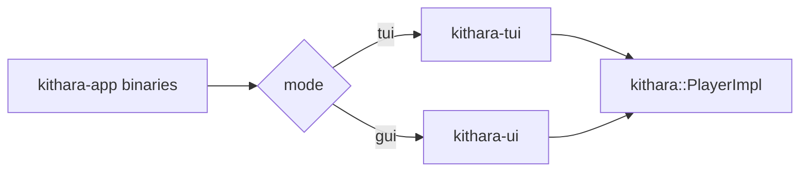

<div align="center">
  
</div>

<div align="center">

[](https://github.com/zvuk/kithara/actions/workflows/ci.yml)
[](../../LICENSE-MIT)

</div>

# kithara-app

Workspace application crate (`publish = false`) that wires demo binaries around shared engine/UI crates.

## Binaries

<table>
<tr><th>Binary</th><th>Purpose</th></tr>
<tr><td><code>kithara</code></td><td>CLI entrypoint with mode auto-detection (<code>--mode auto|tui|gui</code>)</td></tr>
<tr><td><code>kithara-tui</code></td><td>Terminal dashboard player (ratatui)</td></tr>
<tr><td><code>kithara-gui</code></td><td>Desktop GUI player (iced)</td></tr>
</table>

## Run

```bash
# Auto mode
cargo run -p kithara-app --bin kithara -- --mode auto <TRACK_URL_1> <TRACK_URL_2>

# Force TUI
cargo run -p kithara-app --bin kithara-tui -- <TRACK_URL_1> <TRACK_URL_2>

# Force GUI
cargo run -p kithara-app --bin kithara-gui -- <TRACK_URL_1> <TRACK_URL_2>
```

If no tracks are provided, the app loads built-in defaults (one MP3 + one HLS URL).

## Architecture



## Integration

- Depends on `kithara` with `file` + `hls` features.
- Uses `kithara-tui` for terminal rendering/session handling.
- Uses `kithara-ui` for iced GUI state/view/update loop.
