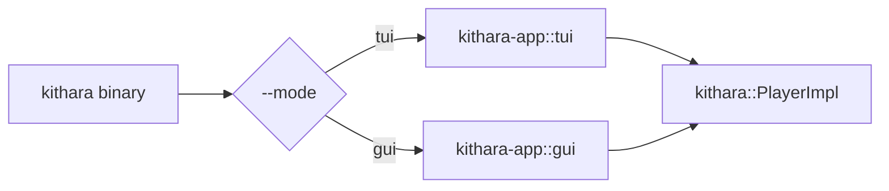

<div align="center">
  
</div>

<div align="center">

[](../../LICENSE-MIT)

</div>

# kithara-app

Workspace application crate (`publish = false`) that wires demo binaries around shared engine/UI crates.

## Binary

Single binary `kithara` with mode auto-detection (`--mode auto|tui|gui`).

## Run

```bash
# Auto mode (picks tui or gui based on the terminal)
cargo run -p kithara-app -- --mode auto <TRACK_URL_1> <TRACK_URL_2>

# Force TUI
cargo run -p kithara-app -- --mode tui <TRACK_URL_1> <TRACK_URL_2>

# Force GUI
cargo run -p kithara-app -- --mode gui <TRACK_URL_1> <TRACK_URL_2>
```

If no tracks are provided, the app loads built-in defaults (one MP3 + one HLS URL).

## Features

- `tui` — terminal dashboard player (ratatui + crossterm).
- `gui` — desktop GUI player (iced).
- `lib` — build as a plain library (used by integration tests).

Defaults: `tui` + `gui`.

## Architecture



## Waveform cache

The DJ studio colored waveform is an expensive whole-track decode + FFT, so its
result is memoized (`wave_cache.rs`, owned by the single `StateController`
listener task). Two distinct identity spaces, kept separate on purpose:

- **`TrackId`** (session-scoped `u64` from the queue) — the stale-guard for an
  in-flight run and the "still current" check at commit. Never persisted.
- **`WaveKey`** (source-derived, query/fragment-stripped URL/path, sha256 for
  the filename) — the cross-session cache key. The same source shares one entry
  and the disk tier survives restarts.

These never mix: `TrackId` answers "is this the same queue slot", `WaveKey`
answers "is this the same audio source". `start_analysis` (`plan_analysis`)
skips when the track is already shown or in flight, serves a cache hit without
wiping the visible waveform, and only wipes + decodes on a genuine miss;
`commit_waveform` populates both tiers.

The disk tier lives under the existing audio cache root
(`file_asset_store.root_dir()/waveforms`), so it shares lifetime with the
cached audio bytes. A `TrackSource` variant with no stable source (the reserved
non-exhaustive seam) is in-memory-only by capability, not a fallback.

Invalidation is by `WAVEFORM_BYTES_VERSION` (kithara-audio): bump it whenever
the encoding, the analysis parameters, or `WAVEFORM_BUCKETS` change. The
filename is a sha256 of the key — a `std` hasher is not stable across toolchain
versions and would orphan every blob. Because the key is the source location
and not the bytes, a file overwritten in place keeps its key until the version
is bumped (acceptable for a library of stable files).

## Integration

- Depends on `kithara` with `file` + `hls` features.
- TUI and GUI frontends are gated by the `tui` / `gui` Cargo features.
