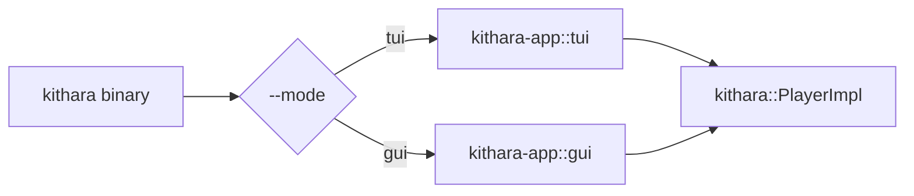

<div align="center">
  
</div>

<div align="center">

[](../../LICENSE-MIT)

</div>

# kithara-app

Workspace application crate (`publish = false`) that wires demo binaries around shared engine/UI crates.

## Binary

Single binary `kithara` with mode auto-detection (`--mode auto|tui|gui`).

## Run

```bash
# Auto mode (picks tui or gui based on the terminal)
cargo run -p kithara-app -- --mode auto <TRACK_URL_1> <TRACK_URL_2>

# Force TUI
cargo run -p kithara-app -- --mode tui <TRACK_URL_1> <TRACK_URL_2>

# Force GUI
cargo run -p kithara-app -- --mode gui <TRACK_URL_1> <TRACK_URL_2>
```

If no tracks are provided, the app loads built-in defaults that include MP3, HLS,
and DRM-HLS examples.

## Features

- `tui` — terminal dashboard player (ratatui + crossterm).
- `gui` — desktop GUI player (iced).
- `lib-only` — build as a plain library (used by integration tests).
- `beat-nn` — NN beat/downbeat detection.
- `stretch-signalsmith` / `stretch-bungee` / `stretch-all` — time-stretch backends.
- `client-reqwest` / `client-wreq` — HTTP backend forwarding.
- `tls-rustls` / `tls-native` — TLS backend forwarding.

Defaults: `tui` + `gui` + `beat-nn` + `stretch-signalsmith`.

## Architecture



## Track Analysis Cache

DJ Studio memoizes whole-track waveform and beat/BPM analysis in memory and on
disk. Runtime freshness is guarded by `TrackId`; cross-session cache identity is
owned by `AnalysisKey`. See CONTEXT.md for the key spaces, disk-tier lifecycle,
and `ANALYSIS_BYTES_VERSION` invalidation contract.

## Integration

- Depends on `kithara` with `file` + `hls` features.
- TUI and GUI frontends are gated by the `tui` / `gui` Cargo features.

See [CONTEXT.md](CONTEXT.md) for detailed contracts, invariants, and internals.
