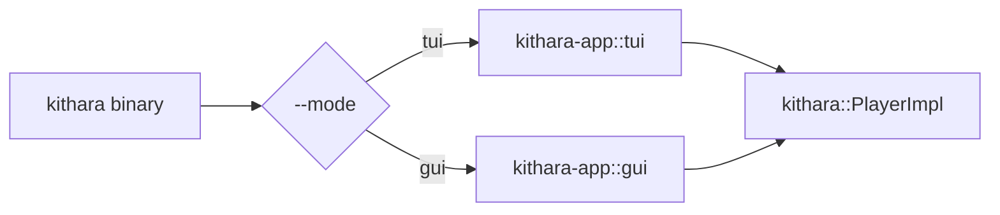

<div align="center">
  
</div>

<div align="center">

[](../../LICENSE-MIT)

</div>

# kithara-app

Workspace application crate (`publish = false`) that wires demo binaries around shared engine/UI crates.

## Binary

Single binary `kithara` with mode auto-detection (`--mode auto|tui|gui`).

## Run

```bash
# Auto mode (picks tui or gui based on the terminal)
cargo run -p kithara-app -- --mode auto <TRACK_URL_1> <TRACK_URL_2>

# Force TUI
cargo run -p kithara-app -- --mode tui <TRACK_URL_1> <TRACK_URL_2>

# Force GUI
cargo run -p kithara-app -- --mode gui <TRACK_URL_1> <TRACK_URL_2>
```

If no tracks are provided, the app loads built-in defaults (one MP3 + one HLS URL).

## Features

- `tui` — terminal dashboard player (ratatui + crossterm).
- `gui` — desktop GUI player (iced).
- `lib` — build as a plain library (used by integration tests).

Defaults: `tui` + `gui`.

## Architecture



## Track Analysis Cache

DJ Studio source analysis (colored waveform + optional source BPM) is memoized in
`wave_cache.rs` across two identity spaces (`TrackId`, `AnalysisKey`) with an
in-memory and a disk tier keyed by source location.

## Integration

- Depends on `kithara` with `file` + `hls` features.
- TUI and GUI frontends are gated by the `tui` / `gui` Cargo features.

See [CONTEXT.md](CONTEXT.md) for detailed contracts, invariants, and internals.
