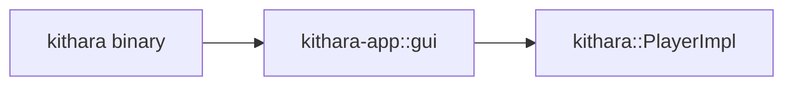

<div align="center">


</div>

<div align="center">

[](https://github.com/zvuk/kithara/blob/main/LICENSE-MIT)

</div>

# kithara-app

Workspace application crate (`publish = false`) that wires demo binaries around shared engine/UI crates.

## Usage

### Binary

Single binary `kithara` — the desktop DJ app.

### Run

```bash
cargo run -p kithara-app -- <TRACK_URL_1> <TRACK_URL_2>
```

If no tracks are provided, the app loads built-in defaults that include MP3, HLS,
and DRM-HLS examples.

### Browser

```bash
just platform wasm build --package kithara-app
```

Builds `dist/` for a WebGPU browser. Serve it with cross-origin isolation
(`Cross-Origin-Opener-Policy: same-origin`,
`Cross-Origin-Embedder-Policy: require-corp`); `dist/_headers` names both for
hosts that read it. The browser build carries `app.web.yaml` over `app.yaml`:
no DRM providers and a playlist of cross-origin streams.

## Features

- `gui` — desktop GUI player (iced).
- `lib-only` — build as a plain library (used by integration tests).
- `beat-nn` — NN beat/downbeat detection.
- `stretch-signalsmith` / `stretch-bungee` / `stretch-all` — time-stretch backends.
- `client-reqwest` / `client-wreq` — HTTP backend forwarding.
- `tls-rustls` / `tls-native` — TLS backend forwarding.

Defaults: `gui` + `beat-nn` + `stretch-signalsmith`.

## Integration

- Depends on `kithara` with `file` + `hls` features.
- The GUI frontend is gated by the `gui` Cargo feature.

### Architecture


```mermaid
flowchart LR
    cli["kithara binary"] --> gui["kithara-app::gui"]
    gui --> core["kithara::PlayerImpl"]
```

### Track Analysis Cache

The app memoizes whole-track waveform and beat/BPM analysis in memory and on
disk. Runtime freshness is guarded by `TrackId`; cross-session cache identity is
owned by `AnalysisTarget`. The app owns the `AssetStore` cache I/O and policy;
the pure analysis snapshot/codec comes from `kithara-analysis`. See [crate contracts](https://github.com/zvuk/kithara/wiki/kithara-app)
for the key spaces, disk-tier lifecycle, and codec-version invalidation
contract.

See [crate contracts](https://github.com/zvuk/kithara/wiki/kithara-app) for detailed contracts, invariants, and internals.
