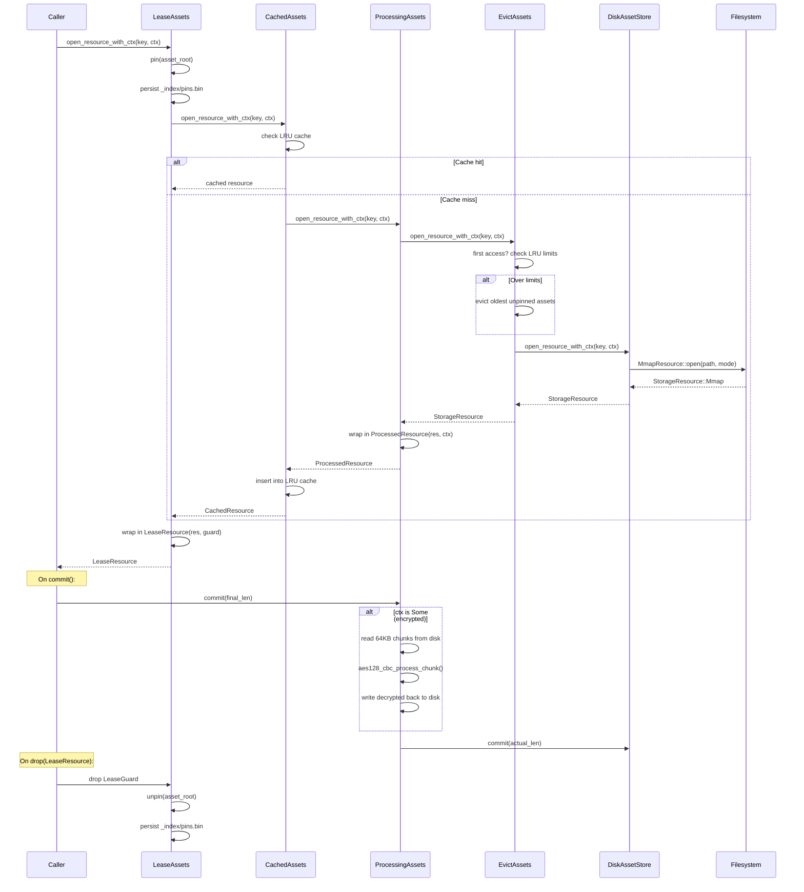

# kithara-assets — Context

Detailed contracts and invariants for the kithara-assets crate; the README is the overview.

## Storage backend

`StorageBackend` selects where committed bytes live: `Memory` (contents die with the process) or `Disk { root }`. A builder with no backend gets a fresh unique temp directory (native) or memory (wasm — no filesystem, `Disk` requests build memory).

## Key mapping (normative)

Disk mapping is `<cache_root>/<layout.root(source)>/<layout.path(resource)>`.
Higher layers describe an `AssetSource` and `AssetResource`; they do not supply
an already-formed relative cache path. Assets validates both layout outputs
before constructing a `ResourceKey`.

### Layout

The `AssetStore` owns an immutable `AssetLayoutRegistry`, configured through
`AssetStoreBuilder::layouts`. `AssetStore::scope::<T>(&AssetSource)` selects the
layout once and resolves its root; `AssetScope::key(&AssetResource)` invokes the
selected layout once to mint the `ResourceKey` used by cache, leases, eviction,
demand, and availability. Switching layouts does not migrate existing cache
entries.

`DefaultLayout` maps source bytes to `track/track.<ext>`, URL resources to a
safe authority/path mirror under `track/`, and named resources to their
namespace and name. Non-empty URL queries add a bounded fingerprint before the
leaf extension. Any registered custom layout is subject to the same root/path
validation and invalid output returns `AssetsError::InvalidKey`.

Auto-pin (lease) semantics: all resources opened through the leasing decorator (`LeaseAssets`) are automatically pinned by `asset_root` for the lifetime of the returned handle. The pin is an RAII guard stored inside the `LeaseWriter` / `LeaseReader`; drop the handle to release the pin.

The global index (`_index/*`) stores small best-effort metadata files. The filesystem remains the source of truth; indexes may be missing and can be rebuilt later.

## Decorator Chain

Requests flow through five layers (outermost to innermost):

<table>
<tr><th>Layer</th><th>Responsibility</th></tr>
<tr><td><code>LeaseAssets</code></td><td>RAII-based pinning; <code>LeaseGuard</code> unpins on drop; prevents eviction of in-use assets</td></tr>
<tr><td><code>CachedAssets</code></td><td>In-memory LRU cache (default 5 entries); prevents duplicate mmap opens</td></tr>
<tr><td><code>ProcessingAssets</code></td><td>Optional chunk-based transformation on <code>commit()</code> (e.g., AES-128-CBC decryption)</td></tr>
<tr><td><code>EvictAssets</code></td><td>LRU eviction by asset count and/or byte size; pinned assets excluded</td></tr>
<tr><td><code>DiskAssetStore</code> / <code>MemAssetStore</code></td><td>Base storage backend; maps <code>ResourceKey</code> to filesystem paths or in-memory resources</td></tr>
</table>

Decorator behavior is capability-gated per call. For an absolute `ResourceKey` (local-file mode), the cache/lease/evict layers bypass and become pass-through; for a relative key under an `asset_root` they apply normally.



## Index Persistence

Three index types are persisted under `_index/` for crash recovery:

<table>
<tr><th>Index</th><th>File</th><th>Purpose</th></tr>
<tr><td>Pins</td><td><code>_index/pins.bin</code></td><td>Persists pinned asset roots</td></tr>
<tr><td>LRU</td><td><code>_index/lru.bin</code></td><td>Monotonic clock + byte accounting for eviction</td></tr>
<tr><td>Availability</td><td><code>_index/availability.bin</code></td><td>Per-resource byte ranges and committed final length — the aggregate snapshot of <code>AvailabilityIndex</code> (see below)</td></tr>
</table>

All indices use `Atomic<R>` for crash-safe writes. **Availability persistence is two-tier**: the background flush worker writes `availability.bin` best-effort and **non-durable** (atomic rename, no `sync_data`) shortly after commits — giving other instances sharing the store fast visibility of committed bytes and speeding crash-recovery hydration after an abnormal exit — while `AssetStore::checkpoint()` performs the **durable** (`sync_data`), authoritative write. Neither write is a correctness dependency: a missing, stale, or corrupt `availability.bin` is recovered by the slow path (rebuild from the committed segment files) plus the one-shot cold-miss fallback to `resource_state`. Pins and the LRU index instead flush eagerly on every boundary mutation.

### Pins index

`PinsIndex` is the in-memory + best-effort disk-backed index of pinned `asset_root`s. It is architecturally symmetric to `AvailabilityIndex`: the `Arc` is encapsulated inside the type, `Clone` is a cheap atomic refcount bump, and every mutation that crosses the pinned/unpinned boundary immediately flushes to the optional disk-backed `Atomic` tempfile.

- Each `asset_root` is tracked by a refcount. Concurrent leases on the same root increment it and drops decrement it. The on-disk pinned set only changes (and only flushes) on the 0→1 and 1→0 transitions; intermediate increments/decrements are pure in-memory updates.
- Persistence is lazy: the disk file is materialised only on the first `flush`. A pre-existing on-disk file from a previous run is opened eagerly during `with_persist_at` (native only) for hydration. On wasm32 the index is always ephemeral.
- Three call-sites share a single instance per disk root: `LeaseAssets` (pin/unpin on resource lifecycle), `EvictAssets` (read pinned set when picking eviction candidates), and `DiskAssetDeleter` (drop pin when an `asset_root` is fully removed).

## Byte Availability — single source of truth

`AssetStore` is the sole authoritative answer to "which bytes of this resource are present?". Callers query it through three read-only methods that are safe to invoke from high-frequency hot paths (e.g. the HLS decoder read loop):

```rust
let scope = store.scope(asset_root);
scope.store().contains_range(&key, 0..4096); // bool: every byte in range
scope.store().available_ranges(&key);        // RangeSet<u64>: full snapshot
scope.store().final_len(&key);               // Option<u64>: committed size
```

Internally these sit on top of an aggregate `AvailabilityIndex` keyed by `(asset_root, ResourceKey)`:

- **Updated** by a `ScopedAvailabilityObserver` attached to every `Resource` opened through `DiskAssetStore` / `MemAssetStore`. Each `Resource::write_at` fires `on_write(range)` and each successful `Resource::commit(Some(len))` fires `on_commit(len)`. Opening a pre-existing committed file also seeds `0..final_len`.
- **Queried** with a fast path first (`DashMap::get → Arc::clone → Mutex::lock`, with the shard guard released before the inner lock). A cold miss on `Disk` falls back once to `resource_state` so pre-existing committed files on disk are still discoverable before the observer has ever fired.
- **Persisted** in two tiers (see the index table above): the background flush worker writes `availability.bin` non-durably soon after commits (best-effort, for cross-instance visibility and crash-recovery speed), and `AssetStore::checkpoint()` writes it durably. Missing / corrupt / wrong-version files are silently treated as an empty seed on rebuild — the slow path then re-derives availability from the committed segment files.

`Resource<D>::CommonState.available` remains the per-resource byte map inside `kithara-storage`, but it is an implementation detail — consumers outside `kithara-storage` must query through `AssetStore`, not through `resource.contains_range()` on an ad-hoc `open_resource` call.

## Processing & readiness gate (Pending/Ready typestate)

Decrypt-readiness is a **phantom typestate** on a split acquisition handle, not a runtime flag. Acquiring an encrypted resource (`ctx = Some`) yields `AcquisitionResult::Pending(ProcessedWriter)`; a committed/cache-hit resource — or any `ctx = None` resource (playlists, keys) — yields `AcquisitionResult::Ready(ProcessedReader)`. Callers pattern-match the outcome; there is no runtime `is_readable()` check.

- `ProcessedWriter` (Pending, **non-`Clone`**) owns the write+decrypt capability: `write_at` streams raw ciphertext to disk; `commit(self, final_len)` reads it back in chunks, transforms each via the resource's `ChunkSink` (no allocation, e.g. AES-128-CBC), writes the plaintext back, and **consumes** the writer into a `ProcessedReader`. `fail(self)` — or dropping the writer without committing — fails the gate so no waiting reader deadlocks. The writer exposes **no reads**: `read_at` on a Pending handle is a compile error.
- `ProcessedReader` (Ready, `Clone`) exposes `read_at`/`wait_range`/`contains_range`/`len`/`next_gap`/`path` over already-processed bytes. `reactivate(self)` consumes the reader into a fresh `ProcessedWriter` carrying a **new** readiness gate.

The Pending/Ready split is not confined to the processing layer — it is the shape of the whole `Assets` contract. `acquire_resource*` returns `AcquisitionResult<ActiveRes: WriteSide, ReadyRes: ReadSide>`; `open_resource*` returns the `ReadyRes` reader directly. Every decorator carries the split through mutually-recursive associated types (`WriteSide::Reader: ReadSide<Writer = Self>` ↔ `ReadSide::Writer: WriteSide<Reader = Self>`): `BaseWriter`/`BaseReader` (storage seam, `resource.rs`) → `ProcessedWriter`/`Reader` → `CachedWriter`/`Reader` → `LeaseWriter`/`Reader`, surfaced at the facade as `AssetWriter` / `AssetReader`. Because the commit owner is non-`Clone` but a streaming download closure needs a clone-able byte sink, `WriteSide::raw_write_handle()` yields a `RawWriteHandle` (a clone-able raw-write path into the writer's generation) decoupled from the single `commit`-owning writer. The cache stores **only `ReadyRes` readers** of the current generation; an acquire that hits a non-committed slot `reactivate`s a fresh writer and re-keys the cache entry, so prior committed reader clones keep their generation's gate.

This replaces the former runtime `ReadinessGate` (a `processed: Mutex<bool>` + `Condvar` shared across `Clone`s of one `ProcessedResource`). That shared gate was the root of the DRM read-before-ready race: a re-fetching writer's `reactivate` flipped the gate for an extant reader's committed clone, so `read_at` hit `StorageError::NotReadable` mid-playback (`live_ephemeral_small_cache_playback_drm`; the older `local_queue_playlist_behavior_*` post-seek hang). The fresh-gate-on-`reactivate` plus the non-`Clone` writer make that race unrepresentable — a reacquiring writer gets its own gate and a committed reader's type-level readiness is never revoked. The gate survives **privately** inside `process.rs` only as the writer↔reader handoff primitive, reachable through `commit`/`await_ready`. Storage lifecycle `status()` stays a runtime `&self` facade (see "Decorator Chain"); the two axes are independent.

## Per-acquire processing (`ProcessCtx`)

The store is **not** generic over a processing context. Processing travels per acquire as `ProcessCtx = Arc<dyn ResourceProcessor>`; `None` is identity passthrough. This is what lets ONE non-generic `AssetStore` serve both plain (file) and decrypting (HLS) scopes — there is no second store instance and no second `_index/` set.

- `ResourceProcessor` (defined here, implemented by consumers, e.g. the HLS `DecryptProcessor`): `identity() -> &[u8]` is the **immutable** cache identity (e.g. `key||iv`); `begin() -> Box<dyn ChunkSink>` mints **fresh per-commit** chaining state.
- `ChunkSink::process(&mut self, …)` carries the evolving state (e.g. the CBC IV advancing between 64KB chunks). `commit` (and `reactivate`-then-`commit`) calls `begin()` each time, so every commit restarts chaining from the seed.
- There is **no** build-time `process_fn`; `AssetStoreBuilder` takes no processing callback. Consumers never see the AES primitive in `kithara-assets` — only the trait.

### Cache identity is exact bytes

The in-memory cache key is `(ResourceKey, Option<RequestIdentity>, Option<CtxIdentity>)`, where `CtxIdentity` wraps `ResourceProcessor::identity()` (via the crate-internal `CacheIdentity` bridge). Equality is **byte-exact** `Eq`, not a hash digest — two distinct processors never collide. `CtxIdentity`'s `Debug` is redacted because the bytes can be key material (e.g. AES `key||iv`).

## Conversions and builder inputs

- `AssetStoreBuilder::{max_assets, max_bytes}` configure eviction directly;
  `EvictConfig` is an internal value assembled by the builder.
- `ResourceStatus` → `AssetResourceState` (`From`) — map storage status to asset state
- `&LruState` ↔ `LruIndexFile` (`From` both ways) — LRU index persistence round-trip

## Consumer Demand

`DemandIndex` is a sibling of `AvailabilityIndex` on `AssetStore`: one instance per `build()`, shared across store clones via `Arc`. Where availability answers "which bytes are present?", demand answers "how far ahead should the single download producer fetch?". It is consumer-driven and protocol-agnostic (byte offsets + a refcount + a cancel token, no HTTP), so unlike availability it needs no storage observer and no decorator threading — just a field and accessors.

Each consumer attaches once:

```rust
let (lease, producer) = store.attach_demand(&key, read_pos, look_ahead);
```

- `read_pos` is an `Arc<AtomicU64>` shared with the consumer; the producer reads its advances directly. `look_ahead` of `None` means "wants the whole file" and collapses that consumer's watermark to `u64::MAX`.
- Per-key state lives in a `DemandCell { entries, refcount, producer_spawned, producer_cancel, notify }`. The aggregate watermark is the **max** of every live consumer's `read_pos + look_ahead` — one mechanism, no "wants-full" flag.
- `attach_demand` get-or-inserts a live slot, pushes the entry, bumps the refcount, and wakes the producer. It returns a `DemandLease` (always) and a `ProducerHandle` to the single CAS-winning attacher only. `producer_cancel` is a child of the store cancel.
- `DemandLease::Drop` removes the entry and decrements the refcount; on zero it cancels `producer_cancel` and removes the slot. `DemandLease::note_progress()` wakes the producer when the consumer's read position advances. Attach and detach both serialize through the per-key shard lock, closing the attach-during-last-drop race.
- The producer driver lives in the protocol crate (`kithara-file`, `kithara-hls`), which speaks HTTP; the index only hands it the slot (`max_watermark`, `notify`) and `producer_cancel`. The driver is owned by the producer election, not by the spawning consumer — dropping any one consumer just decrements the refcount.
- Producer handoff: the election is sticky while the elected `ProducerHandle` is alive. Dropping it (the producer's peer/source went away) re-opens the election by clearing `producer_spawned` and waking the slot, so a surviving consumer's next `DemandLease::try_take_producer()` wins and takes over the download. This keeps a single producer at any instant while letting the role migrate when the original producer leaves but others still need bytes.

Known v1 limitation: the producer observes `producer_cancel` only at its throttle await, not mid-chunk. If the last consumer detaches and a new one attaches almost immediately, the old task can briefly overlap the new one — a short window of two in-flight GETs. Overlapping writes are idempotent, so this is wasteful, not incorrect.

`DemandKey` is the `ResourceKey`, matching the granularity at which the store shares a resource. HTTP-response metadata (content length, codec) is **not** part of the demand index: only the producer (the CAS winner) observes the response headers; other consumers see the shared bytes via availability and the committed `final_len`, and rely on byte-probe codec detection (best-effort, same as a single consumer that lacks a `Content-Type`).

## Resource Transactions

`AssetStore::with_resource_transaction` serializes one read/validate/mutate operation per `ResourceKey` across clones from the same `AssetStore::build`. The closure re-reads state after entering the transaction. Cancellation releases or forwards the transaction to the next waiter. The transaction is process-local, ephemeral, and non-reentrant for the same store and key: it coordinates cache mutation but provides neither rollback nor cross-process locking.

## Eviction Subscription

`EvictionRouter` is the third consumer-driven sibling of `AvailabilityIndex` and `DemandIndex` on `AssetStore`: one instance per `build()`, shared across store clones via `Arc`. It generalises the former HLS-specific eviction-routing registry into a first-class store capability, so one shared store serves file and HLS without an HLS-owned wrapper.

```rust
let guard = store.subscribe_eviction(asset_root, tx); // EvictionSubscription
```

- The ephemeral build path wires the router into the cache's single `on_invalidated` hook: when the cache volatile-displaces a resource the hook clears `AvailabilityIndex` and routes the evicted `ResourceKey` by its `asset_root` to the subscriber registered for that root. Keys under a different `asset_root` are not delivered.
- One subscriber per `asset_root`, **last-writer-wins** (`DashMap::insert`), matching the HLS one-stream-per-`asset_root` model. The returned `EvictionSubscription` is an RAII guard that deregisters on drop; absolute keys (no `asset_root`) and unsubscribed roots no-op.
- Firing is gated by volatile displacement: it fires for ephemeral (`MemAssetStore`) backings, where displacement frees bytes, and is dormant for durable disk backings, where displaced bytes survive on disk — so the disk path wires no `on_invalidated` hook at all. There is no public callback and no builder field; the router reaches the cache only through the ephemeral path's hook.
