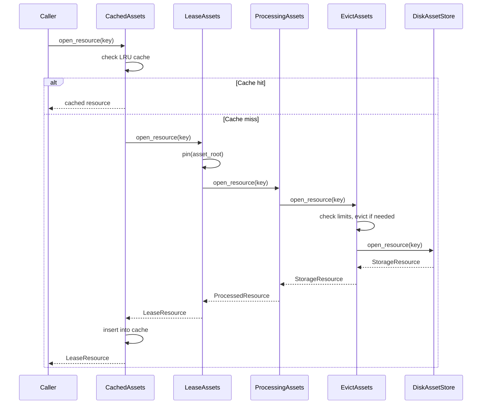

<div align="center">
  
</div>

# kithara-assets

Assets store (disk or in-memory) with lease/pin semantics and LRU eviction. An *asset* is a logical unit addressed by `asset_root` containing multiple *resources* addressed by `rel_path`. All resources use the unified `StorageResource` from `kithara-storage`. `AssetStore` provides file-backed (mmap) storage; `MemAssetStore` / `MemStore` provide ephemeral in-memory storage.

## Usage

```rust
use kithara_assets::{AssetStoreBuilder, ResourceKey};

let store = AssetStoreBuilder::new()
    .root_dir(cache_dir)
    .asset_root("asset123")
    .cancel(cancel.clone())
    .build();
let key = ResourceKey::new("asset123", "segments/001.m4s");
let resource = store.open_resource(&key)?;
```

## Decorator Chain

Requests flow through four layers (outermost to innermost):

| Layer | Responsibility |
|-------|---------------|
| `CachedAssets` | In-memory LRU cache (default 5 entries); prevents duplicate mmap opens |
| `LeaseAssets` | RAII-based pinning; `LeaseGuard` unpins on drop; prevents eviction of in-use assets |
| `ProcessingAssets` | Optional chunk-based transformation on `commit()` (e.g., AES-128-CBC decryption) |
| `EvictAssets` | LRU eviction by asset count and/or byte size; pinned assets excluded |
| `DiskAssetStore` | Base disk I/O; maps `ResourceKey` to filesystem paths |



## Index Persistence

Three index types are persisted under `_index/` for crash recovery:

| Index | File | Purpose |
|-------|------|---------|
| Pins | `_index/pins.bin` | Persists pinned asset roots |
| LRU | `_index/lru.bin` | Monotonic clock + byte accounting for eviction |
| Coverage | `_index/cov.bin` | Per-segment byte-range coverage for partial downloads |

All indices use bincode serialization with `Atomic<R>` for crash-safe writes.

## Integration

Sits between `kithara-storage` (low-level I/O) and protocol crates (`kithara-file`, `kithara-hls`). Provides `AssetStore` type alias composing decorators: `LeaseAssets<CachedAssets<ProcessingAssets<EvictAssets<DiskAssetStore>>>>`. Also provides `MemAssetStore` / `MemStore` for ephemeral in-memory usage.
