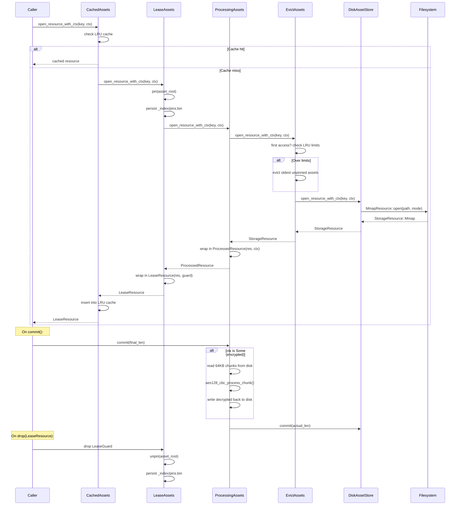

<div align="center">
  
</div>

<div align="center">

[](https://crates.io/crates/kithara-assets)
[](https://crates.io/crates/kithara-assets)
[](https://docs.rs/kithara-assets)
[](../../LICENSE-MIT)

</div>

# kithara-assets

Assets store (disk or in-memory) with lease/pin semantics and LRU eviction. An *asset* is a logical unit addressed by `asset_root` containing multiple *resources* addressed by `rel_path`. All resources use the unified `StorageResource` from `kithara-storage`. `AssetStore` provides file-backed (mmap) storage; `MemAssetStore` / `MemStore` provide ephemeral in-memory storage.

## Usage

```rust
use kithara_assets::{AssetStoreBuilder, ResourceKey};

let store = AssetStoreBuilder::new()
    .root_dir(cache_dir)
    .asset_root("asset123")
    .cancel(cancel.clone())
    .build();
let key = ResourceKey::new("asset123", "segments/001.m4s");
let resource = store.open_resource(&key)?;
```

## Decorator Chain

Requests flow through four layers (outermost to innermost):

<table>
<tr><th>Layer</th><th>Responsibility</th></tr>
<tr><td><code>CachedAssets</code></td><td>In-memory LRU cache (default 5 entries); prevents duplicate mmap opens</td></tr>
<tr><td><code>LeaseAssets</code></td><td>RAII-based pinning; <code>LeaseGuard</code> unpins on drop; prevents eviction of in-use assets</td></tr>
<tr><td><code>ProcessingAssets</code></td><td>Optional chunk-based transformation on <code>commit()</code> (e.g., AES-128-CBC decryption)</td></tr>
<tr><td><code>EvictAssets</code></td><td>LRU eviction by asset count and/or byte size; pinned assets excluded</td></tr>
<tr><td><code>DiskAssetStore</code></td><td>Base disk I/O; maps <code>ResourceKey</code> to filesystem paths</td></tr>
</table>



## Index Persistence

Three index types are persisted under `_index/` for crash recovery:

<table>
<tr><th>Index</th><th>File</th><th>Purpose</th></tr>
<tr><td>Pins</td><td><code>_index/pins.bin</code></td><td>Persists pinned asset roots</td></tr>
<tr><td>LRU</td><td><code>_index/lru.bin</code></td><td>Monotonic clock + byte accounting for eviction</td></tr>
<tr><td>Coverage</td><td><code>_index/cov.bin</code></td><td>Per-segment byte-range coverage for partial downloads</td></tr>
</table>

All indices use bincode serialization with `Atomic<R>` for crash-safe writes.

## Integration

Sits between `kithara-storage` (low-level I/O) and protocol crates (`kithara-file`, `kithara-hls`). Provides `AssetStore` type alias composing decorators: `LeaseAssets<CachedAssets<ProcessingAssets<EvictAssets<DiskAssetStore>>>>`. Also provides `MemAssetStore` / `MemStore` for ephemeral in-memory usage.
