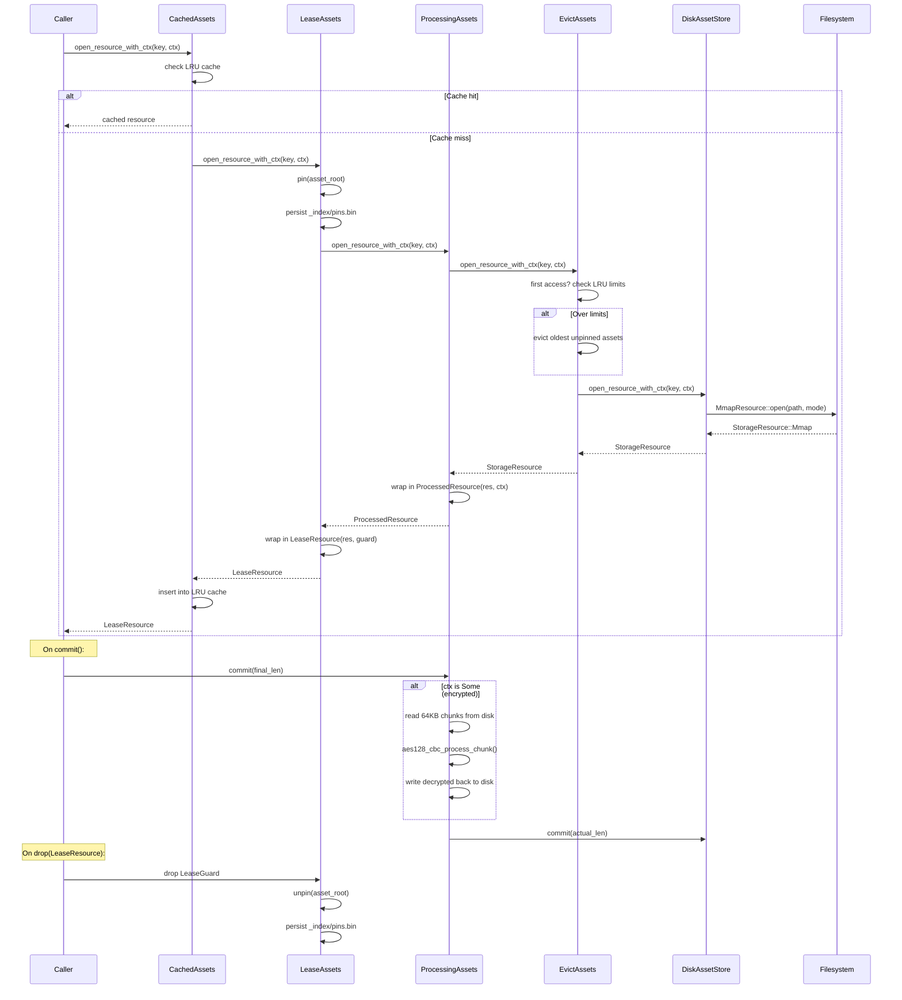

<div align="center">
  
</div>

<div align="center">

[](https://crates.io/crates/kithara-assets)
[](https://docs.rs/kithara-assets)
[](../../LICENSE-MIT)

</div>

# kithara-assets

Assets store (disk or in-memory) with lease/pin semantics and LRU eviction. An *asset* is a logical unit addressed by `asset_root` containing multiple *resources* addressed by `rel_path`. All resources use the unified `StorageResource` from `kithara-storage`. `AssetStore` is a unified wrapper with two backends: file-backed mmap (`Disk`) and ephemeral in-memory storage (`Mem`).

## Usage

```rust
use kithara_assets::{AssetStoreBuilder, ResourceKey};

let store = AssetStoreBuilder::new()
    .root_dir(cache_dir)
    .asset_root(Some("asset123"))
    .cancel(cancel.clone())
    .build();
let key = ResourceKey::new("segments/001.m4s");
let resource = store.open_resource(&key)?;
```

## Public contract

The explicit public contract is the unified `AssetStore` type. Everything else should be considered an implementation detail (even if currently `pub`), and constructors must propagate the shared cancellation token (use `AssetStoreBuilder`).

## Key mapping (normative)

Resources are addressed by strings chosen by higher layers:

- `asset_root`: e.g. `hex(hash(canonical_url))`
- `rel_path`: e.g. `media/audio.mp3`, `segments/0001.m4s`

Disk mapping is `<cache_root>/<asset_root>/<rel_path>`. Assets does not "invent" paths; it only enforces safety (no absolute paths, no `..`, no empty segments).

Auto-pin (lease) semantics: all resources opened through the leasing decorator (`LeaseAssets`) are automatically pinned by `asset_root` for the lifetime of the returned handle. The pin is an RAII guard stored inside `LeaseResource`; drop the handle to release the pin.

The global index (`_index/*`) stores small best-effort metadata files. The filesystem remains the source of truth; indexes may be missing and can be rebuilt later.

## Decorator Chain

Requests flow through five layers (outermost to innermost):

<table>
<tr><th>Layer</th><th>Responsibility</th></tr>
<tr><td><code>CachedAssets</code></td><td>In-memory LRU cache (default 5 entries); prevents duplicate mmap opens</td></tr>
<tr><td><code>LeaseAssets</code></td><td>RAII-based pinning; <code>LeaseGuard</code> unpins on drop; prevents eviction of in-use assets</td></tr>
<tr><td><code>ProcessingAssets</code></td><td>Optional chunk-based transformation on <code>commit()</code> (e.g., AES-128-CBC decryption)</td></tr>
<tr><td><code>EvictAssets</code></td><td>LRU eviction by asset count and/or byte size; pinned assets excluded</td></tr>
<tr><td><code>DiskAssetStore</code> / <code>MemAssetStore</code></td><td>Base storage backend; maps <code>ResourceKey</code> to filesystem paths or in-memory resources</td></tr>
</table>

Decorator behavior is capability-gated by backend. In local-file mode (`asset_root = None` with absolute keys), disk backend disables cache/lease/evict capabilities, so those layers become pass-through.


```mermaid
sequenceDiagram
    participant Caller
    participant Cache as CachedAssets
    participant Lease as LeaseAssets
    participant Proc as ProcessingAssets
    participant Evict as EvictAssets
    participant Disk as DiskAssetStore
    participant FS as Filesystem

    Caller->>Cache: open_resource_with_ctx(key, ctx)
    Cache->>Cache: check LRU cache
    alt Cache hit
        Cache-->>Caller: cached resource
    else Cache miss
        Cache->>Lease: open_resource_with_ctx(key, ctx)
        Lease->>Lease: pin(asset_root)
        Lease->>Lease: persist _index/pins.bin
        Lease->>Proc: open_resource_with_ctx(key, ctx)
        Proc->>Evict: open_resource_with_ctx(key, ctx)
        Evict->>Evict: first access? check LRU limits
        alt Over limits
            Evict->>Evict: evict oldest unpinned assets
        end
        Evict->>Disk: open_resource_with_ctx(key, ctx)
        Disk->>FS: MmapResource::open(path, mode)
        FS-->>Disk: StorageResource::Mmap
        Disk-->>Evict: StorageResource
        Evict-->>Proc: StorageResource
        Proc->>Proc: wrap in ProcessedResource(res, ctx)
        Proc-->>Lease: ProcessedResource
        Lease->>Lease: wrap in LeaseResource(res, guard)
        Lease-->>Cache: LeaseResource
        Cache->>Cache: insert into LRU cache
        Cache-->>Caller: LeaseResource
    end

    Note over Caller: On commit():
    Caller->>Proc: commit(final_len)
    alt ctx is Some (encrypted)
        Proc->>Proc: read 64KB chunks from disk
        Proc->>Proc: aes128_cbc_process_chunk()
        Proc->>Proc: write decrypted back to disk
    end
    Proc->>Disk: commit(actual_len)

    Note over Caller: On drop(LeaseResource):
    Caller->>Lease: drop LeaseGuard
    Lease->>Lease: unpin(asset_root)
    Lease->>Lease: persist _index/pins.bin
```

## Index Persistence

Three index types are persisted under `_index/` for crash recovery:

<table>
<tr><th>Index</th><th>File</th><th>Purpose</th></tr>
<tr><td>Pins</td><td><code>_index/pins.bin</code></td><td>Persists pinned asset roots</td></tr>
<tr><td>LRU</td><td><code>_index/lru.bin</code></td><td>Monotonic clock + byte accounting for eviction</td></tr>
<tr><td>Availability</td><td><code>_index/availability.bin</code></td><td>Per-resource byte ranges and committed final length — the aggregate snapshot of <code>AvailabilityIndex</code> (see below)</td></tr>
</table>

All indices use `postcard` serialization with `Atomic<R>` for crash-safe writes. The availability index is **explicit only** — persisted via `AssetStore::checkpoint()`, never from a `Drop` hook or background timer.

### Pins index

`PinsIndex` is the in-memory + best-effort disk-backed index of pinned `asset_root`s. It is architecturally symmetric to `AvailabilityIndex`: the `Arc` is encapsulated inside the type, `Clone` is a cheap atomic refcount bump, and every mutation that crosses the pinned/unpinned boundary immediately flushes to the optional disk-backed `Atomic` tempfile.

- Each `asset_root` is tracked by a refcount. Concurrent leases on the same root increment it and drops decrement it. The on-disk pinned set only changes (and only flushes) on the 0→1 and 1→0 transitions; intermediate increments/decrements are pure in-memory updates.
- Persistence is lazy: the disk file is materialised only on the first `flush`. A pre-existing on-disk file from a previous run is opened eagerly during `with_persist_at` (native only) for hydration. On wasm32 the index is always ephemeral.
- Three call-sites share a single instance per `cache_dir`: `LeaseAssets` (pin/unpin on resource lifecycle), `EvictAssets` (read pinned set when picking eviction candidates), and `DiskAssetDeleter` (drop pin when an `asset_root` is fully removed).

## Byte Availability — single source of truth

`AssetStore` is the sole authoritative answer to "which bytes of this resource are present?". Callers query it through three read-only methods that are safe to invoke from high-frequency hot paths (e.g. the HLS decoder read loop):

```rust
store.contains_range(&key, 0..4096); // bool — every byte in range
store.available_ranges(&key);        // RangeSet<u64> — full snapshot
store.final_len(&key);               // Option<u64> — committed size
```

Internally these sit on top of an aggregate `AvailabilityIndex` (`DashMap<ResourceKey, Arc<Mutex<Availability>>>`):

- **Updated** by a `ScopedAvailabilityObserver` attached to every `Resource` opened through `DiskAssetStore` / `MemAssetStore`. Each `Resource::write_at` fires `on_write(range)` and each successful `Resource::commit(Some(len))` fires `on_commit(len)`. Opening a pre-existing committed file also seeds `0..final_len`.
- **Queried** with a fast path first (`DashMap::get → Arc::clone → Mutex::lock`, with the shard guard released before the inner lock). A cold miss on `Disk` falls back once to `resource_state` so pre-existing committed files on disk are still discoverable before the observer has ever fired.
- **Persisted** on demand via `AssetStore::checkpoint()` to `_index/availability.bin`. Missing / corrupt / wrong-version files are silently treated as an empty seed on rebuild.

`Resource<D>::CommonState.available` remains the per-resource byte map inside `kithara-storage`, but it is an implementation detail — consumers outside `kithara-storage` must query through `AssetStore`, not through `resource.contains_range()` on an ad-hoc `open_resource` call.

## Processing & readiness gate

`ProcessedResource` wraps a resource and transforms its content on `commit`: it reads raw content in chunks, transforms each chunk via the callback (no allocation), and writes the processed chunks back to disk. `read_at` then returns already-processed data directly from disk. Processing only happens when `ctx` is `Some`; with `ctx = None` (playlists, keys) `commit` just delegates to the inner resource.

`inner.wait_range` reports `Ready` as soon as bytes hit disk via `write_at`, but for an active processor those bytes are still encrypted until `commit` runs `process_and_write`. A reader that saw `wait_range = Ready` and immediately called `read_at` would race the processor and hit `StorageError::NotReadable` (the symptom behind the `local_queue_playlist_behavior_*` post-seek hang under DRM). `ProcessedResource` therefore owns a `ReadinessGate` pairing the `processed` flag with a `Condvar`: `commit` flips the flag and notifies, and `wait_range`/`read_at` block on the gate so callers cannot see "ready bytes" until processing has finished.

## Trait Bridges

- `&Url` → `ResourceKey` (`From`) — derive a unique key from a URL, query-aware
- `&StoreOptions` → `EvictConfig` (`From`) — extract eviction config from store options
- `ResourceStatus` → `AssetResourceState` (`From`) — map storage status to asset state
- `&LruState` ↔ `LruIndexFile` (`From` both ways) — LRU index persistence round-trip
- `DiskStore<Ctx>` / `MemStore<Ctx>` → `AssetStore<Ctx>` (`From`) — wrap a backend into the unified store

## Integration

Sits between `kithara-storage` (low-level I/O) and protocol crates (`kithara-file`, `kithara-hls`). Provides a unified `AssetStore` type (`Disk`/`Mem`) that internally composes decorators: `CachedAssets<LeaseAssets<ProcessingAssets<EvictAssets<...>>>>`.
