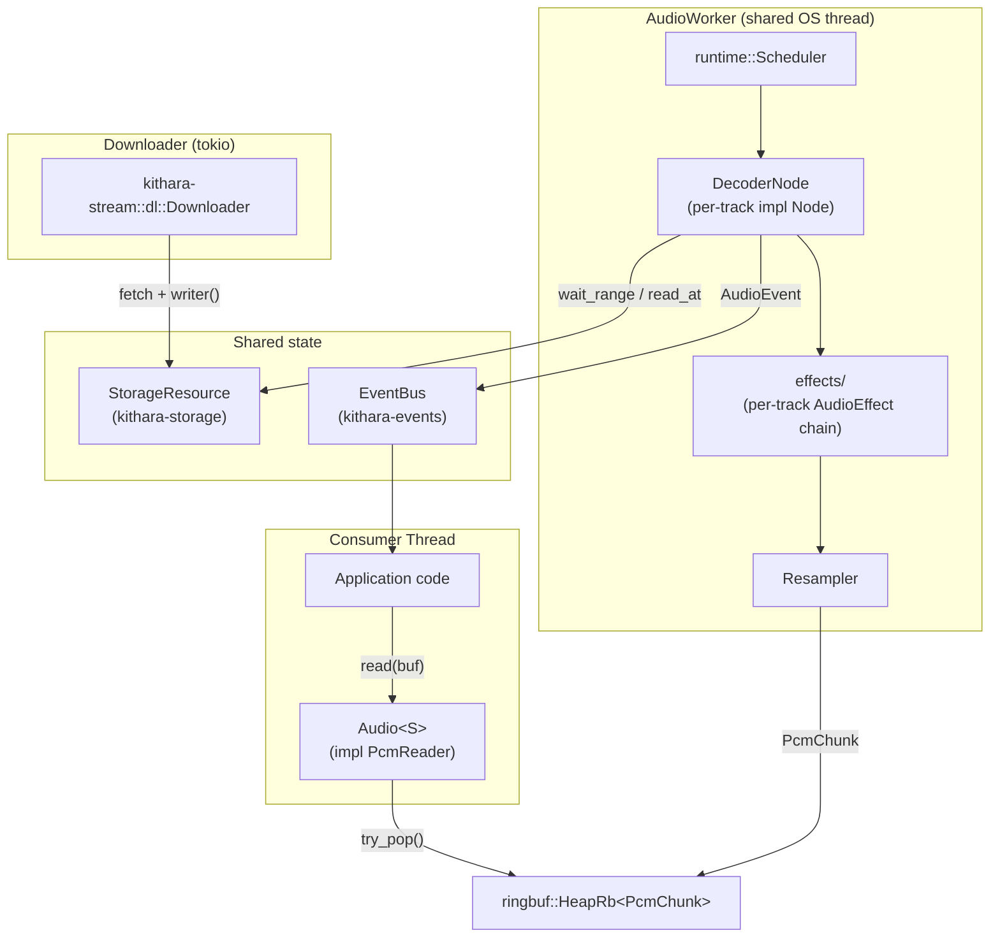
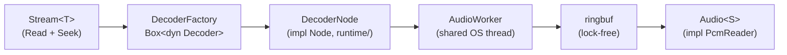

# kithara-audio — Context

Detailed contracts and invariants for the kithara-audio crate; the README is the overview.

## Threading model

- **AudioWorker (shared OS thread)**: an internal priority scheduler in `runtime/` ticks each registered track. Each track is a single `Node` (`DecoderNode`) — effects run as direct operator calls inside the node, not as separate `Node`s with ring buffers between them.
- **Downloader (tokio)**: lives in `kithara-stream::dl`. It owns the HTTP pool and writes bytes directly into the `StorageResource` the `DecoderNode` reads from. The downloader is not spawned by `kithara-audio`.
- **Ring**: a lock-free `ringbuf::HeapRb<PcmChunk>` carries processed PCM from the worker to the consumer; backpressure is enforced by the ring's capacity and an `Outlet` overflow slot.
- **Ring wake**: the producer push and the consumer park form a lock-free wait protocol guarded by a `SeqCst` fence pair (a Dekker StoreLoad barrier) so a just-parked consumer is never missed.
- **Trash ring (spent-chunk return)**: the consumer (`Audio`) runs on the caller's real-time audio thread, so it must never `free`. Returning a `PcmChunk`'s pooled buffer to `kithara-bufpool` can deallocate (shard full, or trim), so the consumer never drops a consumed chunk: it pushes every spent chunk back through a second lock-free ring, and `DecoderNode::drain_trash` drops them on the worker thread on its next tick. The ring is sized `pcm_buffer_chunks + 2` — enough to absorb a seek that drains the whole forward ring at once — so the real-time push is infallible and no buffer is ever freed on the audio thread.
- **Preload gate (`PreloadGate`)**: the one-time startup signal that releases the async consumer's `Resource::preload().await`. The worker is a plain OS thread, not a tokio runtime worker, so it must never run a cross-thread tokio-task `wake()` (that schedules through tokio's inject queue — a lock + futex, real-time-unsafe). The gate is decoupled: the worker only does a lock-free `ready_epoch.store(epoch, Release)` plus `ready.store(true, Release)` via `signal_epoch(epoch)`; the async awaiter (`PreloadGate::wait_for_epoch`) polls with `Acquire` and re-arms its own runtime timer (`POLL_INTERVAL`) while the gate is closed, so the worker never drives the wakeup. `DecoderNode` opens the gate at every preload terminal site — the preload-chunk threshold, EOF, `Failed`, and `on_cancel` — using its producer runtime epoch, and `rearm()`s (re-closes) it in `sync_seek_epoch` so a post-seek wait blocks again until that epoch refills. A stale pre-seek signal must not release a post-seek waiter; a missed signal would stall the consumer before first audio, so all terminal arms must fire it with the epoch they actually produced.
- **Events**: every layer publishes into a unified `EventBus` (`AudioEvent`, `HlsEvent`, `FileEvent`, ABR events).
- **Epoch-based seek invalidation**: each seek bumps an `AtomicU64` epoch; stale chunks tagged with an older epoch are dropped before reaching the ring.
- **`block_on_underrun` thread contract**: with `AudioConfig::block_on_underrun(true)` a `read()` on an empty ring PARKS the calling thread until the worker produces (instead of returning `Pending`). The consumer must therefore live on a thread the async stack does not depend on — an audio callback, a dedicated thread, or `kithara_platform::tokio::task::spawn_blocking`. Calling a parking `read()` on a tokio runtime thread (e.g. directly in a current-thread `#[kithara::test(tokio)]` body) starves the very downloader/peer tasks that feed the ring: under the real clock this degrades fetch dispatch, under `flash` it deadlocks (a woken-but-unpollable task holds `active_async`, freezing the virtual clock).

## Pipeline Architecture

## Track analysis (shared worker)

`analysis/` owns the reusable per-track analysis engine consumed by the demo
app today and by mobile surfaces (kithara-ffi) next:

- **`TrackAnalyzer`** — streaming analyzer fed every decoded chunk once;
  `finish` folds its result into the shared `TrackAnalysis` aggregate
  (`waveform` today; bpm/pitch slots come with their analyzers).
- **`AnalyzerRegistry`** — the set of analyzer factories to run per track.
  Factories take the first chunk's `PcmSpec`, so analyzers can size to the
  source sample rate. Decode once, feed all of them.
- **`analyze_reader`** — the synchronous decode loop over any `PcmReader`:
  cancel-aware, `Pending`-tolerant, `None` on cancel/error/empty input.
  Opening the source stays with the caller (`Resource` lives in
  kithara-play; FFI opens its own reader) so this crate gains no upward
  dependency.
- **`AnalysisWorker`** — a long-lived named thread running `analyze_reader`
  per queued job. Jobs carry caller-owned cancel tokens that must be
  children of the same scope that owns the worker (one cancel hierarchy);
  the caller keeps at most one job in flight and cancels the previous token
  to preempt. Results arrive on a `watch` channel; on failure/cancel the
  sender drops without a value. The job channel is
  `kithara_platform::sync::mpsc`, never `std::sync::mpsc`: the worker is a
  `spawn_named` thread (a flash-visible quiescence participant), so a raw
  `std::sync::mpsc::recv` idle-blocking for the next job would pin the
  engine's `active` slot off the radar and freeze the virtual clock — the
  download feeding the queued reader would never get to run. The platform
  channel's `recv` is an engine-visible condvar wait, so the clock advances
  while the worker idles. Likewise the `Pending` backoff inside
  `analyze_reader` uses `thread::paced_backoff`, not `thread::sleep`, so it
  is paced by the real download instead of free-running the virtual clock.
- **Feature seam, runtime switch**: the `analysis` cargo feature gates only
  the FFT stack (`realfft` + `WaveformAnalyzer`). The analysis API above is
  always compiled; `waveform_analyzer(buckets)` returns `None` without the
  feature, so consumers use one runtime check (empty registry → skip
  scheduling) instead of spreading `#[cfg]` upward.

## Waveform

Pure, synchronous DSP that turns decoded PCM into a `Waveform` for display. No
async, I/O, cancel, or color types live here - `kithara-audio` is math only;
the band -> color mapping and orchestration live in the consumer crates.

- **Types** (`waveform/`): `Bucket { low, mid, high }` are three independent
  per-bucket band heights, each normalized `[0, 1]` on one shared scale. They are
  not a single bar plus a color: the deck paints them as three concentric
  mirrored bars (low behind, high in front, Serato-style overlay) so all three
  bands are visible at once; the tallest band is the outer hull. All-zero is
  silence. `Waveform` is a sealed `Arc<[Bucket]>` with `buckets()` / `len()` /
  `is_empty()` accessors (no bare slice deref).
- **Sealed construction**: a `Waveform` is obtainable only via
  `WaveformAnalyzer::finalize`, so its invariants hold by construction.
- **Normalized-position index** (`bucketize`): buckets are indexed by normalized
  track position `[0, 1]`, never wall-clock seconds. `bucketize` is the single
  home of that `[0, 1]` mapping: bucket `b` folds the raw range
  `[b*R/N, (b+1)*R/N)`. A bucket whose range is empty (tracks shorter than the
  bucket count) is filled with the supplied `empty` value, so the output length
  always equals the requested bucket count.
- **Source-only invariant**: analysis runs on the decoded SOURCE signal, never
  the post-EQ / post-timestretch / post-resample output. The waveform is the
  track's identity; playback-rate and mixer transforms remap only the time axis
  and never re-run analysis.
- **PCM <-> frequency boundary**: `WaveformAnalyzer::new` takes the track
  `sample_rate` because band crossovers map to FFT bins via
  `bin_hz = sample_rate / fft_size`. Constant sample rate per track is assumed;
  build the analyzer once the first chunk's `PcmSpec` is known.
- **Silence rule**: a silent bucket is `Bucket::default()` (all-zero), renders as
  nothing, and never produces `NaN`.
- **Reduction**: per FFT window, band energy is summed into low/mid/high
  (DC bin zeroed; windows below `energy_floor` RMS contribute nothing) and each
  band is divided by its bin count, i.e. an energy DENSITY (RMS-like). Without
  that, the wide mid/high bands outweigh the narrow low band by sheer bin count
  and mid becomes the hull; the density form lets bass be the hull as it should.
  Windows overlap, hopped by `fft_size / 4` (75% Hann overlap), so the spectral
  series is not coarser than the bucket count and a normal-length track is covered
  end to end; only genuinely short tracks fall back to a single zero-padded window.
  `finalize` keeps each bucket's loudest window (component-wise max), takes
  `sqrt` to magnitude, applies the per-band perceptual `band_gain`, then divides
  all three by one shared global max. Shared (not per-band) normalization keeps
  the loudness tilt - bass stays the dominant hull and quiet stays quiet - while
  `band_gain` lifts mid/high, which music tilts toward silence, into visibility
  without inverting the hierarchy. Tunables (`fft_size`, crossovers,
  `energy_floor`, `band_gain`) live in `AnalysisParams`.

## Blob codec

Analysis artifacts that persist to the on-disk cache (`Waveform`, `BeatGrid`)
share one versioned little-endian encoding via the internal crate-level `blob`
module (domain-agnostic, not waveform-specific). The `Blob` trait owns the
format frame; each artifact only implements its body.

- **Frame**: `Vec::<u8>::from(&artifact)` writes a `u32` version header
  (`Blob::VERSION`) then the artifact body; `Artifact::try_from(&[u8])` checks
  the version, decodes the body, and requires the cursor to consume the blob
  exactly (trailing bytes are corruption).
- **Versioning**: each artifact owns its `VERSION` constant. A mismatch is a
  typed `BlobError::Version`; a truncated, mis-sized, or out-of-range body is
  `BlobError::Corrupt`. Both are cache misses — the caller re-analyses and
  overwrites. There is no in-place migration of old blobs.
- **Boundary**: `BlobError` is the only piece that crosses the crate boundary
  (it is the public `TryFrom<&[u8]>` error). `Blob`, `Reader`, and `Writer` are
  crate-internal; consumers serialize through the artifacts' `From<&Self> for
  Vec<u8>` / `TryFrom<&[u8]>` impls. The composite track-analysis blob (version +
  config fingerprint + per-artifact sections) is a separate app-layer concern
  owned by `kithara-app`, not this codec.

## Resampler Quality Levels

<table>
<tr><th>Quality</th><th>Algorithm</th><th>Use Case</th></tr>
<tr><td>Fast</td><td>Polynomial (cubic)</td><td>Low-power, previews</td></tr>
<tr><td>Normal</td><td>64-tap sinc, linear</td><td>Standard playback</td></tr>
<tr><td>Good</td><td>128-tap sinc, linear</td><td>Better quality</td></tr>
<tr><td>High (default)</td><td>256-tap sinc, cubic</td><td>Recommended for music</td></tr>
<tr><td>Maximum</td><td>FFT-based</td><td>Offline / high-end</td></tr>
</table>

## Time-Stretch (key-lock)

Preserve-pitch tempo lives in the pre-resampler `TimeStretchProcessor` slot.
The whole stretch DSP exists only when a backend is compiled in
(`stretch-signalsmith` / `stretch-bungee`, native targets). `create_effects`
builds one of two chains:

- **resampler-first** (`stretch = None`): no stretch slot; the resampler reads `playback_rate` directly. Used by plain (non-DJ) playback.
- **tempo mode** (`stretch = Some`): a `TimeStretchProcessor` runs *before* the resampler. It is **always present** in tempo mode regardless of key-lock, and reads the live `StretchControls` (`speed` + `region_plan` + gated `keylock`/`backend`) each chunk. Without a compiled-in backend (no-stretch build, wasm) no slot is added, and the resampler follows the speed atomic directly — same audible behavior as key-lock off.

**Live speed routing — the one seam to know.** `StretchControls` is the single source of truth, shared (`Arc`) between the consumer/UI and this slot. The slot owns the *speed split* and is the sole writer of the resampler's rate atomic (`resampler_rate`, created in `create_effects` and handed to both the slot and the resampler that follows it):

| mode | what the stretch slot does | `resampler_rate` |
|---|---|---|
| key-lock **on** | `set_ratio(1/speed)`, `set_pitch(1.0)` → tempo moves, pitch held | `1.0` |
| key-lock **off** | true pass-through (chunk forwarded untouched) | `speed` (resampler shifts pitch, vinyl-style) |

Both effects run sequentially on the same worker thread, so the resampler always reads the value written for the current chunk — no cross-thread race, no control-thread mirror. Because the controls are read each chunk, **key-lock, backend, and speed all apply live, mid-track, with no reload.** A live key-lock or backend change discards the FFT backend's internal buffer (`reset`/rebuild), so expect a brief transient (~100–300 ms) at the switch; steady-state key-lock-off audio is byte-identical to the resampler-first chain (the slot never touches the buffer while bypassing).

**Backend seam.** `kithara-stretch` is the optional DSP backend crate. It owns `StretchBackend`, `StretchBackendError`, `StretchKind`, `StretchOptions`, `build_backend`, and the backend adapters behind `stretch-signalsmith` / `stretch-bungee`; `kithara-audio` only enables that dependency through its matching stretch features. `TimeStretchProcessor` owns one `Box<dyn StretchBackend>` selected from `controls.backend()` and rebuilt in place on a live backend swap (or a source-spec change); the trait is DSP-only (interleaved `process`/`flush`/`set_ratio`/`set_pitch`/`max_output_samples`/`reset`) so all `PcmChunk`/pool/timeline plumbing lives in kithara-audio and each library is a small adapter. `set_ratio` is the time factor (`output/input`, >1 = slower); `set_pitch` is independent (1.0 = pitch locked) — that decoupling is what makes key-lock real. Backends select statically via `StretchKind` + `cfg`:

- `signalsmith-stretch` (C++ FFI) — native-only, feature `stretch-signalsmith`.
- `bungee` (C++ FFI) — native-only, feature `stretch-bungee`.

`StretchKind::all()` lists exactly the backends compiled into the current target (the default is `all()[0]`, discriminants are stable: 1 = Signalsmith, 2 = Bungee), so the UI selector never offers an absent one — selecting an uncompiled backend is un-representable, not a runtime error. With no `stretch-*` feature the optional `kithara-stretch` dependency is not linked and the kind/backend/processor re-exports are compiled out; `StretchControls` still exposes speed and optional region-plan storage.

**Region plan (beat-aligned stretch).** The pure region types (`GridSegment`, `RegionPlan`, `RegionPlanError`, and `ActiveRegion`) live in `kithara-audio::region`; public callers use the unconditional `kithara_audio::{GridSegment, RegionPlan, RegionPlanError}` re-exports. `StretchControls` and `TimeStretchProcessor` stay in kithara-audio: controls optionally carry a `RegionPlan` (`ArcSwapOption`, installed via `set_region_plan`, read each chunk — the same live-swap shape as the other controls), and the processor applies the plan. Plans are sorted, non-overlapping `[start_frame, end_frame)` segments in **source frames** (`PcmMeta.frame_offset` space, never output time), each with a `ratio_correction` (validated at construction with a typed `RegionPlanError`). In key-lock mode the processor maps each chunk's `frame_offset` to its segment (cached cursor, binary search on a miss after seek/swap), splits chunks at segment boundaries, and drives the backend at `1/speed × ratio_correction`. The backend is `flush`ed (tail drained at the old ratio) + `reset` **only** when a boundary actually moves the effective ratio beyond `RATIO_EPS`; equal-ratio boundaries and gaps between segments (correction `1.0`) cost nothing, and live speed moves inside one region glide via `set_ratio` without a reset. An empty or absent plan is exactly the planless path. For region work prefer `signalsmith` (`bungee`'s no-op `flush` drops the tail at every real ratio boundary).

**Timeline.** A stretch changes the output frame *count*, not the rate: each emitted chunk recomputes `meta.frames` but preserves `timestamp`/`end_timestamp`/`spec` verbatim (the resampler's `finalize_resample_chunk` recipe), so the playhead stays in source-track time — a 3-minute track reads `0:00→3:00` even at 50 % tempo. `bungee` has no clean tail drain through its high-level `Stream`, so its `flush` is a no-op (the final ~latency of audio is dropped at EOS rather than padded with stretched silence). If `bungee`'s `Stream::new` ever fails at construction (only on an invalid spec — unreachable for real stereo/mono audio), the backend warns once and then emits silence until the track is reloaded, rather than erroring per chunk.

## Engine load (live cost meter)

The audio worker measures its own processing cost and publishes it to a shared `EngineLoad` (lock-free `portable_atomic::AtomicF32`s — safe on the forbid-blocking produce core, no allocation). Each time `DecoderNode::tick` produces a chunk it times the whole decode→effects step (`source.step_track`: decode + resampler + EQ + time-stretch) with `Instant` and divides by the produced audio duration (`frames / sample_rate`), EWMA-smoothed. `EngineLoadSnapshot` exposes:

- `realtime` — produced audio-seconds per CPU-second (`>1` = faster than realtime); the cost-per-sample metric for comparing stretch backends live.
- `load` — the `busy / audio` fraction (`0.05` = 5%).
- `ms` — wall time per produced chunk (latency of one processing cycle).

One `Arc<EngineLoad>` is created in `PlayerImpl`, threaded through `AudioConfig::engine_load` → `TrackRegistration` into every track's `DecoderNode`, and read back via `PlayerImpl::engine_load()` → `Queue::engine_load()` for the DJ-studio status bar. The atomics double as the EWMA state; the worker thread is the only writer, so the read-blend-store needs no lock. It reflects whichever track is currently producing and is meaningful whenever audio is flowing — independent of key-lock. `realtime == 0` means "no measurement yet" (paused / not started).

## Construction reads (initial decoder)

`Audio::new` builds the initial decoder **exactly once** (`create_initial_decoder` → one `spawn_blocking`), with **no retry loop and no readiness gate**. The construction read goes through the **blocking** off-RT `Stream::read` adapter — `SharedStream` carries a construction-phase `blocking` flag that `Audio::new` arms before the build and disarms before the RT worker is registered, so the decode loop the worker then drives always uses the non-blocking `probe_read`. (This is a staged construction → steady-state ownership transfer of the read mode, never a live toggle.)

The blocking adapter is what makes construction wait — off the RT worker — for the bytes the build reads (the container header in the init segment, spilling into the first packet). A slow-but-arriving prefix waits up to the stream's blocking-read budget and the build then succeeds, instead of erroring on the first not-ready probe (the old `Audio::new -> Interrupted` flake under load); the wait lives in the stream/byte layer (`Stream::read` wakes the peer downloader), not in a retry loop here. A construction-range byte that genuinely never arrives surfaces the **stream layer's** typed terminal (`Stream::read` → source `io::Error` / typed `StreamPending`) verbatim, bounded by the blocking-read budget — the audio layer never mints its own construction error type, and there is no synthetic `TimedOut`.

A `VariantChange`/`SeekPending` at construction is **not** a rebuild trigger: the variant is settled before the build, and construction never calls `clear_variant_fence` (that stays a recreate-path delegate). Construction always probes at offset 0; a concurrent user seek (play-then-seek) is applied by the post-construction seek path. A `VariantChange` genuinely surfacing at construction would be a stream-state bug to fix in the stream layer, not papered over with a loop. Pinned by `tests/tests/kithara_hls/probe_not_ready_at_creation.rs`.

## Format Change Handling

On a fenced cross-codec ABR variant switch, the `DecoderNode` detects the format change via `Source::media_info()` polling and then:

1. Uses the variant fence on the source to prevent cross-variant reads.
2. Seeks to the first segment of the new variant (where init data lives).
3. Recreates the decoder via `DecoderFactory`.
4. Resets the effects chain to avoid audio artifacts.

Known same-codec HLS switches are not decoder format changes. The HLS source retargets byte mapping at the segment boundary and keeps byte-continuity for the existing decoder; the audio layer must not turn a variant-index-only change into a recreate/fence.

### Decoder recreate policy

- Decoder is **not** recreated on every seek.
- Decoder is recreated when a stream format changes (codec/container boundary) or when post-seek decode reports a recoverable format mismatch.
- Recreate path is metadata-first (`MediaInfo`) with native Symphonia probe fallback from a fresh source.
- Decoder recreate always uses seek target anchor/base offset from timeline/source, so new decoder starts from stream timeline truth.
- **Seek-epoch suppression**: `detect_format_change` returns `NoChange` while a seek is pending and the session was installed at that same seek epoch. The decoder is already aligned with the seek's landing variant, so a second cross-variant recreate inside one seek epoch is wasted work and would discard the freshly-built decoder before it emits a sample.
- **Seek anchor ownership**: a `SourceSeekAnchor` byte offset is valid only in the variant byte space that resolved it. `ApplyingSeek` re-resolves the seek when the active ABR variant no longer matches the anchor's `variant_index` before `decoder.seek()` runs; `AwaitingResume` may gate on the anchor offset only while the current ABR variant still matches it. After a manual switch or boundary commit changes the active variant, the old byte offset is discarded. This prevents a stale same-codec seek anchor from holding the worker on bytes that are meaningful only in the previous variant layout.
- **Mid-playback recreate continues from the decode head, not `committed`**: a `FormatBoundary` recreate that fires during sustained playback (a variant switch taking effect at a segment boundary, no pending user seek) does **not** bump the seek epoch and does **not** flush the outlet ring. The producer has already emitted chunks ahead of the consumer's lagging `committed_position`, up to its decode head (`source.rs::decode_head`); re-seeking the rebuilt decoder to `committed` would re-emit the `[committed..decode_head]` range that is still queued in the ring — duplicated content the consumer reads as a backward phase jump (the variant-switch phase-drift seam). `execute_recreation` therefore resumes at the decode head. A pending user seek (`resume_target` for the current epoch) takes precedence only while it has not yet materialized in produced chunks (`target > decode_head`): once the producer has trimmed past the seek target, `[target..decode_head]` is already queued in the ring and resuming at `target` would re-emit it — the same duplicated-content seam, gated on CPU contention (the consumer's `committed` lags behind `target` while the producer is already past it; comparing `target` against `committed` mislabeled exactly that case). The decode head is stored as an exact frame and converted to a seek target with `duration_for_frames`; the demuxer quantizes that landing to a sample, and the rebuilt decoder relabels its first chunk via `frame_offset_for`, which rounds the landing PTS to the nearest frame (consistent with `frames_to_trim`). A floored `frame_offset_for` disagreed with that round by one frame when the landing fell a fraction of a sample below the target, leaving a residual −1-sample label seam (the audio stayed continuous); rounding to nearest closes it.
- **Aligned-fence forced recreate (switch-back-to-current race)**: `HlsCoord::commit_variant_switch` raises the read fence only for decoder-recreate switches and publishes the fence's **target variant** (`VariantControl::variant_change_target`) before the generation bump. When the fence targets the variant the session already labels itself with (a seek recreate landed on the switch target before the commit raised the fence — typical for a manual switch back to the variant a racing seek just anchored to), no format diff will ever become observable, and the fence blocks the very reads that drive the seek/recreate paths that clear fences — without intervention the producer would recheck `NoChange` forever and the consumer starves into the watchdog (the pre-recheck code killed the producer with `InvalidData` in the same state). `handle_variant_change` therefore detects this shape (fence target == session variant == published `media_info` variant, no pending seek, init range resolvable) and forces the `FormatBoundary` recreate instead of bare-acking the fence: the session label can lie about the demuxer's actual bitstream (a stale seek anchor stamps the pre-commit variant), so the recreate re-primes the demuxer on the active variant's real bytes, clears the fence inside `apply_format_change`, and resumes from the decode head. A transient pre-publish observation (fence bumped before `abr.apply_decision`) fails the published-`media_info` check and falls through to the bounded recheck.

### Recreate readiness gating

What *kind* of bytes gate a decoder recreate is not guessed by the gate: `recreate_input` (`source.rs`) asks `DecoderFactory::input_requirement` for the demuxer's input contract (kithara-decode `README.md` "Decoder input contract"). The contract names the input **shape**; this layer resolves it to a virtual byte range in `recreate_ready_range`, shared by the gate (`source_ready_for_recreate`) and the wait path (`wait_for_source_on_recreate`) so the two never disagree — a mismatch livelocks the worker (the HE-AAC v2 variant-switch hang). The demuxer cannot name the *virtual* range itself, because only the stream knows the ABR byte shift (`served_from`).

- **`InputRequirement::InitOnly`** (segment-aware fMP4): gate on the init header resolved in virtual byte space (`format_change_segment_range`, `served_from`-aware), falling back to the `[offset..offset + DEFAULT_READ_AHEAD)` read-ahead window when the init is unaddressable or larger than `DEFAULT_READ_AHEAD`. The landing media segment is read by the rebuilt demuxer's first `next_frame`, not gated up front.
- **`InputRequirement::Incremental`** (raw WAV/MP3/FLAC/Ogg): no init to wait for — gate on the read-ahead window directly.

### Playback readiness gating

Steady-state forward decode has the same gate-vs-read contract as recreation: the readiness gate must cover what the decoder actually reads, or the worker hot-spins. `source_is_ready` (the `Track<Decoding>::step` entry gate) clamps its look-ahead window to the **next segment boundary** — it only requires the current segment to be ready before entering `decode_one_step`. But the decoder's container parser reads *across* that boundary into the next segment. When the next segment's body is withheld (slow network), the decoder returns `Pending` while `source_is_ready` still reports `Ready` (the current segment is fully cached). Returning a bare `TrackStep::Blocked(Waiting)` and staying in `Decoding` then re-runs the full `decode_one_step` on every scheduler wake — a busy-spin (`step_track took too long — starving other tracks`), driven hard by the blocking consumer's `recv_outcome_blocking` wake loop (flake F5).

So a `DecodeStep::NotReady` parks in `WaitContext::Playback`, and that wait context's phase (`source_phase_for_wait_context`) gates on `source_phase_forward` — the unclamped `[pos, pos + DEFAULT_READ_AHEAD)` window the decoder reads through, **not** the single-byte `phase()` at `pos`. The worker then re-checks that wider window cheaply on each wake and only re-enters `Decoding` (re-running the decode) once it is ready. Gate (`source_phase_forward`) and the decoder's real read never disagree, so the loop parks instead of spinning.

### Source-readiness parks re-aim the producer

A worker parking on source bytes must *also* nudge the producer (the HLS peer) to fetch them, or the peer — aimed elsewhere after a seek/switch — never schedules them and the park never ends (a recreate parks *before* the decoder exists, so unlike the read paths it never reads to trigger the wake itself). `StreamAudioSource::source_park` is the single helper that turns a not-ready `SourcePhase` into a parked `TrackStep::Blocked`, arming the peer wake on every not-ready source, so **every** readiness gate (recreate, playback, post-seek, apply-seek, seek-request) re-aims the producer by construction. Under **flash** the 10 ms scheduler-poll backstop is virtual and collapses, so a missing re-aim surfaces deterministically; in real time the poll masked it.

### Seek error recovery

A failed `decoder.seek()` routes through one shared recovery path that splits by `DecodeError` variant (not string match):

- **Decoder internal-state corruption** (e.g. Symphonia's moof fragment table holding stale offsets after a variant switch) — fresh decoder state resolves this, so recreate is the right cure. This is the default class for any error that is not a typed out-of-range.
- **Caller-side invalid target** (`DecodeError::SeekOutOfRange`: seek past EOF, or a target timestamp outside the stream's known duration) — recreate cannot fix this, since a freshly built decoder has the same `duration()` and rejects the same target. Retrying loops forever (the "перемотка не работает" prod bug), so these route directly to `fail_seek` with no recreate and no retry.

Init-bearing containers (fMP4/MP4/WAV/MKV/CAF) must recreate at the source's init segment range; a mid-segment recreate would land on bytes with no ftyp/RIFF/EBML header and the factory would fail silently. Mid-stream-decodable containers (MPEG-ES/ADTS/FLAC/Ogg/MPEG-TS) and unknown containers recreate at the offset directly. The recovery path also calls `fail_seek` on missing `MediaInfo` or when an init-bearing container has no available init range.

## Epoch-Based Seek

On seek, epoch is incremented atomically. The worker tags each decoded chunk with the current epoch. The consumer discards stale chunks (old epoch), preventing leftover data from reaching output after a seek.

There are two distinct epoch atomics: the **timeline** seek epoch, bumped by the consumer the instant it requests a seek (`Audio::seek` → `Timeline::initiate_seek`), and the **producer's decode epoch** (`StreamAudioSource::epoch`), advanced only when the worker actually *applies* a seek. The decode epoch therefore lags the timeline epoch across the window where a seek has been requested but not yet applied. Decoded chunks are tagged with the decode epoch, and terminal markers (EOF / failure) **must** be tagged the same way — via `AudioWorkerSource::decode_epoch()`, not the live `timeline().seek_epoch()`. A near-end seek can drive the decoder to a genuine EOF in the same window where a newer seek has already bumped the timeline epoch; stamping the marker with the live timeline epoch would make the stale end-of-stream pass the consumer's validator and surface as a false `ReadOutcome::Eof` for the newer (in-range) seek. Tagging with the decode epoch lets the validator discard it. This race only manifests under CPU starvation (the seek-bump and the EOF-stamp interleave), so its regression guard tags the marker through a mocked `decode_epoch` that differs from the timeline epoch.

## Agent guardrails

- **Node Architecture**: A track is represented by a single `Node` implementation (`DecoderNode`), stored in the shared scheduler as `Box<dyn Node>` through `runtime/`.
- **Operators vs Nodes**: Audio effects are implemented as operators (`AudioEffect`) that are called directly within the track's `Node`. We do not use separate `Node`s or ring buffers between effects.
- **Chain order**: The effect chain is `[..pre, Resampler, ..custom]`. With `AudioConfig::stretch` set (tempo mode), a source-domain `TimeStretchProcessor` occupies the `pre` slot before the host resampler and drives the resampler's rate atomic (`1.0` when key-locked, else `speed`). Without it, the chain is resampler-first and `playback_rate` drives the resampler "vinyl" speed+pitch path.
- **EOF drain**: At true EOF `StreamAudioSource` drains the effect chain incrementally, one emitted chunk per FSM step: each stage is flushed to exhaustion only after the upstream stage's outputs pass through it, so a buffering effect's multi-pull tail is never truncated and the producer core does not allocate a drain queue. `EndOfStream` fires once on completion, not at source exhaustion.

### Coordinate spaces

The whole pipeline runs in one space: **decoder/song time** (`PcmMeta.timestamp` / `end_timestamp` / `frame_offset`, `Timeline`, `total_duration`, the seek target, the UI playhead). A duration-changing `AudioEffect` (resampler "vinyl" today, preserve-pitch time-stretch later) changes frame counts but is the sole timeline authority: it restamps only `spec`+`frames` and carries the consumed input's song-time meta forward (`ResamplerProcessor::last_input_meta` pattern). The consumer keeps reading `end_timestamp` for position, so no translation layer and no parallel frame counter exist (single source of truth). Reporting perceived/elapsed output time instead would need an explicit translation owner; it is deliberately deferred until a real stretch backend lands.
- **Buffers**: If a backpressure boundary or rate-matching is needed (e.g. between the worker and the audio callback), a separate buffer `Node` should be introduced explicitly.
- **Push with Backpressure**: Producer nodes call `Outlet::try_push` directly. The outlet has a built-in single-slot overflow that absorbs one backpressure miss per tick, so a producer that emits at most one chunk per tick treats `try_push` as infallible. Each tick begins with `Outlet::flush()` to forward the parked item to the ring once the consumer drains it; if the ring is still full the node returns `TickResult::Waiting`. Under normal operation, the source's FSM is ticked every pass. However, if the outlet is completely saturated (both the ring buffer and the overflow slot are full), the node will return `Waiting` immediately without ticking the FSM. This provides strict backpressure, pausing all internal state transitions (including seeks) until the consumer drains the ring.
- **Cancellation**: Do not use `CancelToken` inside `Node` implementations. Cancellation is handled centrally by calling `worker.unregister_track(...)`, which triggers the scheduler to call `Node::on_cancel()`.
- **Track lifecycle**: A `Node` returns `TickResult::Done` only when truly terminal (e.g. `TrackStep::Failed`). EOF is *not* terminal — the track stays alive so a subsequent seek can re-arm it; idle ticks just return `TickResult::Waiting`.
- `kithara-audio` owns decoder lifecycle, seek or session state, effects reset timing, and stale chunk invalidation.
- Prefer explicit FSM or session objects for multi-step control flow. Avoid scattering new `pending_*` or shadow flags across worker, source, and consumer layers.
- Audio should consume source contracts, not reconstruct HLS or file policy from protocol-specific heuristics.
