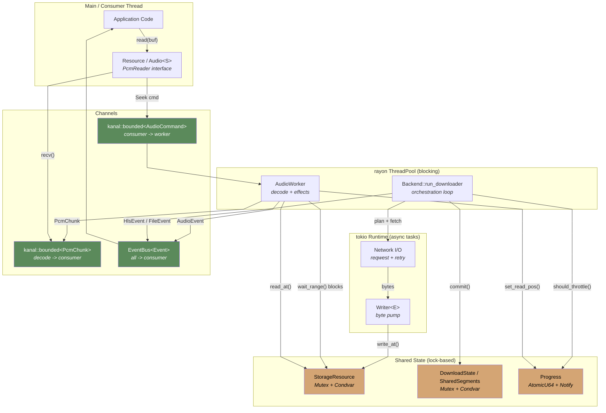
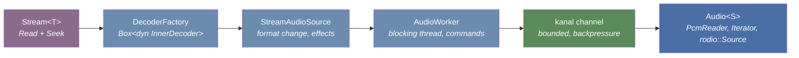

<div align="center">
  
</div>

<div align="center">

[](https://crates.io/crates/kithara-audio)
[](https://crates.io/crates/kithara-audio)
[](https://docs.rs/kithara-audio)
[](../../LICENSE-MIT)

</div>

# kithara-audio

Audio pipeline with decoding, effects chain, and sample rate conversion. Runs a dedicated OS thread for blocking decode/process work and bridges it to the caller via `kanal` channels. Provides `Audio<S>` as the main entry point and `AudioSyncReader` (behind `rodio` feature) for rodio integration.

## Usage

```rust
use kithara_audio::{Audio, AudioConfig, ResamplerQuality};
use kithara_hls::{Hls, HlsConfig};
use kithara_stream::Stream;

let config = AudioConfig::<Hls>::new(hls_config)
    .with_host_sample_rate(sample_rate)
    .with_resampler_quality(ResamplerQuality::High);
let mut audio = Audio::<Stream<Hls>>::new(config).await?;

// Read interleaved PCM
let mut buf = [0.0f32; 1024];
while !audio.is_eof() {
    let n = audio.read(&mut buf);
    play(&buf[..n]);
}
```

## Threading model



- **OS thread** (`kithara-audio`): runs `run_audio_loop` -- drains seek commands, calls `Decoder::next_chunk`, applies effects (resampler), sends processed chunks through a bounded `kanal` channel with backpressure.
- **tokio task**: publishes events (ABR switch, progress, decode) to a unified `EventBus`.
- **Epoch-based invalidation**: after seek, stale in-flight chunks are filtered by epoch counter (`Arc<AtomicU64>`).

## Pipeline Architecture



## Resampler Quality Levels

<table>
<tr><th>Quality</th><th>Algorithm</th><th>Use Case</th></tr>
<tr><td>Fast</td><td>Polynomial (cubic)</td><td>Low-power, previews</td></tr>
<tr><td>Normal</td><td>64-tap sinc, linear</td><td>Standard playback</td></tr>
<tr><td>Good</td><td>128-tap sinc, linear</td><td>Better quality</td></tr>
<tr><td>High (default)</td><td>256-tap sinc, cubic</td><td>Recommended for music</td></tr>
<tr><td>Maximum</td><td>FFT-based</td><td>Offline / high-end</td></tr>
</table>

## Format Change Handling

On ABR variant switch, `StreamAudioSource` detects the format change via `media_info()` polling, then:

1. Uses the variant fence to prevent cross-variant reads.
2. Seeks to the first segment of the new variant (where init data lives).
3. Recreates the decoder via factory.
4. Resets the effects chain to avoid audio artifacts.

## Epoch-Based Seek

On seek, epoch is incremented atomically. The worker tags each decoded chunk with the current epoch. The consumer discards stale chunks (old epoch), preventing leftover data from reaching output after a seek.

## Integration

Sits between `kithara-decode` (synchronous Symphonia wrapper) and the consumer (rodio, cpal, custom). Depends on `kithara-stream` for `Stream<T>` and `kithara-bufpool` for zero-allocation PCM buffers.
