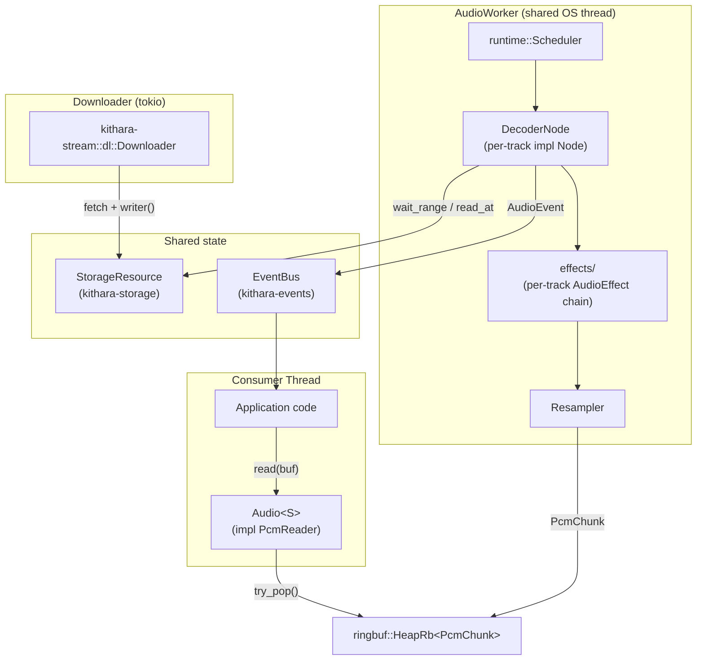
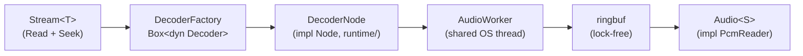

<div align="center">
  
</div>

<div align="center">

[](../../LICENSE-MIT)

</div>

# kithara-audio

Audio pipeline with decoding, effects chain, and sample rate conversion. Runs a shared OS thread (`AudioWorker`) for blocking decode/process work and bridges it to the caller via `ringbuf` lock-free ring buffers. `Audio<S>` is the main entry point; multiple tracks share one worker thread via `AudioWorkerHandle`.

## Usage

```rust
use kithara_audio::{Audio, AudioConfig, ResamplerQuality};
use kithara_decode::GaplessMode;
use kithara_hls::{Hls, HlsConfig};
use kithara_stream::Stream;

let audio_config = AudioConfig::<Hls>::builder()
    .stream_config(hls_config)
    .host_sample_rate(sample_rate)
    .resampler_quality(ResamplerQuality::High)
    .gapless_mode(GaplessMode::CodecPriming)
    .build();

let mut audio = Audio::<Stream<Hls>>::new(audio_config).await?;
```

`AudioConfig` is a [`bon`](https://crates.io/crates/bon) builder; the fields shown above are the most common knobs. The exact builder method names match the field names on `AudioConfig`.

## Threading model


```mermaid
flowchart TB
    subgraph "Consumer Thread"
        App["Application code"]
        AS["Audio&lt;S&gt;<br/>(impl PcmReader)"]
        App -- "read(buf)" --> AS
    end

    subgraph "AudioWorker (shared OS thread)"
        Sched["runtime::Scheduler"]
        DN["DecoderNode<br/>(per-track impl Node)"]
        Resampler
        Effects["effects/<br/>(per-track AudioEffect chain)"]
        Sched --> DN --> Effects --> Resampler
    end

    subgraph "Downloader (tokio)"
        DL["kithara-stream::dl::Downloader"]
    end

    subgraph "Shared state"
        SR["StorageResource<br/>(kithara-storage)"]
        Bus["EventBus<br/>(kithara-events)"]
    end

    DL -- "fetch + writer()" --> SR
    DN -- "wait_range / read_at" --> SR
    Resampler -- "PcmChunk" --> Ring["ringbuf::HeapRb&lt;PcmChunk&gt;"]
    AS -- "try_pop()" --> Ring
    DN -- "AudioEvent" --> Bus
    Bus --> App
```

- **AudioWorker (shared OS thread)**: an internal priority scheduler in `runtime/` ticks each registered track. Each track is a single `Node` (`DecoderNode`) — effects run as direct operator calls inside the node, not as separate `Node`s with ring buffers between them.
- **Downloader (tokio)**: lives in `kithara-stream::dl`. It owns the HTTP pool and writes bytes directly into the `StorageResource` the `DecoderNode` reads from. The downloader is not spawned by `kithara-audio`.
- **Ring**: a lock-free `ringbuf::HeapRb<PcmChunk>` carries processed PCM from the worker to the consumer; backpressure is enforced by the ring's capacity and an `Outlet` overflow slot.
- **Trash ring (spent-chunk return)**: the consumer (`Audio`) runs on the caller's real-time audio thread, so it must never `free`. Returning a `PcmChunk`'s pooled buffer to `kithara-bufpool` can deallocate (shard full, or trim), so the consumer never drops a consumed chunk: it pushes every spent chunk back through a second lock-free ring, and `DecoderNode::drain_trash` drops them on the worker thread on its next tick. The ring is sized `pcm_buffer_chunks + 2` — enough to absorb a seek that drains the whole forward ring at once — so the real-time push is infallible and no buffer is ever freed on the audio thread.
- **Events**: every layer publishes into a unified `EventBus` (`AudioEvent`, `HlsEvent`, `FileEvent`, ABR events).
- **Epoch-based seek invalidation**: each seek bumps an `AtomicU64` epoch; stale chunks tagged with an older epoch are dropped before reaching the ring.

## Pipeline Architecture


```mermaid
flowchart LR
    ST["Stream&lt;T&gt;<br/>(Read + Seek)"]
    DF["DecoderFactory<br/>Box&lt;dyn Decoder&gt;"]
    Node["DecoderNode<br/>(impl Node, runtime/)"]
    AW["AudioWorker<br/>(shared OS thread)"]
    Ring["ringbuf<br/>(lock-free)"]
    A["Audio&lt;S&gt;<br/>(impl PcmReader)"]

    ST --> DF --> Node --> AW --> Ring --> A
```

## Resampler Quality Levels

<table>
<tr><th>Quality</th><th>Algorithm</th><th>Use Case</th></tr>
<tr><td>Fast</td><td>Polynomial (cubic)</td><td>Low-power, previews</td></tr>
<tr><td>Normal</td><td>64-tap sinc, linear</td><td>Standard playback</td></tr>
<tr><td>Good</td><td>128-tap sinc, linear</td><td>Better quality</td></tr>
<tr><td>High (default)</td><td>256-tap sinc, cubic</td><td>Recommended for music</td></tr>
<tr><td>Maximum</td><td>FFT-based</td><td>Offline / high-end</td></tr>
</table>

## Format Change Handling

On an ABR variant switch, the `DecoderNode` detects the format change via `Source::media_info()` polling and then:

1. Uses the variant fence on the source to prevent cross-variant reads.
2. Seeks to the first segment of the new variant (where init data lives).
3. Recreates the decoder via `DecoderFactory`.
4. Resets the effects chain to avoid audio artifacts.

### Decoder recreate policy

- Decoder is **not** recreated on every seek.
- Decoder is recreated when a stream format changes (codec/container boundary) or when post-seek decode reports a recoverable format mismatch.
- Recreate path is metadata-first (`MediaInfo`) with native Symphonia probe fallback from a fresh source.
- Decoder recreate always uses seek target anchor/base offset from timeline/source, so new decoder starts from stream timeline truth.

## Epoch-Based Seek

On seek, epoch is incremented atomically. The worker tags each decoded chunk with the current epoch. The consumer discards stale chunks (old epoch), preventing leftover data from reaching output after a seek.

## Agent guardrails

- **Node Architecture**: A track is represented by a single `Node` implementation (`DecoderNode`), stored in the shared scheduler as `Box<dyn Node>` through `runtime/`.
- **Operators vs Nodes**: Audio effects are implemented as operators (`AudioEffect`) that are called directly within the track's `Node`. We do not use separate `Node`s or ring buffers between effects.
- **Buffers**: If a backpressure boundary or rate-matching is needed (e.g. between the worker and the audio callback), a separate buffer `Node` should be introduced explicitly.
- **Push with Backpressure**: Producer nodes call `Outlet::try_push` directly. The outlet has a built-in single-slot overflow that absorbs one backpressure miss per tick, so a producer that emits at most one chunk per tick treats `try_push` as infallible. Each tick begins with `Outlet::flush()` to forward the parked item to the ring once the consumer drains it; if the ring is still full the node returns `TickResult::Waiting`. Under normal operation, the source's FSM is ticked every pass. However, if the outlet is completely saturated (both the ring buffer and the overflow slot are full), the node will return `Waiting` immediately without ticking the FSM. This provides strict backpressure, pausing all internal state transitions (including seeks) until the consumer drains the ring.
- **Cancellation**: Do not use `CancellationToken` inside `Node` implementations. Cancellation is handled centrally by calling `worker.unregister_track(...)`, which triggers the scheduler to call `Node::on_cancel()`.
- **Track lifecycle**: A `Node` returns `TickResult::Done` only when truly terminal (e.g. `TrackStep::Failed`). EOF is *not* terminal — the track stays alive so a subsequent seek can re-arm it; idle ticks just return `TickResult::Waiting`.
- `kithara-audio` owns decoder lifecycle, seek or session state, effects reset timing, and stale chunk invalidation.
- Prefer explicit FSM or session objects for multi-step control flow. Avoid scattering new `pending_*` or shadow flags across worker, source, and consumer layers.
- Audio should consume source contracts, not reconstruct HLS or file policy from protocol-specific heuristics.

## Features

<table>
<tr><th>Feature</th><th>Default</th><th>Effect</th></tr>
<tr><td><code>symphonia</code></td><td>yes</td><td>Symphonia software decoder path via <code>kithara-decode/symphonia</code></td></tr>
<tr><td><code>apple</code></td><td>no</td><td>Apple AudioToolbox hardware decoder via <code>kithara-decode/apple</code></td></tr>
<tr><td><code>android</code></td><td>no</td><td>Android <code>MediaExtractor</code>/<code>MediaCodec</code> via <code>kithara-decode/android</code></td></tr>
<tr><td><code>probe</code></td><td>no</td><td>USDT probes for tracing</td></tr>
<tr><td><code>mock</code></td><td>no</td><td><code>unimock</code> mocks of public traits</td></tr>
<tr><td><code>perf</code></td><td>no</td><td>Hotpath instrumentation</td></tr>
<tr><td><code>memprof</code></td><td>no</td><td>Allocation tracking via <code>hotpath/hotpath-alloc</code></td></tr>
</table>

## Integration

Sits between `kithara-decode` and the consumer (`cpal` via Firewheel inside `kithara-play`, or custom PCM readers). Depends on `kithara-stream` for `Stream<T>` and `Source`, `kithara-bufpool` for zero-allocation PCM buffers, `kithara-decode` for the decoder factory, `kithara-events` for the `EventBus`, and `kithara-platform` for cross-platform sync types.
