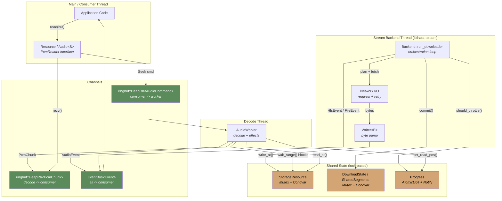
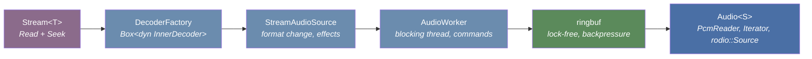

<div align="center">
  
</div>

<div align="center">

[](https://crates.io/crates/kithara-audio)
[](https://crates.io/crates/kithara-audio)
[](https://docs.rs/kithara-audio)
[](../../LICENSE-MIT)

</div>

# kithara-audio

Audio pipeline with decoding, effects chain, and sample rate conversion. Runs a dedicated OS thread for blocking decode/process work and bridges it to the caller via `ringbuf` lock-free ring buffers. Provides `Audio<S>` as the main entry point; with `rodio` feature enabled, `Audio<S>` implements `rodio::Source` directly.

## Usage

```rust
use kithara_audio::{Audio, AudioConfig, ResamplerQuality};
use kithara_hls::{Hls, HlsConfig};
use kithara_stream::Stream;

let config = AudioConfig::<Hls>::new(hls_config)
    .with_host_sample_rate(sample_rate)
    .with_resampler_quality(ResamplerQuality::High);
let mut audio = Audio::<Stream<Hls>>::new(config).await?;

// Read interleaved PCM
let mut buf = [0.0f32; 1024];
while !audio.is_eof() {
    let n = audio.read(&mut buf);
    play(&buf[..n]);
}
```

## Threading model


```mermaid
%%{init: {"flowchart": {"curve": "linear"}} }%%
flowchart TB
    subgraph "Main / Consumer Thread"
        App["Application Code"]
        Resource["Resource / Audio&lt;S&gt;<br/><i>PcmReader interface</i>"]
        App -- "read(buf)" --> Resource
    end

    subgraph "Stream Backend Thread (kithara-stream)"
        DLLoop["Backend::run_downloader<br/><i>orchestration loop</i>"]
        NetTask["Network I/O<br/><i>reqwest + retry</i>"]
        WriterTask["Writer&lt;E&gt;<br/><i>byte pump</i>"]
        DLLoop -- "plan + fetch" --> NetTask
        NetTask -- "bytes" --> WriterTask
    end

    subgraph "Decode Thread"
        DecodeWorker["AudioWorker<br/><i>decode + effects</i>"]
    end

    subgraph "Shared State (lock-based)"
        StorageRes["StorageResource<br/><i>Mutex + Condvar</i>"]
        SegIdx["DownloadState / SharedSegments<br/><i>Mutex + Condvar</i>"]
        Progress["Progress<br/><i>AtomicU64 + Notify</i>"]
    end

    subgraph "Channels"
        PcmChan["ringbuf::HeapRb&lt;PcmChunk&gt;<br/><i>decode -> consumer</i>"]
        CmdChan["ringbuf::HeapRb&lt;AudioCommand&gt;<br/><i>consumer -> worker</i>"]
        EventChan["EventBus&lt;Event&gt;<br/><i>all -> consumer</i>"]
    end

    WriterTask -- "write_at()" --> StorageRes
    DLLoop -- "commit()" --> SegIdx

    DecodeWorker -- "wait_range() blocks" --> StorageRes
    DecodeWorker -- "read_at()" --> StorageRes
    DecodeWorker -- "PcmChunk" --> PcmChan
    Resource -- "recv()" --> PcmChan

    Resource -- "Seek cmd" --> CmdChan
    CmdChan --> DecodeWorker

    DecodeWorker -- "AudioEvent" --> EventChan
    DLLoop -- "HlsEvent / FileEvent" --> EventChan
    EventChan --> App

    DLLoop -- "should_throttle()" --> Progress
    DecodeWorker -- "set_read_pos()" --> Progress

    style StorageRes fill:#d4a574,color:#000
    style SegIdx fill:#d4a574,color:#000
    style Progress fill:#d4a574,color:#000
    style PcmChan fill:#5b8a5b,color:#fff
    style CmdChan fill:#5b8a5b,color:#fff
    style EventChan fill:#5b8a5b,color:#fff
```

- **Stream backend thread** (`kithara-stream`): runs `Backend::run_downloader` via `handle.block_on()` -- async orchestration loop that plans, fetches (reqwest), and writes bytes to `StorageResource` through `Writer<E>`.
- **Decode thread** (dedicated OS thread): runs `run_audio_loop` -- drains seek commands, calls `Decoder::next_chunk`, applies effects (resampler), sends processed chunks through a lock-free `ringbuf` ring buffer with backpressure.
- **Events**: published to a unified `EventBus` (ABR switch, progress, decode).
- **Epoch-based invalidation**: after seek, stale in-flight chunks are filtered by epoch counter (`Arc<AtomicU64>`).

`kithara-audio` owns the decode/effects worker; stream download orchestration remains in `kithara-stream` implementations (`File` / `Hls`).

## Pipeline Architecture


```mermaid
%%{init: {"flowchart": {"curve": "linear"}} }%%
flowchart LR
    ST["Stream&lt;T&gt;<br/><i>Read + Seek</i>"]
    DF["DecoderFactory<br/><i>Box&lt;dyn InnerDecoder&gt;</i>"]
    SAS["StreamAudioSource<br/><i>format change, effects</i>"]
    AW["AudioWorker<br/><i>blocking thread, commands</i>"]
    KC["ringbuf<br/><i>lock-free, backpressure</i>"]
    A["Audio&lt;S&gt;<br/><i>PcmReader, Iterator, rodio::Source</i>"]

    ST --> DF --> SAS --> AW --> KC --> A

    style ST fill:#8b6b8b,color:#fff
    style DF fill:#6b8cae,color:#fff
    style SAS fill:#6b8cae,color:#fff
    style AW fill:#6b8cae,color:#fff
    style KC fill:#5b8a5b,color:#fff
    style A fill:#4a6fa5,color:#fff
```

## Resampler Quality Levels

<table>
<tr><th>Quality</th><th>Algorithm</th><th>Use Case</th></tr>
<tr><td>Fast</td><td>Polynomial (cubic)</td><td>Low-power, previews</td></tr>
<tr><td>Normal</td><td>64-tap sinc, linear</td><td>Standard playback</td></tr>
<tr><td>Good</td><td>128-tap sinc, linear</td><td>Better quality</td></tr>
<tr><td>High (default)</td><td>256-tap sinc, cubic</td><td>Recommended for music</td></tr>
<tr><td>Maximum</td><td>FFT-based</td><td>Offline / high-end</td></tr>
</table>

## Format Change Handling

On ABR variant switch, `StreamAudioSource` detects the format change via `media_info()` polling, then:

1. Uses the variant fence to prevent cross-variant reads.
2. Seeks to the first segment of the new variant (where init data lives).
3. Recreates the decoder via factory.
4. Resets the effects chain to avoid audio artifacts.

### Decoder recreate policy

- Decoder is **not** recreated on every seek.
- Decoder is recreated when stream format changes (codec/container boundary) or when post-seek decode reports a recoverable format mismatch.
- Recreate path is metadata-first (`MediaInfo`) with native Symphonia probe fallback from a fresh source.
- Decoder recreate always uses seek target anchor/base offset from timeline/source, so new decoder starts from stream timeline truth.

## Epoch-Based Seek

On seek, epoch is incremented atomically. The worker tags each decoded chunk with the current epoch. The consumer discards stale chunks (old epoch), preventing leftover data from reaching output after a seek.

## Integration

Sits between `kithara-decode` (synchronous Symphonia wrapper) and the consumer (rodio, cpal, custom). Depends on `kithara-stream` for `Stream<T>` and `kithara-bufpool` for zero-allocation PCM buffers.
