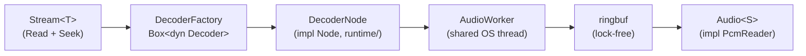

<div align="center">
  
</div>

<div align="center">

[](https://crates.io/crates/kithara-audio)
[](https://docs.rs/kithara-audio)
[](../../LICENSE-MIT)

</div>

# kithara-audio

Audio pipeline with decoding, effects chain, and sample rate conversion. Runs a shared OS thread (`AudioWorker`) for blocking decode/process work and bridges it to the caller via `ringbuf` lock-free ring buffers. `Audio<S>` is the main entry point; multiple tracks share one worker thread via `AudioWorkerHandle`.

## Role in the workspace

Sits between `kithara-decode` and the consumer (`cpal` via Firewheel inside `kithara-play`, or custom PCM readers). Depends on `kithara-stream` for `Stream<T>` and `Source`, `kithara-bufpool` for zero-allocation PCM buffers, `kithara-decode` for the decoder factory, `kithara-events` for the `EventBus`, and `kithara-platform` for cross-platform sync types.

## Key types / entry points

- **`Audio<S>`** — main entry point; an `impl PcmReader` the consumer reads from.
- **`AudioConfig<T>`** — [`bon`](https://crates.io/crates/bon) builder for the pipeline (stream config, host sample rate, resampler quality, gapless mode, stretch, engine load).
- **`AudioWorker` / `AudioWorkerHandle`** — the shared OS thread that runs decode/effects; multiple tracks register on one worker.
- **`DecoderNode`** — the per-track `Node` (in `runtime/`) that decodes, runs the effects chain, and pushes PCM to the ring.
- **`ResamplerQuality`** — sample-rate-conversion quality selector.
- **`StretchControls` / `TimeStretchProcessor`** — preserve-pitch tempo (key-lock), gated by `stretch-*` backends.
- **`Waveform` / `WaveformAnalyzer` / `TrackAnalyzer`** — pure-DSP track analysis for display (`analysis/`, `waveform/`).
- **`EngineLoad` / `EngineLoadSnapshot`** — live processing-cost meter.

## Usage

```rust
use kithara_audio::{Audio, AudioConfig, ResamplerQuality};
use kithara_decode::GaplessMode;
use kithara_hls::{Hls, HlsConfig};
use kithara_stream::Stream;

let audio_config = AudioConfig::<Hls>::builder()
    .stream_config(hls_config)
    .host_sample_rate(sample_rate)
    .resampler_quality(ResamplerQuality::High)
    .gapless_mode(GaplessMode::CodecPriming)
    .build();

let mut audio = Audio::<Stream<Hls>>::new(audio_config).await?;
```

`AudioConfig` is a [`bon`](https://crates.io/crates/bon) builder; the fields shown above are the most common knobs. The exact builder method names match the field names on `AudioConfig`.

## Pipeline at a glance


```mermaid
flowchart LR
    ST["Stream&lt;T&gt;<br/>(Read + Seek)"]
    DF["DecoderFactory<br/>Box&lt;dyn Decoder&gt;"]
    Node["DecoderNode<br/>(impl Node, runtime/)"]
    AW["AudioWorker<br/>(shared OS thread)"]
    Ring["ringbuf<br/>(lock-free)"]
    A["Audio&lt;S&gt;<br/>(impl PcmReader)"]

    ST --> DF --> Node --> AW --> Ring --> A
```

The `AudioWorker` is a plain OS thread (not a tokio runtime worker) that ticks each registered track; the `kithara-stream` downloader (tokio) writes bytes into shared storage, and processed PCM crosses to the consumer over a lock-free ring. Seeks are epoch-tagged so stale chunks are discarded.

## Features

<table>
<tr><th>Feature</th><th>Default</th><th>Effect</th></tr>
<tr><td><code>symphonia</code></td><td>yes</td><td>Symphonia software decoder path via <code>kithara-decode/symphonia</code></td></tr>
<tr><td><code>apple</code></td><td>no</td><td>Apple AudioToolbox hardware decoder via <code>kithara-decode/apple</code></td></tr>
<tr><td><code>android</code></td><td>no</td><td>Android <code>MediaExtractor</code>/<code>MediaCodec</code> via <code>kithara-decode/android</code></td></tr>
<tr><td><code>probe</code></td><td>no</td><td>USDT probes for tracing</td></tr>
<tr><td><code>mock</code></td><td>no</td><td><code>unimock</code> mocks of public traits</td></tr>
<tr><td><code>perf</code></td><td>no</td><td>Hotpath instrumentation</td></tr>
<tr><td><code>memprof</code></td><td>no</td><td>Allocation tracking via <code>hotpath/hotpath-alloc</code></td></tr>
<tr><td><code>stretch-signalsmith</code></td><td>no</td><td>Native-only <code>signalsmith-stretch</code> (C++) time-stretch backend</td></tr>
<tr><td><code>stretch-bungee</code></td><td>no</td><td>Native-only <code>bungee</code> (C++) time-stretch backend</td></tr>
<tr><td><code>analysis</code></td><td>no</td><td>FFT stack for track analysis (<code>realfft</code> + <code>WaveformAnalyzer</code>); without it <code>waveform_analyzer()</code> returns <code>None</code> and the analysis API stays inert</td></tr>
</table>

See [CONTEXT.md](CONTEXT.md) for detailed contracts, invariants, and internals.
