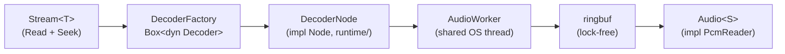

<div align="center">
  
</div>

<div align="center">

[](https://crates.io/crates/kithara-audio)
[](https://docs.rs/kithara-audio)
[](../../LICENSE-MIT)

</div>

# kithara-audio

Audio pipeline with decoding, effects chain, and sample rate conversion. Runs a shared OS thread (`AudioWorker`) for blocking decode/process work and bridges it to the caller via `ringbuf` lock-free ring buffers. `Audio<S>` is the main entry point; multiple tracks share one worker thread via `AudioWorkerHandle`.

## Role in the workspace

Sits between `kithara-decode` and the consumer (`cpal` via Firewheel inside `kithara-play`, or custom PCM readers). Depends on `kithara-stream` for `Stream<T>` and `Source`, `kithara-bufpool` for zero-allocation PCM buffers, `kithara-decode` for the decoder factory, `kithara-events` for the `EventBus`, and `kithara-platform` for cross-platform sync types.

## Key types / entry points

- **`Audio<S>`** — main entry point; an `impl PcmReader` the consumer reads from.
- **`AudioConfig<T>`** — [`bon`](https://crates.io/crates/bon) builder for the pipeline (stream config, host sample rate, resampler quality, gapless mode, stretch, engine load).
- **`AudioWorker` / `AudioWorkerHandle`** — the shared OS thread that runs decode/effects; multiple tracks register on one worker.
- **`DecoderNode`** — the per-track `Node` (in `runtime/`) that decodes, runs the effects chain, and pushes PCM to the ring.
- **`ResamplerQuality`** — sample-rate-conversion quality selector.
- **`StretchControls` / `TimeStretchProcessor`** — preserve-pitch tempo (key-lock), gated by `stretch-*` backends.
- **`Waveform` / `WaveformAnalyzer` / `TrackAnalyzer`** — pure-DSP track analysis for display (`analysis/`, `waveform/`).
- **`EngineLoad` / `EngineLoadSnapshot`** — live processing-cost meter.

## Usage

```rust
use kithara_audio::{Audio, AudioConfig, ResamplerQuality};
use kithara_decode::GaplessMode;
use kithara_hls::{Hls, HlsConfig};
use kithara_stream::Stream;

let audio_config = AudioConfig::<Hls>::builder()
    .stream_config(hls_config)
    .host_sample_rate(sample_rate)
    .resampler_quality(ResamplerQuality::High)
    .gapless_mode(GaplessMode::CodecPriming)
    .build();

let mut audio = Audio::<Stream<Hls>>::new(audio_config).await?;
```

`AudioConfig` is a [`bon`](https://crates.io/crates/bon) builder; the fields shown above are the most common knobs. The exact builder method names match the field names on `AudioConfig`.

## Pipeline at a glance


```mermaid
flowchart LR
    ST["Stream&lt;T&gt;<br/>(Read + Seek)"]
    DF["DecoderFactory<br/>Box&lt;dyn Decoder&gt;"]
    Node["DecoderNode<br/>(impl Node, runtime/)"]
    AW["AudioWorker<br/>(shared OS thread)"]
    Ring["ringbuf<br/>(lock-free)"]
    A["Audio&lt;S&gt;<br/>(impl PcmReader)"]

    ST --> DF --> Node --> AW --> Ring --> A
```

The `AudioWorker` is a plain OS thread (not a tokio runtime worker) that ticks each registered track; the `kithara-stream` downloader (tokio) writes bytes into shared storage, and processed PCM crosses to the consumer over a lock-free ring. Seeks are epoch-tagged so stale chunks are discarded.

## Track analysis (shared worker)

`analysis/` owns the reusable per-track analysis engine consumed by the demo
app today and by mobile surfaces (kithara-ffi) next:

- **`TrackAnalyzer`** — streaming analyzer fed every decoded chunk once;
  `finish` folds its result into the shared `TrackAnalysis` aggregate
  (`waveform` today; bpm/pitch slots come with their analyzers).
- **`AnalyzerRegistry`** — the set of analyzer factories to run per track.
  Factories take the first chunk's `PcmSpec`, so analyzers can size to the
  source sample rate. Decode once, feed all of them.
- **`analyze_reader`** — the synchronous decode loop over any `PcmReader`:
  cancel-aware, `Pending`-tolerant, `None` on cancel/error/empty input.
  Opening the source stays with the caller (`Resource` lives in
  kithara-play; FFI opens its own reader) so this crate gains no upward
  dependency.
- **`AnalysisWorker`** — a long-lived named thread running `analyze_reader`
  per queued job. Jobs carry caller-owned cancel tokens that must be
  children of the same scope that owns the worker (one cancel hierarchy);
  the caller keeps at most one job in flight and cancels the previous token
  to preempt. Results arrive on a `watch` channel; on failure/cancel the
  sender drops without a value.
- **Feature seam, runtime switch**: the `analysis` cargo feature gates only
  the FFT stack (`realfft` + `WaveformAnalyzer`). The analysis API above is
  always compiled; `waveform_analyzer(buckets)` returns `None` without the
  feature, so consumers use one runtime check (empty registry → skip
  scheduling) instead of spreading `#[cfg]` upward.

## Waveform

Pure, synchronous DSP that turns decoded PCM into a `Waveform` for display. No
async, I/O, cancel, or color types live here - `kithara-audio` is math only;
the band -> color mapping and orchestration live in the consumer crates.

- **Types** (`waveform/`): `Bucket { low, mid, high }` are three independent
  per-bucket band heights, each normalized `[0, 1]` on one shared scale. They are
  not a single bar plus a color: the deck paints them as three concentric
  mirrored bars (low behind, high in front, Serato-style overlay) so all three
  bands are visible at once; the tallest band is the outer hull. All-zero is
  silence. `Waveform` is a sealed `Arc<[Bucket]>` with `buckets()` / `len()` /
  `is_empty()` accessors (no bare slice deref).
- **Sealed construction**: a `Waveform` is obtainable only via
  `WaveformAnalyzer::finalize`, so its invariants hold by construction.
- **Normalized-position index** (`bucketize`): buckets are indexed by normalized
  track position `[0, 1]`, never wall-clock seconds. `bucketize` is the single
  home of that `[0, 1]` mapping: bucket `b` folds the raw range
  `[b*R/N, (b+1)*R/N)`. A bucket whose range is empty (tracks shorter than the
  bucket count) is filled with the supplied `empty` value, so `bucketize`'s
  output length always equals its requested count.
- **Source-only invariant**: analysis runs on the decoded SOURCE signal, never
  the post-EQ / post-timestretch / post-resample output. The waveform is the
  track's identity; playback-rate and mixer transforms remap only the time axis
  and never re-run analysis.
- **PCM <-> frequency boundary**: `WaveformAnalyzer::new` takes the track
  `sample_rate` because band crossovers map to FFT bins via
  `bin_hz = sample_rate / fft_size`. Constant sample rate per track is assumed;
  build the analyzer once the first chunk's `PcmSpec` is known.
- **Silence rule**: a silent bucket is `Bucket::default()` (all-zero), renders as
  nothing, and never produces `NaN`.
- **Reduction**: per FFT window, band energy is summed into low/mid/high
  (DC bin zeroed; windows below `energy_floor` RMS contribute nothing) and each
  band is divided by its bin count, i.e. an energy DENSITY (RMS-like). Without
  that, the wide mid/high bands outweigh the narrow low band by sheer bin count
  and mid becomes the hull; the density form lets bass be the hull as it should.
  Windows overlap, hopped by `fft_size / 4` (75% Hann overlap), so the spectral
  series is not coarser than the bucket count and a normal-length track is covered
  end to end; only genuinely short tracks fall back to a single zero-padded window.
  `finalize` keeps each bucket's loudest window (component-wise max), takes
  `sqrt` to magnitude, applies the per-band perceptual `band_gain`, then divides
  all three by one shared global max. Shared (not per-band) normalization keeps
  the loudness tilt - bass stays the dominant hull and quiet stays quiet - while
  `band_gain` lifts mid/high, which music tilts toward silence, into visibility
  without inverting the hierarchy. Tunables (`fft_size`, crossovers,
  `energy_floor`, `band_gain`) live in `AnalysisParams`.

## Blob codec

Analysis artifacts that persist to the on-disk cache (`Waveform`, `BeatGrid`)
share one versioned little-endian encoding via the internal crate-level `blob`
module (domain-agnostic, not waveform-specific). The `Blob` trait owns the
format frame; each artifact only implements its body.

- **Frame**: `to_bytes` writes a `u32` version header (`Blob::VERSION`) then the
  artifact body; `from_bytes` checks the version, decodes the body, and requires
  the cursor to consume the blob exactly (trailing bytes are corruption).
- **Versioning**: each artifact owns its `VERSION` constant. A mismatch is a
  typed `BlobError::Version`; a truncated, mis-sized, or out-of-range body is
  `BlobError::Corrupt`. Both are cache misses — the caller re-analyses and
  overwrites. There is no in-place migration of old blobs.
- **Boundary**: `BlobError` is the only piece that crosses the crate boundary
  (it is the public `from_bytes` error). `Blob`, `Reader`, and `Writer` are
  crate-internal; consumers serialize through the artifacts' inherent
  `to_bytes` / `from_bytes`. The composite track-analysis blob (version +
  config fingerprint + per-artifact sections) is a separate app-layer concern
  owned by `kithara-app`, not this codec.

## Resampler Quality Levels

<table>
<tr><th>Quality</th><th>Algorithm</th><th>Use Case</th></tr>
<tr><td>Fast</td><td>Polynomial (cubic)</td><td>Low-power, previews</td></tr>
<tr><td>Normal</td><td>64-tap sinc, linear</td><td>Standard playback</td></tr>
<tr><td>Good</td><td>128-tap sinc, linear</td><td>Better quality</td></tr>
<tr><td>High (default)</td><td>256-tap sinc, cubic</td><td>Recommended for music</td></tr>
<tr><td>Maximum</td><td>FFT-based</td><td>Offline / high-end</td></tr>
</table>

## Time-Stretch (key-lock)

Preserve-pitch tempo lives in the pre-resampler `TimeStretchProcessor` slot.
The whole stretch DSP exists only when a backend is compiled in
(`stretch-signalsmith` / `stretch-bungee`, native targets). `create_effects`
builds one of two chains:

- **resampler-first** (`stretch = None`): no stretch slot; the resampler reads `playback_rate` directly. Used by plain (non-DJ) playback.
- **tempo mode** (`stretch = Some`): a `TimeStretchProcessor` runs *before* the resampler. It is **always present** in tempo mode regardless of key-lock, and reads the live `StretchControls` (`speed` + `region_plan` + gated `keylock`/`backend`) each chunk. Without a compiled-in backend (default native build, wasm) no slot is added, and the resampler follows the speed atomic directly — same audible behavior as key-lock off.

**Live speed routing — the one seam to know.** `StretchControls` is the single source of truth, shared (`Arc`) between the consumer/UI and this slot. The slot owns the *speed split* and is the sole writer of the resampler's rate atomic (`resampler_rate`, created in `create_effects` and handed to both the slot and the resampler that follows it):

| mode | what the stretch slot does | `resampler_rate` |
|---|---|---|
| key-lock **on** | `set_ratio(1/speed)`, `set_pitch(1.0)` → tempo moves, pitch held | `1.0` |
| key-lock **off** | true pass-through (chunk forwarded untouched) | `speed` (resampler shifts pitch, vinyl-style) |

Both effects run sequentially on the same worker thread, so the resampler always reads the value written for the current chunk — no cross-thread race, no control-thread mirror. Because the controls are read each chunk, **key-lock, backend, and speed all apply live, mid-track, with no reload.** A live key-lock or backend change discards the FFT backend's internal buffer (`reset`/rebuild), so expect a brief transient (~100–300 ms) at the switch; steady-state key-lock-off audio is byte-identical to the resampler-first chain (the slot never touches the buffer while bypassing).

**Backend seam.** `TimeStretchProcessor` owns one `Box<dyn StretchBackend>` selected from `controls.backend()` and rebuilt in place on a live backend swap (or a source-spec change); the trait is DSP-only (interleaved `process`/`flush`/`set_ratio`/`set_pitch`/`max_output_samples`/`reset`) so all `PcmChunk`/pool/timeline plumbing lives in one place and each library is a small adapter. `set_ratio` is the time factor (`output/input`, >1 = slower); `set_pitch` is independent (1.0 = pitch locked) — that decoupling is what makes key-lock real. Backends select statically via `StretchBackendKind` + `cfg`:

- `signalsmith-stretch` (C++ FFI) — native-only, feature `stretch-signalsmith`.
- `bungee` (C++ FFI) — native-only, feature `stretch-bungee`.

`StretchBackendKind::ALL` lists exactly the backends compiled into the current target (the default is `ALL[0]`, discriminants are stable: 1 = Signalsmith, 2 = Bungee), so the UI selector never offers an absent one — selecting an uncompiled backend is un-representable, not a runtime error. With no `stretch-*` feature the kind, the trait, and the processor are compiled out entirely; `StretchControls` still exposes speed and optional region-plan storage.

**Region plan (beat-aligned stretch).** The pure region types (`GridSegment`, `RegionPlan`, `RegionPlanError`, and `ActiveRegion`) live in `kithara-audio::region`; public callers use the unconditional `kithara_audio::{GridSegment, RegionPlan, RegionPlanError}` re-exports. `StretchControls` optionally carries a `RegionPlan` (`ArcSwapOption`, installed via `set_region_plan`, read each chunk — the same live-swap shape as the other controls): sorted, non-overlapping `[start_frame, end_frame)` segments in **source frames** (`PcmMeta.frame_offset` space, never output time), each with a `ratio_correction` (validated at construction with a typed `RegionPlanError`). In key-lock mode the processor maps each chunk's `frame_offset` to its segment (cached cursor, binary search on a miss after seek/swap), splits chunks at segment boundaries, and drives the backend at `1/speed × ratio_correction`. The backend is `flush`ed (tail drained at the old ratio) + `reset` **only** when a boundary actually moves the effective ratio beyond `RATIO_EPS`; equal-ratio boundaries and gaps between segments (correction `1.0`) cost nothing, and live speed moves inside one region glide via `set_ratio` without a reset. An empty or absent plan is exactly the planless path. For region work prefer `signalsmith` (`bungee`'s no-op `flush` drops the tail at every real ratio boundary).

**Timeline.** A stretch changes the output frame *count*, not the rate: each emitted chunk recomputes `meta.frames` but preserves `timestamp`/`end_timestamp`/`spec` verbatim (the resampler's `finalize_resample_chunk` recipe), so the playhead stays in source-track time — a 3-minute track reads `0:00→3:00` even at 50 % tempo. `bungee` has no clean tail drain through its high-level `Stream`, so its `flush` is a no-op (the final ~latency of audio is dropped at EOS rather than padded with stretched silence). If `bungee`'s `Stream::new` ever fails at construction (only on an invalid spec — unreachable for real stereo/mono audio), the backend warns once and then emits silence until the track is reloaded, rather than erroring per chunk.

## Engine load (live cost meter)

The audio worker measures its own processing cost and publishes it to a shared `EngineLoad` (lock-free `portable_atomic::AtomicF32`s — safe on the forbid-blocking produce core, no allocation). Each time `DecoderNode::tick` produces a chunk it times the whole decode→effects step (`source.step_track`: decode + resampler + EQ + time-stretch) with `Instant` and divides by the produced audio duration (`frames / sample_rate`), EWMA-smoothed. `EngineLoadSnapshot` exposes:

- `realtime` — produced audio-seconds per CPU-second (`>1` = faster than realtime); the cost-per-sample metric for comparing stretch backends live.
- `load` — the `busy / audio` fraction (`0.05` = 5%).
- `ms` — wall time per produced chunk (latency of one processing cycle).

One `Arc<EngineLoad>` is created in `PlayerImpl`, threaded through `AudioConfig::engine_load` → `TrackRegistration` into every track's `DecoderNode`, and read back via `PlayerImpl::engine_load()` → `Queue::engine_load()` for the DJ-studio status bar. The atomics double as the EWMA state; the worker thread is the only writer, so the read-blend-store needs no lock. It reflects whichever track is currently producing and is meaningful whenever audio is flowing — independent of key-lock. `realtime == 0` means "no measurement yet" (paused / not started).

## Format Change Handling

On an ABR variant switch, the `DecoderNode` detects the format change via `Source::media_info()` polling and then:

1. Uses the variant fence on the source to prevent cross-variant reads.
2. Seeks to the first segment of the new variant (where init data lives).
3. Recreates the decoder via `DecoderFactory`.
4. Resets the effects chain to avoid audio artifacts.

### Decoder recreate policy

- Decoder is **not** recreated on every seek.
- Decoder is recreated when a stream format changes (codec/container boundary) or when post-seek decode reports a recoverable format mismatch.
- Recreate path is metadata-first (`MediaInfo`) with native Symphonia probe fallback from a fresh source.
- Decoder recreate always uses seek target anchor/base offset from timeline/source, so new decoder starts from stream timeline truth.
- **Seek-epoch suppression**: `detect_format_change` returns `NoChange` while a seek is pending and the session was installed at that same seek epoch. The decoder is already aligned with the seek's landing variant, so a second cross-variant recreate inside one seek epoch is wasted work and would discard the freshly-built decoder before it emits a sample.

### Recreate readiness gating

`recreate_ready_range` defines the byte range whose readiness gates decoder recreation. The same range is shared by the gate (`source_ready_for_recreate`) and the wait path (`wait_for_source_on_recreate` / `WaitContext::Recreation`) so the two never disagree on what "ready" means — a mismatch livelocks the worker (the `recv_outcome_blocking` hang on HE-AAC v2 variant switch).

- **Separate init segment** (CMAF `EXT-X-MAP` init box, typically well under `DEFAULT_READ_AHEAD_BYTES`): gate on the init range alone. The factory probe needs only the init to rebuild the codec, and the post-recreate `Seek`/`ApplySeek`/`Decode` repositions via `decoder_seek_safe`. Gating on the wider seg-0 window is unsafe because after a backwards seek the HLS scheduler emits segments around the reader byte cursor and never schedules `[0..DEFAULT_READ_AHEAD)`, which hangs.
- **No separate init** (raw containers like WAV, where `format_change_segment_range` falls back to the full seg-0 range): fall through to the `[offset..offset + DEFAULT_READ_AHEAD)` window, which the scheduler actively keeps in flight around the reader.

### Seek error recovery

A failed `decoder.seek()` routes through one shared recovery path that splits by `DecodeError` variant (not string match):

- **Decoder internal-state corruption** (e.g. Symphonia's moof fragment table holding stale offsets after a variant switch) — fresh decoder state resolves this, so recreate is the right cure. This is the default class for any error that is not a typed out-of-range.
- **Caller-side invalid target** (`DecodeError::SeekOutOfRange`: seek past EOF, or a target timestamp outside the stream's known duration) — recreate cannot fix this, since a freshly built decoder has the same `duration()` and rejects the same target. Retrying loops forever (the "перемотка не работает" prod bug), so these route directly to `fail_seek` with no recreate and no retry.

Init-bearing containers (fMP4/MP4/WAV/MKV/CAF) must recreate at the source's init segment range; a mid-segment recreate would land on bytes with no ftyp/RIFF/EBML header and the factory would fail silently. Mid-stream-decodable containers (MPEG-ES/ADTS/FLAC/Ogg/MPEG-TS) and unknown containers recreate at the offset directly. The recovery path also calls `fail_seek` on missing `MediaInfo` or when an init-bearing container has no available init range.

## Epoch-Based Seek

On seek, epoch is incremented atomically. The worker tags each decoded chunk with the current epoch. The consumer discards stale chunks (old epoch), preventing leftover data from reaching output after a seek.

## Agent guardrails

- **Node Architecture**: A track is represented by a single `Node` implementation (`DecoderNode`), stored in the shared scheduler as `Box<dyn Node>` through `runtime/`.
- **Operators vs Nodes**: Audio effects are implemented as operators (`AudioEffect`) that are called directly within the track's `Node`. We do not use separate `Node`s or ring buffers between effects.
- **Chain order**: The effect chain is `[..pre, Resampler, ..custom]`. With `AudioConfig::stretch` set (tempo mode), a source-domain `TimeStretchProcessor` occupies the `pre` slot before the host resampler and drives the resampler's rate atomic (`1.0` when key-locked, else `speed`). Without it, the chain is resampler-first and `playback_rate` drives the resampler "vinyl" speed+pitch path.
- **EOF drain**: At true EOF `StreamAudioSource` drains the effect chain incrementally, one emitted chunk per FSM step: each stage is flushed to exhaustion only after the upstream stage's outputs pass through it, so a buffering effect's multi-pull tail is never truncated and the producer core does not allocate a drain queue. `EndOfStream` fires once on completion, not at source exhaustion.

### Coordinate spaces

The whole pipeline runs in one space: **decoder/song time** (`PcmMeta.timestamp` / `end_timestamp` / `frame_offset`, `Timeline`, `total_duration`, the seek target, the UI playhead). A duration-changing `AudioEffect` (resampler "vinyl" today, preserve-pitch time-stretch later) changes frame counts but is the sole timeline authority: it restamps only `spec`+`frames` and carries the consumed input's song-time meta forward (`ResamplerProcessor::last_input_meta` pattern). The consumer keeps reading `end_timestamp` for position, so no translation layer and no parallel frame counter exist (single source of truth). Reporting perceived/elapsed output time instead would need an explicit translation owner; it is deliberately deferred until a real stretch backend lands.
- **Buffers**: If a backpressure boundary or rate-matching is needed (e.g. between the worker and the audio callback), a separate buffer `Node` should be introduced explicitly.
- **Push with Backpressure**: Producer nodes call `Outlet::try_push` directly. The outlet has a built-in single-slot overflow that absorbs one backpressure miss per tick, so a producer that emits at most one chunk per tick treats `try_push` as infallible. Each tick begins with `Outlet::flush()` to forward the parked item to the ring once the consumer drains it; if the ring is still full the node returns `TickResult::Waiting`. Under normal operation, the source's FSM is ticked every pass. However, if the outlet is completely saturated (both the ring buffer and the overflow slot are full), the node will return `Waiting` immediately without ticking the FSM. This provides strict backpressure, pausing all internal state transitions (including seeks) until the consumer drains the ring.
- **Cancellation**: Do not use `CancelToken` inside `Node` implementations. Cancellation is handled centrally by calling `worker.unregister_track(...)`, which triggers the scheduler to call `Node::on_cancel()`.
- **Track lifecycle**: A `Node` returns `TickResult::Done` only when truly terminal (e.g. `TrackStep::Failed`). EOF is *not* terminal — the track stays alive so a subsequent seek can re-arm it; idle ticks just return `TickResult::Waiting`.
- `kithara-audio` owns decoder lifecycle, seek or session state, effects reset timing, and stale chunk invalidation.
- Prefer explicit FSM or session objects for multi-step control flow. Avoid scattering new `pending_*` or shadow flags across worker, source, and consumer layers.
- Audio should consume source contracts, not reconstruct HLS or file policy from protocol-specific heuristics.

## Features

<table>
<tr><th>Feature</th><th>Default</th><th>Effect</th></tr>
<tr><td><code>symphonia</code></td><td>yes</td><td>Symphonia software decoder path via <code>kithara-decode/symphonia</code></td></tr>
<tr><td><code>apple</code></td><td>no</td><td>Apple AudioToolbox hardware decoder via <code>kithara-decode/apple</code></td></tr>
<tr><td><code>android</code></td><td>no</td><td>Android <code>MediaExtractor</code>/<code>MediaCodec</code> via <code>kithara-decode/android</code></td></tr>
<tr><td><code>probe</code></td><td>no</td><td>USDT probes for tracing</td></tr>
<tr><td><code>mock</code></td><td>no</td><td><code>unimock</code> mocks of public traits</td></tr>
<tr><td><code>perf</code></td><td>no</td><td>Hotpath instrumentation</td></tr>
<tr><td><code>memprof</code></td><td>no</td><td>Allocation tracking via <code>hotpath/hotpath-alloc</code></td></tr>
<tr><td><code>stretch-signalsmith</code></td><td>no</td><td>Native-only <code>signalsmith-stretch</code> (C++) time-stretch backend</td></tr>
<tr><td><code>stretch-bungee</code></td><td>no</td><td>Native-only <code>bungee</code> (C++) time-stretch backend</td></tr>
<tr><td><code>analysis</code></td><td>no</td><td>FFT stack for track analysis (<code>realfft</code> + <code>WaveformAnalyzer</code>); without it <code>waveform_analyzer()</code> returns <code>None</code> and the analysis API stays inert</td></tr>
</table>

See [CONTEXT.md](CONTEXT.md) for detailed contracts, invariants, and internals.
