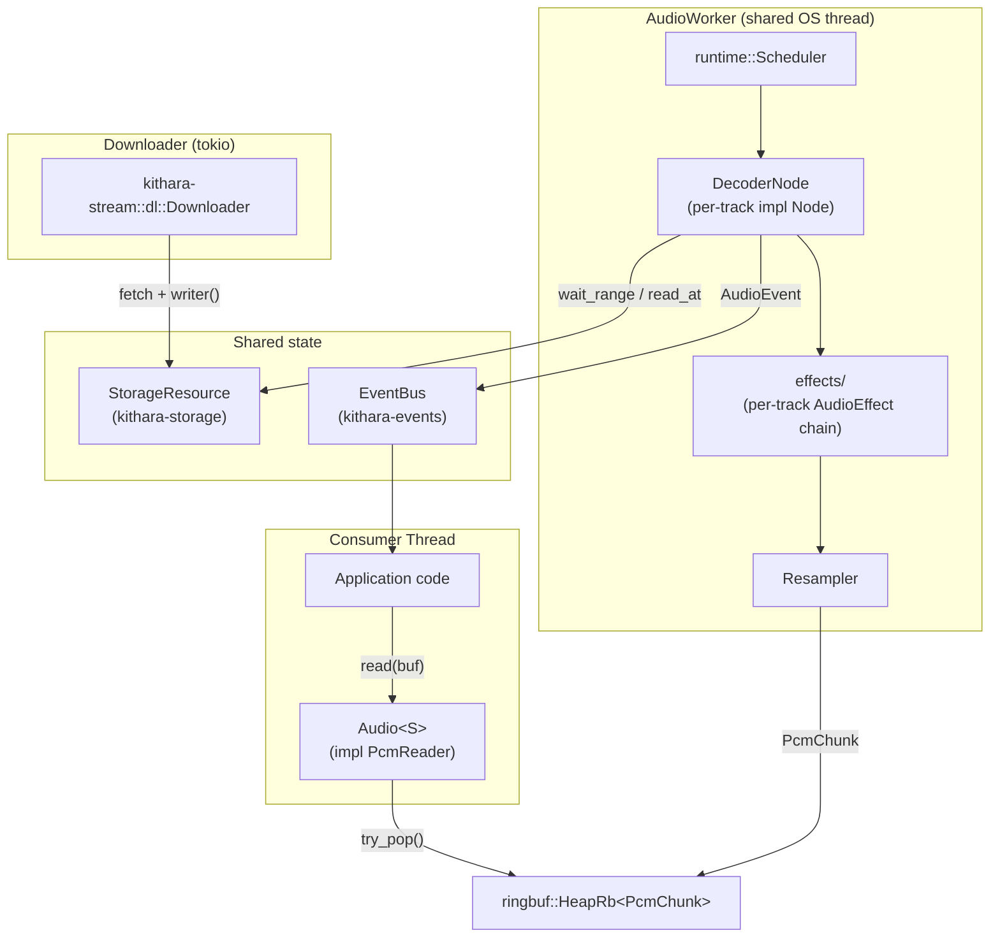
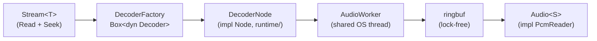

<div align="center">
  
</div>

<div align="center">

[](https://crates.io/crates/kithara-audio)
[](https://docs.rs/kithara-audio)
[](../../LICENSE-MIT)

</div>

# kithara-audio

Audio pipeline with decoding, effects chain, and sample rate conversion. Runs a shared OS thread (`AudioWorker`) for blocking decode/process work and bridges it to the caller via `ringbuf` lock-free ring buffers. `Audio<S>` is the main entry point; multiple tracks share one worker thread via `AudioWorkerHandle`.

## Usage

```rust
use kithara_audio::{Audio, AudioConfig, ResamplerQuality};
use kithara_decode::GaplessMode;
use kithara_hls::{Hls, HlsConfig};
use kithara_stream::Stream;

let audio_config = AudioConfig::<Hls>::builder()
    .stream_config(hls_config)
    .host_sample_rate(sample_rate)
    .resampler_quality(ResamplerQuality::High)
    .gapless_mode(GaplessMode::CodecPriming)
    .build();

let mut audio = Audio::<Stream<Hls>>::new(audio_config).await?;
```

`AudioConfig` is a [`bon`](https://crates.io/crates/bon) builder; the fields shown above are the most common knobs. The exact builder method names match the field names on `AudioConfig`.

## Threading model


```mermaid
flowchart TB
    subgraph "Consumer Thread"
        App["Application code"]
        AS["Audio&lt;S&gt;<br/>(impl PcmReader)"]
        App -- "read(buf)" --> AS
    end

    subgraph "AudioWorker (shared OS thread)"
        Sched["runtime::Scheduler"]
        DN["DecoderNode<br/>(per-track impl Node)"]
        Resampler
        Effects["effects/<br/>(per-track AudioEffect chain)"]
        Sched --> DN --> Effects --> Resampler
    end

    subgraph "Downloader (tokio)"
        DL["kithara-stream::dl::Downloader"]
    end

    subgraph "Shared state"
        SR["StorageResource<br/>(kithara-storage)"]
        Bus["EventBus<br/>(kithara-events)"]
    end

    DL -- "fetch + writer()" --> SR
    DN -- "wait_range / read_at" --> SR
    Resampler -- "PcmChunk" --> Ring["ringbuf::HeapRb&lt;PcmChunk&gt;"]
    AS -- "try_pop()" --> Ring
    DN -- "AudioEvent" --> Bus
    Bus --> App
```

- **AudioWorker (shared OS thread)**: an internal priority scheduler in `runtime/` ticks each registered track. Each track is a single `Node` (`DecoderNode`) — effects run as direct operator calls inside the node, not as separate `Node`s with ring buffers between them.
- **Downloader (tokio)**: lives in `kithara-stream::dl`. It owns the HTTP pool and writes bytes directly into the `StorageResource` the `DecoderNode` reads from. The downloader is not spawned by `kithara-audio`.
- **Ring**: a lock-free `ringbuf::HeapRb<PcmChunk>` carries processed PCM from the worker to the consumer; backpressure is enforced by the ring's capacity and an `Outlet` overflow slot.
- **Trash ring (spent-chunk return)**: the consumer (`Audio`) runs on the caller's real-time audio thread, so it must never `free`. Returning a `PcmChunk`'s pooled buffer to `kithara-bufpool` can deallocate (shard full, or trim), so the consumer never drops a consumed chunk: it pushes every spent chunk back through a second lock-free ring, and `DecoderNode::drain_trash` drops them on the worker thread on its next tick. The ring is sized `pcm_buffer_chunks + 2` — enough to absorb a seek that drains the whole forward ring at once — so the real-time push is infallible and no buffer is ever freed on the audio thread.
- **Preload gate (`PreloadGate`)**: the one-time startup signal that releases the async consumer's `Resource::preload().await`. The worker is a plain OS thread, not a tokio runtime worker, so it must never run a cross-thread tokio-task `wake()` (that schedules through tokio's inject queue — a lock + futex, real-time-unsafe). The gate is decoupled: the worker only does a lock-free `ready.store(true, Release)` via `signal()`; the async awaiter (`PreloadGate::wait`) polls `ready` with `Acquire` and re-arms its own runtime timer (`POLL_INTERVAL`) while the gate is closed, so the worker never drives the wakeup. `DecoderNode` opens the gate at every preload terminal site — the preload-chunk threshold, EOF, `Failed`, and `on_cancel` — and `rearm()`s (re-closes) it in `sync_seek_epoch` so a post-seek `wait()` blocks again until the refill. A missed `signal()` would stall the consumer before first audio, so all terminal arms must fire it.
- **Events**: every layer publishes into a unified `EventBus` (`AudioEvent`, `HlsEvent`, `FileEvent`, ABR events).
- **Epoch-based seek invalidation**: each seek bumps an `AtomicU64` epoch; stale chunks tagged with an older epoch are dropped before reaching the ring.

## Pipeline Architecture


```mermaid
flowchart LR
    ST["Stream&lt;T&gt;<br/>(Read + Seek)"]
    DF["DecoderFactory<br/>Box&lt;dyn Decoder&gt;"]
    Node["DecoderNode<br/>(impl Node, runtime/)"]
    AW["AudioWorker<br/>(shared OS thread)"]
    Ring["ringbuf<br/>(lock-free)"]
    A["Audio&lt;S&gt;<br/>(impl PcmReader)"]

    ST --> DF --> Node --> AW --> Ring --> A
```

## Waveform

Pure, synchronous DSP that turns decoded PCM into a `Waveform` for display. No
async, I/O, cancel, or color types live here - `kithara-audio` is math only;
the band -> color mapping and orchestration live in the consumer crates.

- **Types** (`waveform/`): `Bucket { low, mid, high }` are three independent
  per-bucket band heights, each normalized `[0, 1]` on one shared scale. They are
  not a single bar plus a color: the deck paints them as three concentric
  mirrored bars (low behind, high in front, Serato-style overlay) so all three
  bands are visible at once; the tallest band is the outer hull. All-zero is
  silence. `Waveform` is a sealed `Arc<[Bucket]>` with `buckets()` / `len()` /
  `is_empty()` accessors (no bare slice deref).
- **Sealed construction**: a `Waveform` is obtainable only via
  `WaveformAnalyzer::finalize`, so its invariants hold by construction.
- **Normalized-position index** (`bucketize`): buckets are indexed by normalized
  track position `[0, 1]`, never wall-clock seconds. `bucketize` is the single
  home of that `[0, 1]` mapping: bucket `b` folds the raw range
  `[b*R/N, (b+1)*R/N)`. A bucket whose range is empty (tracks shorter than the
  bucket count) is filled with the supplied `empty` value, so the output length
  always equals the requested bucket count.
- **Source-only invariant**: analysis runs on the decoded SOURCE signal, never
  the post-EQ / post-timestretch / post-resample output. The waveform is the
  track's identity; playback-rate and mixer transforms remap only the time axis
  and never re-run analysis.
- **PCM <-> frequency boundary**: `WaveformAnalyzer::new` takes the track
  `sample_rate` because band crossovers map to FFT bins via
  `bin_hz = sample_rate / fft_size`. Constant sample rate per track is assumed;
  build the analyzer once the first chunk's `PcmSpec` is known.
- **Silence rule**: a silent bucket is `Bucket::default()` (all-zero), renders as
  nothing, and never produces `NaN`.
- **Reduction**: per FFT window, band energy is summed into low/mid/high
  (DC bin zeroed; windows below `energy_floor` RMS contribute nothing) and each
  band is divided by its bin count, i.e. an energy DENSITY (RMS-like). Without
  that, the wide mid/high bands outweigh the narrow low band by sheer bin count
  and mid becomes the hull; the density form lets bass be the hull as it should.
  Windows overlap, hopped by `fft_size / 4` (75% Hann overlap), so the spectral
  series is not coarser than the bucket count and a normal-length track is covered
  end to end; only genuinely short tracks fall back to a single zero-padded window.
  `finalize` keeps each bucket's loudest window (component-wise max), takes
  `sqrt` to magnitude, applies the per-band perceptual `band_gain`, then divides
  all three by one shared global max. Shared (not per-band) normalization keeps
  the loudness tilt - bass stays the dominant hull and quiet stays quiet - while
  `band_gain` lifts mid/high, which music tilts toward silence, into visibility
  without inverting the hierarchy. Tunables (`fft_size`, crossovers,
  `energy_floor`, `band_gain`) live in `AnalysisParams`.

## Resampler Quality Levels

<table>
<tr><th>Quality</th><th>Algorithm</th><th>Use Case</th></tr>
<tr><td>Fast</td><td>Polynomial (cubic)</td><td>Low-power, previews</td></tr>
<tr><td>Normal</td><td>64-tap sinc, linear</td><td>Standard playback</td></tr>
<tr><td>Good</td><td>128-tap sinc, linear</td><td>Better quality</td></tr>
<tr><td>High (default)</td><td>256-tap sinc, cubic</td><td>Recommended for music</td></tr>
<tr><td>Maximum</td><td>FFT-based</td><td>Offline / high-end</td></tr>
</table>

## Format Change Handling

On an ABR variant switch, the `DecoderNode` detects the format change via `Source::media_info()` polling and then:

1. Uses the variant fence on the source to prevent cross-variant reads.
2. Seeks to the first segment of the new variant (where init data lives).
3. Recreates the decoder via `DecoderFactory`.
4. Resets the effects chain to avoid audio artifacts.

### Decoder recreate policy

- Decoder is **not** recreated on every seek.
- Decoder is recreated when a stream format changes (codec/container boundary) or when post-seek decode reports a recoverable format mismatch.
- Recreate path is metadata-first (`MediaInfo`) with native Symphonia probe fallback from a fresh source.
- Decoder recreate always uses seek target anchor/base offset from timeline/source, so new decoder starts from stream timeline truth.
- **Seek-epoch suppression**: `detect_format_change` returns `NoChange` while a seek is pending and the session was installed at that same seek epoch. The decoder is already aligned with the seek's landing variant, so a second cross-variant recreate inside one seek epoch is wasted work and would discard the freshly-built decoder before it emits a sample.

### Recreate readiness gating

`recreate_ready_range` defines the byte range whose readiness gates decoder recreation. The same range is shared by the gate (`source_ready_for_recreate`) and the wait path (`wait_for_source_on_recreate` / `WaitContext::Recreation`) so the two never disagree on what "ready" means — a mismatch livelocks the worker (the `recv_outcome_blocking` hang on HE-AAC v2 variant switch).

- **Separate init segment** (CMAF `EXT-X-MAP` init box, typically well under `DEFAULT_READ_AHEAD_BYTES`): gate on the init range alone. The factory probe needs only the init to rebuild the codec, and the post-recreate `Seek`/`ApplySeek`/`Decode` repositions via `decoder_seek_safe`. Gating on the wider seg-0 window is unsafe because after a backwards seek the HLS scheduler emits segments around the reader byte cursor and never schedules `[0..DEFAULT_READ_AHEAD)`, which hangs.
- **No separate init** (raw containers like WAV, where `format_change_segment_range` falls back to the full seg-0 range): fall through to the `[offset..offset + DEFAULT_READ_AHEAD)` window, which the scheduler actively keeps in flight around the reader.

### Seek error recovery

A failed `decoder.seek()` routes through one shared recovery path that splits by `DecodeError` variant (not string match):

- **Decoder internal-state corruption** (e.g. Symphonia's moof fragment table holding stale offsets after a variant switch) — fresh decoder state resolves this, so recreate is the right cure. This is the default class for any error that is not a typed out-of-range.
- **Caller-side invalid target** (`DecodeError::SeekOutOfRange`: seek past EOF, or a target timestamp outside the stream's known duration) — recreate cannot fix this, since a freshly built decoder has the same `duration()` and rejects the same target. Retrying loops forever (the "перемотка не работает" prod bug), so these route directly to `fail_seek` with no recreate and no retry.

Init-bearing containers (fMP4/MP4/WAV/MKV/CAF) must recreate at the source's init segment range; a mid-segment recreate would land on bytes with no ftyp/RIFF/EBML header and the factory would fail silently. Mid-stream-decodable containers (MPEG-ES/ADTS/FLAC/Ogg/MPEG-TS) and unknown containers recreate at the offset directly. The recovery path also calls `fail_seek` on missing `MediaInfo` or when an init-bearing container has no available init range.

## Epoch-Based Seek

On seek, epoch is incremented atomically. The worker tags each decoded chunk with the current epoch. The consumer discards stale chunks (old epoch), preventing leftover data from reaching output after a seek.

## Agent guardrails

- **Node Architecture**: A track is represented by a single `Node` implementation (`DecoderNode`), stored in the shared scheduler as `Box<dyn Node>` through `runtime/`.
- **Operators vs Nodes**: Audio effects are implemented as operators (`AudioEffect`) that are called directly within the track's `Node`. We do not use separate `Node`s or ring buffers between effects.
- **Chain order**: The effect chain is `[..pre, Resampler, ..custom]`. With `AudioConfig::tempo_ratio` set (tempo mode), a source-domain `TimeStretchProcessor` occupies the `pre` slot before the host resampler, and the resampler's `playback_rate` is pinned to `1.0` (host SRC only). Without it, the chain is resampler-first and `playback_rate` drives the resampler "vinyl" speed+pitch path.
- **EOF drain**: At true EOF the whole chain is drained once (`drain_effects`): each stage is flushed to exhaustion after the upstream stage's outputs pass through it, so a buffering effect's multi-pull tail is never truncated. `StreamAudioSource` parks the drained tail in a one-shot `eof_drain_queue` and emits one chunk per call; `EndOfStream` fires once on completion, not at source exhaustion.

### Coordinate spaces

The whole pipeline runs in one space: **decoder/song time** (`PcmMeta.timestamp` / `end_timestamp` / `frame_offset`, `Timeline`, `total_duration`, the seek target, the UI playhead). A duration-changing `AudioEffect` (resampler "vinyl" today, preserve-pitch time-stretch later) changes frame counts but is the sole timeline authority: it restamps only `spec`+`frames` and carries the consumed input's song-time meta forward (`ResamplerProcessor::last_input_meta` pattern). The consumer keeps reading `end_timestamp` for position, so no translation layer and no parallel frame counter exist (single source of truth). Reporting perceived/elapsed output time instead would need an explicit translation owner; it is deliberately deferred until a real stretch backend lands.
- **Buffers**: If a backpressure boundary or rate-matching is needed (e.g. between the worker and the audio callback), a separate buffer `Node` should be introduced explicitly.
- **Push with Backpressure**: Producer nodes call `Outlet::try_push` directly. The outlet has a built-in single-slot overflow that absorbs one backpressure miss per tick, so a producer that emits at most one chunk per tick treats `try_push` as infallible. Each tick begins with `Outlet::flush()` to forward the parked item to the ring once the consumer drains it; if the ring is still full the node returns `TickResult::Waiting`. Under normal operation, the source's FSM is ticked every pass. However, if the outlet is completely saturated (both the ring buffer and the overflow slot are full), the node will return `Waiting` immediately without ticking the FSM. This provides strict backpressure, pausing all internal state transitions (including seeks) until the consumer drains the ring.
- **Cancellation**: Do not use `CancellationToken` inside `Node` implementations. Cancellation is handled centrally by calling `worker.unregister_track(...)`, which triggers the scheduler to call `Node::on_cancel()`.
- **Track lifecycle**: A `Node` returns `TickResult::Done` only when truly terminal (e.g. `TrackStep::Failed`). EOF is *not* terminal — the track stays alive so a subsequent seek can re-arm it; idle ticks just return `TickResult::Waiting`.
- `kithara-audio` owns decoder lifecycle, seek or session state, effects reset timing, and stale chunk invalidation.
- Prefer explicit FSM or session objects for multi-step control flow. Avoid scattering new `pending_*` or shadow flags across worker, source, and consumer layers.
- Audio should consume source contracts, not reconstruct HLS or file policy from protocol-specific heuristics.

## Features

<table>
<tr><th>Feature</th><th>Default</th><th>Effect</th></tr>
<tr><td><code>symphonia</code></td><td>yes</td><td>Symphonia software decoder path via <code>kithara-decode/symphonia</code></td></tr>
<tr><td><code>apple</code></td><td>no</td><td>Apple AudioToolbox hardware decoder via <code>kithara-decode/apple</code></td></tr>
<tr><td><code>android</code></td><td>no</td><td>Android <code>MediaExtractor</code>/<code>MediaCodec</code> via <code>kithara-decode/android</code></td></tr>
<tr><td><code>probe</code></td><td>no</td><td>USDT probes for tracing</td></tr>
<tr><td><code>mock</code></td><td>no</td><td><code>unimock</code> mocks of public traits</td></tr>
<tr><td><code>perf</code></td><td>no</td><td>Hotpath instrumentation</td></tr>
<tr><td><code>memprof</code></td><td>no</td><td>Allocation tracking via <code>hotpath/hotpath-alloc</code></td></tr>
</table>

## Integration

Sits between `kithara-decode` and the consumer (`cpal` via Firewheel inside `kithara-play`, or custom PCM readers). Depends on `kithara-stream` for `Stream<T>` and `Source`, `kithara-bufpool` for zero-allocation PCM buffers, `kithara-decode` for the decoder factory, `kithara-events` for the `EventBus`, and `kithara-platform` for cross-platform sync types.
