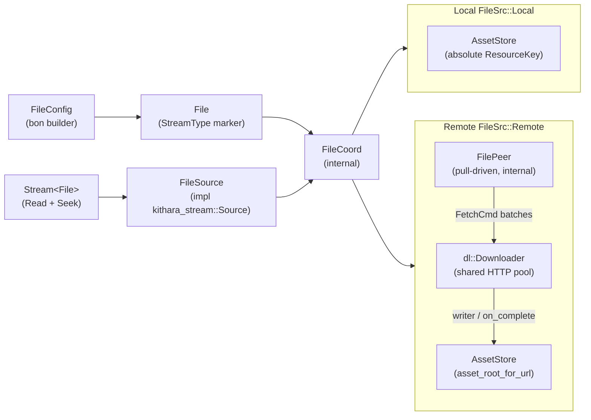

# kithara-file — Context

Detailed contracts and invariants for the kithara-file crate; the README is the overview.

## Architecture

- A remote `FileConfig` spawns an internal `FilePeer`, registers it with the shared `Downloader`, and emits `FetchCmd` batches from `Peer::poll_next()`.
- Each fetch's `writer` closure writes bytes directly into the underlying `AssetStore`-managed `StorageResource`; `on_complete` lets the peer advance its state.
- The reader side (`Stream<File>::Read + Seek`) goes through `FileSource::wait_range` / `read_at` — a single non-blocking readiness probe (`Ready`/`Eof`/`Interrupted`/`WaitBudgetExceeded`), not a blocking wait; the worker decode path never blocks on a syscall. `Eof` is returned only past the stream's known length; an in-range range that has not yet been written returns `WaitBudgetExceeded` (→ `Pending`/need-data) so the reader holds rather than terminating. See `crates/kithara-stream/README.md` "End-of-stream contract" for the cross-source invariant. Note: the EOF length source currently blends the announced length (`FileCoord::total_bytes`, seeded from `Content-Length`) with the committed length (`AssetReader::len()`); keying EOF strictly off the committed length is the hardening tracked in the Phase 1 EndOfStream design (`.docs/plans/2026-06-02-test-determinism/PHASE1-EOF-DESIGN.md`, B4).

## Local Files

When `FileSrc::Local(path)` is used, the crate opens the file via `AssetStore` with an absolute `ResourceKey`, skips all network activity, and produces a fully-cached `FileSource` with no peer / downloader.

## Remote Files

For `FileSrc::Remote(url)`, downloading is pull-driven: the peer requests fetches as the reader advances, with backpressure controlled by the `Timeline` shared between `FileCoord` and the reader. Seek miss enqueues an explicit range fetch for the requested offset.
