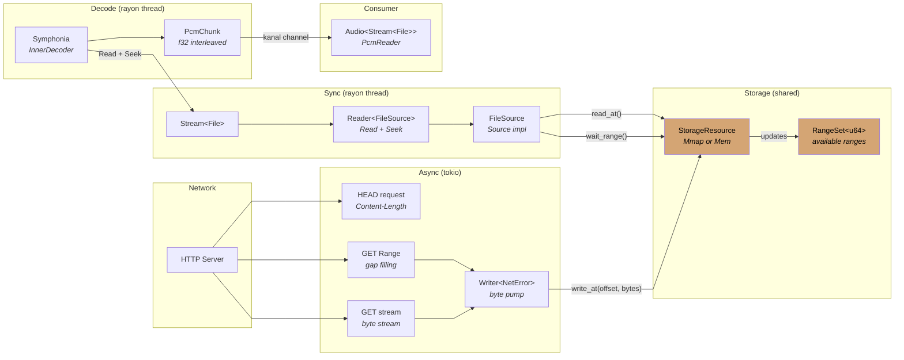

<div align="center">
  
</div>

<div align="center">

[](https://crates.io/crates/kithara-file)
[](https://crates.io/crates/kithara-file)
[](https://docs.rs/kithara-file)
[](../../LICENSE-MIT)

</div>

# kithara-file

Progressive file download and playback for single-file media (MP3, AAC, etc.). Implements `StreamType` for use with `Stream<File>`, providing HTTP download with disk caching, seeking, and progress events.

## Usage

```rust
use kithara_stream::Stream;
use kithara_file::{File, FileConfig};

let config = FileConfig::new(url);
let stream = Stream::<File>::new(config).await?;
```

## Download flow



- **Backpressure**: downloader pauses when too far ahead of the reader (configurable `look_ahead_bytes`). Resumes when reader advances (notified via `tokio::Notify`).
- **Lifecycle**: `Backend` task is leaked (`mem::forget`) and runs until cancellation or completion.

## Three-Phase Download

<table>
<tr><th>Phase</th><th>Strategy</th></tr>
<tr><td>Sequential</td><td>Stream from file start via <code>Writer</code>; fast path for complete downloads</td></tr>
<tr><td>Gap Filling</td><td>HTTP Range requests for missing chunks; batches up to 4 gaps, each up to 2 MB</td></tr>
<tr><td>Complete</td><td>All data downloaded; resource committed</td></tr>
</table>

## Local File Handling

When configured with a local path, the crate opens the file via `AssetStore` with an absolute `ResourceKey`, skips all network activity, and creates a fully-cached `FileSource` with no background downloader.

## On-Demand Downloads

When the reader seeks beyond the current download position, it pushes a range request via a lock-free `SegQueue`. The downloader picks up these requests with higher priority than sequential downloading, enabling responsive seek behavior during streaming.

## Integration

Depends on `kithara-net` for HTTP and `kithara-assets` for caching. Composes with `kithara-audio` as `Audio<Stream<File>>` for full decode pipeline.
