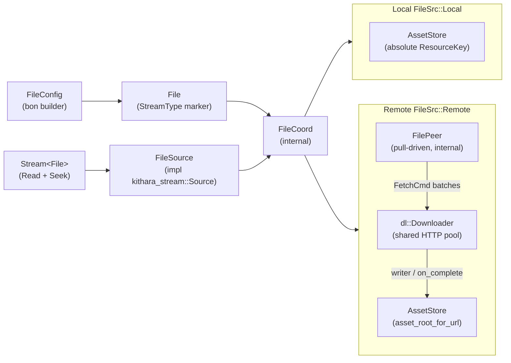

<div align="center">
  
</div>

<div align="center">

[](https://crates.io/crates/kithara-file)
[](https://docs.rs/kithara-file)
[](../../LICENSE-MIT)

</div>

# kithara-file

Single-file media streaming (MP3, AAC, FLAC, ALAC, WAV …). Implements `kithara_stream::StreamType` for use with `Stream<File>`. Backed by a pull-driven peer registered with the shared `kithara_stream::dl::Downloader`, and a `kithara-assets` `AssetStore` for disk caching. Supports both remote HTTP sources and direct local-file playback.

## Usage

```rust
use kithara_stream::Stream;
use kithara_file::{File, FileConfig, FileSrc};

// Remote HTTP source
let config = FileConfig::new(FileSrc::Remote(url));
let stream = Stream::<File>::new(config).await?;

// Local file source
let local = FileConfig::new(FileSrc::Local(path));
let stream = Stream::<File>::new(local).await?;
```

`FileConfig` is a [`bon`](https://crates.io/crates/bon) builder. `FileConfig::for_src(src)` returns the chained builder for non-default settings (event channel capacity, downloader, asset store, cancel token).

## Architecture


```mermaid
flowchart LR
    Cfg["FileConfig<br/>(bon builder)"]
    Cfg --> File["File<br/>(StreamType marker)"]
    File --> Coord["FileCoord<br/>(internal)"]

    subgraph Local["Local FileSrc::Local"]
        AS1["AssetStore<br/>(absolute ResourceKey)"]
    end

    subgraph Remote["Remote FileSrc::Remote"]
        Peer["FilePeer<br/>(pull-driven, internal)"]
        DL["dl::Downloader<br/>(shared HTTP pool)"]
        AS2["AssetStore<br/>(asset_root_for_url)"]
    end

    Coord --> Local
    Coord --> Remote
    Peer -- "FetchCmd batches" --> DL
    DL -- "writer / on_complete" --> AS2

    Source["FileSource<br/>(impl kithara_stream::Source)"] --> Coord
    Stream2["Stream&lt;File&gt;<br/>(Read + Seek)"] --> Source
```

- A remote `FileConfig` spawns an internal `FilePeer`, registers it with the shared `Downloader`, and emits `FetchCmd` batches from `Peer::poll_next()`.
- Each fetch's `writer` closure writes bytes directly into the underlying `AssetStore`-managed `StorageResource`; `on_complete` lets the peer advance its state.
- The reader side (`Stream<File>::Read + Seek`) goes through `FileSource::wait_range` / `read_at`, which block until the requested range is present in the resource.

## Public Items

<table>
<tr><th>Item</th><th>Kind</th><th>Role</th></tr>
<tr><td><code>File</code></td><td>struct (marker)</td><td>Zero-sized type implementing <code>StreamType</code></td></tr>
<tr><td><code>FileConfig</code></td><td>struct (bon-builder)</td><td>Source, event-bus, downloader, asset store, cancel token</td></tr>
<tr><td><code>FileSrc</code></td><td>enum</td><td><code>Local(PathBuf)</code> for direct disk playback, <code>Remote(Url)</code> for HTTP streaming</td></tr>
</table>

`FileSource` is the `StreamType::Source` associated type; it is exported through `kithara_stream::Stream<File>` and is rarely constructed directly. `FilePeer`, `FileCoord`, and the rest of the orchestration types are internal.

## Local Files

When `FileSrc::Local(path)` is used, the crate opens the file via `AssetStore` with an absolute `ResourceKey`, skips all network activity, and produces a fully-cached `FileSource` with no peer / downloader.

## Remote Files

For `FileSrc::Remote(url)`, downloading is pull-driven: the peer requests fetches as the reader advances, with backpressure controlled by the `Timeline` shared between `FileCoord` and the reader. Seek miss enqueues an explicit range fetch for the requested offset.

## Features

<table>
<tr><th>Feature</th><th>Default</th><th>Effect</th></tr>
<tr><td><code>perf</code></td><td>no</td><td>Hotpath instrumentation (also enables <code>kithara-net/perf</code>)</td></tr>
</table>

## Integration

Depends on `kithara-stream` (Peer/Downloader, Source, Timeline), `kithara-net` (HTTP), `kithara-assets` (disk cache via `AssetStore`), `kithara-storage` (`Resource`), `kithara-events` (`FileEvent` via the shared `EventBus`). Composes with `kithara-audio` as `Audio<Stream<File>>` inside the decode pipeline.
