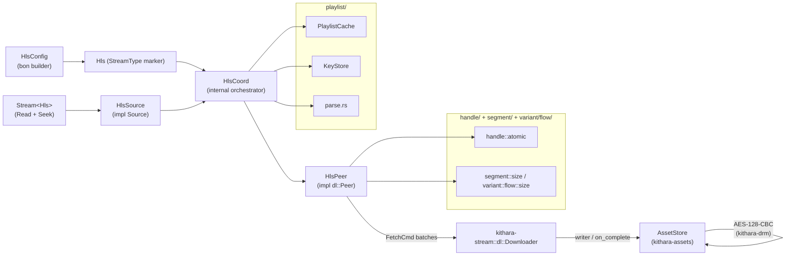

# kithara-hls — Context

Detailed contracts and invariants for the kithara-hls crate; the README is the overview.

## Architecture

The crate's public surface is `Hls`, `HlsConfig`, `HlsSource`, the playlist parser, and the cache/key helpers. `HlsCoord` and `HlsPeer` are the internal orchestration types and are not part of the contract.

## Public Items

<table>
<tr><th>Item</th><th>Kind</th><th>Role</th></tr>
<tr><td><code>Hls</code></td><td>struct (marker)</td><td>Zero-sized type implementing <code>kithara_stream::StreamType</code> for HLS streams</td></tr>
<tr><td><code>HlsConfig</code></td><td>struct (bon-builder)</td><td>HLS stream configuration — URL, ABR caps, key handling, downloader, asset store, cancel token, event bus</td></tr>
<tr><td><code>KeyOptions</code></td><td>struct</td><td>DRM key-resolution options consumed by <code>HlsConfig</code></td></tr>
<tr><td><code>HlsSource</code></td><td>struct</td><td><code>Source</code> implementation backed by <code>HlsCoord</code>; what <code>Stream&lt;Hls&gt;</code> wraps</td></tr>
<tr><td><code>HlsError</code> / <code>HlsResult</code></td><td>enum / alias</td><td>Crate-level error type and result alias</td></tr>
<tr><td><code>VariantIndex</code></td><td>type</td><td>Position of a variant in the master playlist</td></tr>
<tr><td><code>KeyStore</code></td><td>struct</td><td>Coordinates AES-128 key fetches and caches resolved keys</td></tr>
<tr><td><code>PlaylistCache</code></td><td>struct</td><td>In-memory cache of parsed playlists keyed by URL</td></tr>
<tr><td><code>ParsedMaster</code>, <code>MediaPlaylist</code>, <code>VariantStream</code>, <code>VariantId</code></td><td>types</td><td>Parsed playlist representations from <code>playlist::parse</code></td></tr>
<tr><td><code>parse_master_playlist</code>, <code>parse_media_playlist</code></td><td>fns</td><td>Standalone playlist parsers usable without the rest of the stack</td></tr>
<tr><td><code>PlaylistState</code>, <code>SegmentState</code>, <code>VariantState</code></td><td>types</td><td>Runtime view into playlist and segment state for the player / ABR</td></tr>
</table>

Re-exports: `AbrMode` from `kithara-abr`; `KeyProcessor`, `KeyProcessorRegistry`, `KeyProcessorRule` from `kithara-drm`.

## ABR and Variant Switching

- The peer asks `AbrController` for a decision per fetch (pull-driven, no separate scheduler thread).
- A cross-codec variant switch recreates the decoder; same-codec fMP4 switches refresh the init segment in place.
- Throughput samples are fed to ABR after each completed segment.
- Manual ABR (`AbrMode::Manual`) overrides automatic selection — the next fetch picks the requested variant immediately.

### Decoder-probe rebuild

On a post-ABR switch into mid-playback, `rebuild_with_decoder_probe` rebuilds the active variant's fetch queue like `rebuild` but also enqueues `seg 0` when `from_seg > 0`. The decoder factory's probe (Symphonia format reader) reads the container's first ~1 KB to construct the codec; without `seg 0` the queue would start at `target_seg`, leaving `[0..PROBE)` unfetched and the probe hanging on `wait_range budget exceeded`.

`seg 0` is required even when the variant advertises a separate init (CMAF `EXT-X-MAP`): the init covers only a small header, but the probe scans further into the first media chunk. After the probe succeeds, `decoder_seek_safe(target_time)` jumps the decoder forward, so segments `1..from_seg` are never fetched — only `seg 0`. This adds at most one extra segment per switch; if `seg 0` is already cached the scheduler skips the fetch and the queue entry resolves via `committed_final_len` in `dispatch`.

### Variant init

`HlsVariant::build_init_entry` (`variant/io/init.rs`) records a separately
fetched init segment as `Option<Segment::Init>`. Existence is keyed on the
playlist `#EXT-X-MAP` URL — a static fact — **not** on the init HEAD size:

- `None` — no separate init fetch: no `#EXT-X-MAP` URL, or a byte-range-embedded
  init (the init lives inside segment 0's byte range, so there is no separate
  init URL). `rebuild` never enqueues `PlannedFetch::Init` and every init query
  reads as 0.
- `Some(init)` — a real `#EXT-X-MAP` init. Always has a real URL; its size starts
  at the HEAD estimate, which **may be 0** when the init HEAD failed or was
  absent. It is enqueued at the front of the fetch queue so the demuxer has the
  container header before any media segment.

A failed init HEAD does **not** mean the init is absent: `#EXT-X-MAP` still
declares it and it must be fetched (its commit sets the real size). Keying on the
HEAD size would drop the init, seed segment 0 at offset 0, and make `read_at(0)`
serve segment 0's container where the demuxer expects the init's `ftyp`
(`re_mp4: ftyp not found`), or wedge the reader with no progress.

While an init is declared but not yet sized (`init_size() == 0` — a failed/absent
HEAD, or the pre-commit window), `read_at` on the fresh-activation frame
(`served_from() == 0`) holds reads pending: the init prefix is reserved for the
init, not for media, until the init's commit sizes it. A terminally failed init
(`init_failed`) releases the reservation so the read surfaces an error instead
of waiting forever. The URL-keyed existence fact stays frozen at construction;
only the size changes when the resource commits.

### Format-change header byte range

`header_byte_range` returns the byte range a demuxer reads to re-establish container state after a decoder-recreate format change (cross-codec switch or unknown codec continuity). It returns `Ok(range)` only when recovery is applicable:

- `served_from() == 0` and `init_size > 0` (fMP4 with `#EXT-X-MAP`): the virtual init range `[0..init_size)`. The decoder factory's Symphonia probe re-reads init from here.
- `served_from() == 0` and `init_size == 0` (raw WAV/PCM with a leading header, or raw TS/AAC): the start of segment 0, where the demuxer re-parses the header.

It returns `Err(FormatChangeNotApplicable)` when the variant was activated by `activate_at_segment_with_shift` (a same-codec ABR commit) and has `served_from() > 0`. Init bytes then live at the natural `[0..init_size)` while virtual space starts at `byte_shift`; same-codec playback continues through the shift without init recovery. Cross-codec recovery only runs after `reset_to_full_range` zeroes the shift. Containers with implicit framing (AAC ADTS, MP3, MPEG-TS) do not need this range — callers filter via `container_needs_init_range` before reading.

## Encryption (AES-128-CBC)

Encrypted segments parse `#EXT-X-KEY` from the media playlist; `KeyStore` resolves the key URL (with `KeyProcessorRule`-driven rewriting if configured) and the asset store decrypts on read. URIs in `#EXT-X-KEY` are resolved relative to the **segment** URL, not the media-playlist URL.

Every final AES-128 key, whether used directly or produced by a provider
processor, is validated as exactly 16 bytes before it enters session memory or
the asset store. Key repair is serialized per resource: an invalid cached key is
removed and refetched once, with cache state rechecked after the transaction is
acquired. Session memory owns the validated key needed by synchronous segment
construction, so a cache persistence failure does not turn a successful key
fetch into a playback failure.

## Caching

Each segment is stored as its own `AssetResource` via `AssetStore` (`kithara-assets`). Encrypted segments are acquired with `acquire_resource_with_ctx(key, identity, Some(ProcessCtx))`, where `DecryptContext` is wrapped by `decrypt_processor.rs` as a `ResourceProcessor`, so decryption is part of the resource lifecycle.

HLS cache naming is owned by the `AssetLayout` carried on the scope (`kithara-assets`). Keys are minted once at the semantic site via `scope.key_for(&url)` — every resource (manifest, init, segment, key) is keyed by its URL alone; `stream/hls.rs` resolves the layout from `config.store.layout` (`StoreOptions`), or the store default.

Playlist bytes are one validated cache transaction. A cached master or media
playlist is parsed before it is accepted; a parse failure removes the resource
through `AssetStore::remove_resource`, which also clears its availability-index
entry, then performs one network fetch. Empty committed resources follow the
same removal path. The store serializes this transaction per resource across
independent playlist caches, so a late stale reader cannot delete a repaired
entry. Network bytes are parsed before commit, so an invalid response is
returned as an error and never becomes a persistent cache hit.

A valid network playlist remains usable when cache persistence fails. The write
failure is logged at `WARN`, and a later cache/session retries persistence rather
than turning a cache outage into a playback outage. The current `PlaylistCache`
keeps its parsed value in memory for the rest of that cache instance.

## Seek and wait_range Contract

- `Source::wait_range(start..end, timeout)` has two modes, selected by `timeout`:
  - **`Some(_)` — wake-free probe** (the RT worker / `Stream::probe_read`): a single non-blocking readiness check. Returns `Ready` only when the requested bytes are readable in the current virtual layout owned by `HlsCoord`, `Interrupted` while the timeline is flushing, `Eof` past total bytes, a terminal `Err` when a covering segment failed, and otherwise `WaitBudgetExceeded` immediately. It never sleeps — the worker decode path stays off any blocking syscall, and the backoff between probes lives in the audio scheduler's `Waiting` park. `HlsVariant::wait_range` ignores the timeout value (the probe is the same regardless); pinned by `variant::tests::wait_range_probes_without_sleeping` / `_flush_short_circuits_without_sleeping`.
  - **`None` — event-driven blocking wait** (the off-RT `Stream::read` / `prime_seek_range`): `HlsCoord` parks on a shared readiness gate (`kithara_platform::sync::CondvarGate<u64>`, the unified condvar gate) until the probe resolves (`Ready`/`Eof`/`Interrupted`), a covering segment fails, or cancel fires. **No wall-clock poll** — the prior `park_timeout` spin (a 500ms seek-prime deadline + a 10ms read backoff) accumulated under heavy load into spurious timeouts; the gate wakes the reader the instant its range fills. See "Event-driven read wait" below.
- **Event-driven read wait.** Every transition that can flip the wake-free probe `signal()`s the gate so a parked `wait_range(_, None)` re-probes: each **segment byte write** (the `FetchSlot` writer wrapper) and **settle** (commit/fail/cancel) on the fetch path; **fence raise/clear** (`commit_variant_switch` / `clear_variant_fence`) and **seek reset** (`reset_for_seek`) on the coord; and **cancel** via a `CancelToken::on_cancel` waker registered for the wait's lifetime (the one transition with no producer-side signal, mirroring `kithara-storage` `wait_range_inner`). The reader snapshots the gate counter **before** probing and parks only if it is unchanged — a seqlock guard that closes the lost-wakeup window even though the probe predicate (the `kithara-assets` availability index) and the gate sit under different locks. A genuine wedge (no signal site ever fires) trips the `#[kithara::hang_watchdog]` on the wait rather than parking forever. The probe path stays wake-free; only the off-RT `None` caller blocks.
- **Event-driven audio-worker wake.** The wake-free probe path above means the RT decoder's worker, when it underruns on a not-yet-arrived segment, parks on the audio scheduler's `Waiting` timer (`kithara-audio` `WAITING_TIMEOUT` = 10 ms) and rediscovers data only on the next poll. Under heavy load that park stretches (OS deschedule) and accumulates — across the hundreds of seeks in the live DRM/HLS stress tests — into the same spurious-timeout flake the off-RT gate fixed for raw reads (flash-masked, since virtual time collapses the park). Any off-RT readiness edge that can flip the wake-free probe also fires a `kithara_stream::WorkerWake` (installed by the audio worker via `Source::set_worker_wake`, bridged to `AudioWorkerHandle::wake`) right after `ready.signal()`: per-chunk **write** (plaintext bytes land), fetch **settle** (commit, where the DRM decrypt gate opens), cache-hit slot adoption (`committed_final_len` fast paths), and **fence raise / variant commit** (`commit_variant_switch`, including manual ABR mode changes). The worker re-ticks the decoder the instant bytes or a variant fence become observable instead of on its 10 ms poll; the timeout stays as a backstop. `clear_variant_fence` still does **not** fire it: it runs on the `#[rtsan_forbid_blocking]` produce core where a cross-thread unpark is illegal, and seek already wakes the worker directly. Wait-free (atomic bump + `unpark`) from off-RT readiness producers.
- On a seek miss, the source enqueues an explicit on-demand segment fetch for the active variant and seek epoch.
- On a mid-stream ABR switch, stale metadata offsets are discarded — the source wakes the sequential downloader rather than trusting old offsets.
- **`is_canonical_complete` two-step read.** It loads the lock-free `sizes_complete` atomic (`Acquire`) *before* taking the frame lock for the `byte_shift` / `served` / `init_seed` / `offsets` geometry checks. The split is safe because `sizes_complete` is republished only **after** `recompute` inside `Layout::apply_commit` / `reset` (mutate frame under the write lock → materialise the `FrameSnapshot` → drop the guard → `republish`): the atomic flips back to `true` only once the offset table is already exact, so a `true` read can never observe an in-progress recompute. Gates `layout_seek_invariant` / `prepare_for_seek`'s seek-reset skip.
- **Two `time → segment` resolvers coexist.** The hot per-seek path uses `HlsVariant::seek_point_at_time` (`variant/map/media.rs`, bisect over the cumulative offset table); `HlsCoord::commit_variant_switch` uses the cold `find_seek_point_for_time` (`playlist/state.rs`, linear scan). They are independent implementations and **must agree** on the mapping under S13's on-demand sizing — a variant switch must land the reader on the same segment a plain seek to that time would, or the post-switch read diverges from the pre-switch geometry.
- **Exact-byte seek gates fold the init in.** The exact-byte seek short-circuits (`set_exact_seek_demand` / `set_exact_byte_seek_demand` / `exact_byte_position_ready` in `variant/flow/size.rs`) gate on `all_sizes_complete()` = `sizes_complete() && exact_init_complete()`, **not** the MEDIA-only `sizes_complete()`. The exact-byte offset table seeds from the `EXT-X-MAP` init size, so for a `needs_exact_byte_sizes` fMP4 profile a seek issued before the init resolves must still register `SizeDemand::Init` and run the `complete_exact_seek_if_ready` anchor correction; a media-only short-circuit would skip both and land on stale bytes once the init commit shifts every segment offset. (Raw WAV/PCM has no `#EXT-X-MAP`, so `exact_init_complete()` is vacuously `true` and the gate reduces to `sizes_complete()` there.)
- `Eof` is returned **only** when the requested range starts at or after the variant layout's effective total bytes (`HlsVariant::total_bytes()`) **and every served segment's byte size is known** (`HlsVariant::sizes_complete()`). It is never inferred for an in-range segment whose body has not yet arrived, **nor while any served segment's size estimate is still missing** — either case yields `WaitBudgetExceeded` (→ `Pending`/need-data) so the reader holds rather than terminating. This is the EOF contract that prevents the production "silent auto-advance" cascade: segment sizes are normally learned up-front (`#EXT-X-BYTERANGE` or HEAD `Content-Length`; see `segment/size.rs` and `variant/flow/size.rs`), but on an **immediate seek before size-estimation completes** a served segment is still size-`0` (unknown), which under-counts `total_bytes()` and makes an in-range offset look past-the-end → a premature `Eof` would latch the audio consumer into `AtEof` and the queue would skip the track. Gating the three byte-EOF mints (`phase_at` / `read_at` / `wait_range`) on `sizes_complete()` closes that window: while incomplete, `total_bytes()` is treated as a lower bound, not the stream end. `sizes_complete` is republished lock-free alongside `total_bytes` on every layout mutation (one `FrameSnapshot`, so the two never tear). Pinned by `tests/tests/kithara_queue/early_seek_size_withheld_advance.rs` (`immediate_seek_size_and_body_withheld`).

## Features

<table>
<tr><th>Feature</th><th>Default</th><th>Effect</th></tr>
<tr><td><code>default</code></td><td>yes</td><td><code>client-reqwest</code> + <code>tls-rustls</code></td></tr>
<tr><td><code>probe</code></td><td>no</td><td>USDT probe points for tracing</td></tr>
<tr><td><code>perf</code></td><td>no</td><td>Hotpath instrumentation (also enables <code>kithara-net/perf</code>)</td></tr>
<tr><td><code>client-reqwest</code></td><td>yes</td><td>Forward the reqwest HTTP backend to network-reaching deps</td></tr>
<tr><td><code>client-wreq</code></td><td>no</td><td>Forward the wreq HTTP backend to network-reaching deps</td></tr>
<tr><td><code>tls-rustls</code></td><td>yes</td><td>Forward rustls TLS selection to network-reaching deps</td></tr>
<tr><td><code>tls-native</code></td><td>no</td><td>Forward native TLS selection to network-reaching deps</td></tr>
</table>

## Integration

Depends on `kithara-stream` (Peer/Downloader, Source, `MediaInfo`), `kithara-net` (HTTP), `kithara-assets` (segment cache via `AssetStore`), `kithara-abr` (ABR algorithm), `kithara-drm` (AES-128), `kithara-events` (HLS events). Composes with `kithara-audio` as `Audio<Stream<Hls>>` inside the decode pipeline. Emits `HlsEvent` via the shared `EventBus`.
