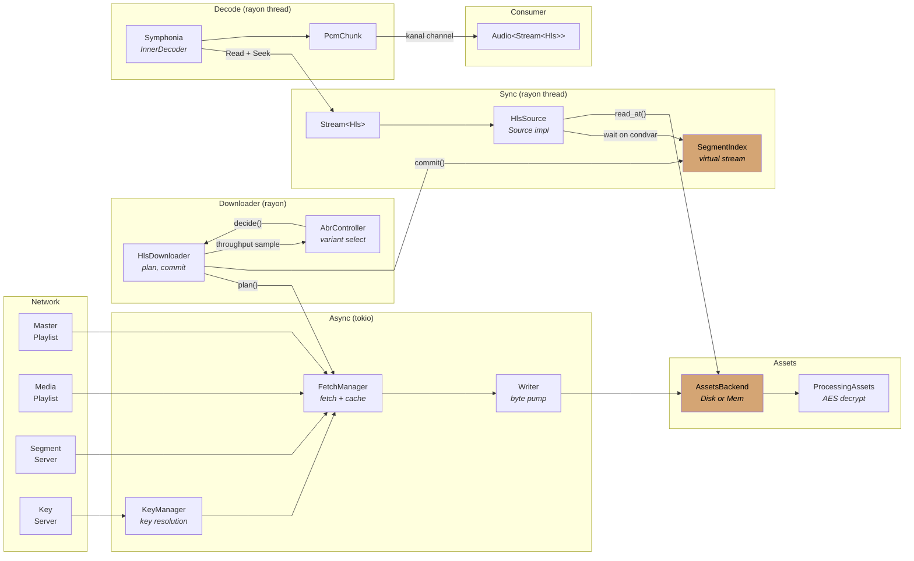

<div align="center">
  
</div>

<div align="center">

[](https://crates.io/crates/kithara-hls)
[](https://crates.io/crates/kithara-hls)
[](https://docs.rs/kithara-hls)
[](../../LICENSE-MIT)

</div>

# kithara-hls

HLS (HTTP Live Streaming) VOD orchestration with adaptive bitrate, persistent caching, and encryption key management. Implements `StreamType` for use with `Stream<Hls>`, coordinating playlist parsing, segment fetching, ABR decisions, and disk cache.

## Usage

```rust
use kithara_stream::Stream;
use kithara_hls::{Hls, HlsConfig};

let config = HlsConfig::new(url);
let stream = Stream::<Hls>::new(config).await?;
```

## Segment download flow



- **ABR**: `AbrController` selects variant (quality) based on throughput estimation and buffer state. Emits `HlsEvent::VariantApplied` on quality switch.
- **Virtual byte stream**: segments are indexed linearly. Reader sees a single contiguous byte stream via `SegmentIndex`.
- **Backpressure**: downloader waits when too far ahead of reader position (`look_ahead_bytes`).

## Virtual Stream Layout

Segments are logically stitched into a contiguous byte stream:

```
Single variant:
  [Init] [Seg0] [Seg1] [Seg2] ...
  0──────┬──────┬──────┬──────┤

Mid-stream ABR switch (V0 → V1):
  [V0 Seg0] [V0 Seg1] (fence) [V1 Init] [V1 Seg2] [V1 Seg3] ...
  0─────────┬─────────┬────────┬─────────┬──────────┤
```

`SegmentIndex` maintains a mapping of `(variant, segment_index) → SegmentEntry` plus a `RangeSet<u64>` for loaded byte ranges. On ABR switch, `fence_at()` discards old variant segments.

## ABR Integration

1. `plan()` calls `make_abr_decision()` which queries `AbrController`.
2. On variant change: emit `VariantApplied`, calculate new variant metadata via HEAD requests.
3. `ensure_variant_ready()` handles mid-stream switches by fencing old segments.
4. Throughput samples are fed to ABR after each segment download.

## Caching and Offline Support

- Leverages `AssetsBackend<DecryptContext>` (disk or ephemeral) for persistent segment storage.
- `populate_cached_segments()` scans disk for committed segments on startup.
- `#EXT-X-ALLOW-CACHE` flag respected.
- `CoverageIndex` tracks per-segment byte-range coverage for crash recovery.

## Integration

Depends on `kithara-net` for HTTP, `kithara-assets` for caching (disk or in-memory via `AssetsBackend`), and `kithara-abr` for ABR algorithm. Composes with `kithara-audio` as `Audio<Stream<Hls>>`. Emits `HlsEvent` via broadcast channel for monitoring.
