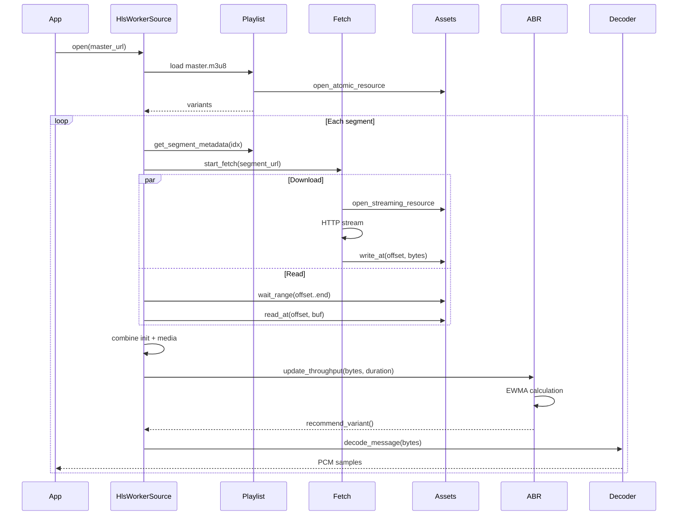
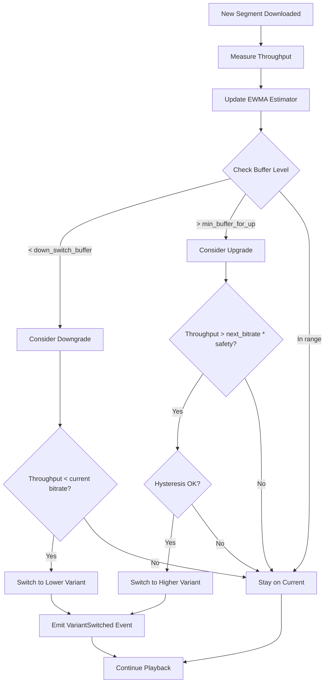

# `kithara-hls` — HLS VOD orchestration with caching and ABR

`kithara-hls` provides HLS (HTTP Live Streaming) VOD (Video-on-Demand) orchestration for Kithara, with support for:
- Adaptive Bitrate (ABR) switching based on network conditions
- Persistent caching for offline playback
- Playlist parsing and management
- Segment fetching with retry logic
- Key management for encrypted streams
- Event-driven architecture for monitoring and control

## Public contract (normative)

### Entry point
- `struct Hls` — Type parameter for `StreamSource::<Hls>::open(url, params)`
- `struct HlsSource` — Random-access source adapter (implements `kithara_stream::Source`)
- `StreamSource::<Hls>` — Unified source interface with event subscription

### Configuration
- `struct HlsOptions` — Comprehensive configuration for HLS behavior
- `struct AbrOptions` — ABR-specific configuration
- `struct NetworkOptions` — Network request configuration
- `struct CacheOptions` — Cache configuration
- `struct KeyOptions` — Key processing configuration

### Events and errors
- `enum HlsEvent` — Events emitted during HLS playback
- `enum HlsError` — Error type for HLS operations
- `type HlsResult<T> = Result<T, HlsError>` — Result alias

### ABR types
- `struct AbrDecision` — ABR decision result
- `enum AbrReason` — Reason for ABR decision
- `struct ThroughputSample` — Network throughput measurement
- `struct Variant` — Variant (quality level) information

## Architecture overview

```
┌──────────────────────────────────────────────────────────┐
│           StreamSource::<Hls>::open()                    │
│              (Creates HlsSource)                         │
└──────────────────────────┬───────────────────────────────┘
                           │
┌──────────────────────────▼───────────────────────────────┐
│                   StreamSource<Hls>                      │
│              (Wraps HlsSource)                           │
│              .events() → Receiver<HlsEvent>              │
└──────────────────────────┬───────────────────────────────┘
                           │
┌──────────────────────────▼──────────────────────────────┐
│                   SegmentStream                          │
│   (Iterates variants and segments, handles ABR)          │
└─────┬────────────┬────────────┬────────────┬────────────┘
      │            │            │            │
┌─────▼─────┐ ┌───▼────┐ ┌─────▼─────┐ ┌───▼──────┐
│ Playlist  │ │ Fetch  │ │   Key    │ │   ABR    │
│ Manager   │ │Manager │ │ Manager  │ │Controller│
└───────────┘ └────────┘ └──────────┘ └──────────┘
      │            │
┌─────▼─────┐ ┌───▼────┐
│kithara-net│ │kithara-│
│ (HTTP)    │ │ assets │
└───────────┘ └────────┘
```

### Module structure

```
src/
  lib.rs              — Public API re-exports
  error.rs            — HlsError, HlsResult
  events.rs           — HlsEvent, EventEmitter
  options.rs          — HlsOptions, AbrOptions, etc.
  source.rs           — Hls factory (SourceFactory impl)
  session.rs          — HlsSession
  source_adapter.rs   — HlsSource (implements Source trait)
  abr/                — ABR logic
    controller.rs     — AbrController
    estimator.rs      — ThroughputEstimator
    types.rs          — Variant, ThroughputSample
  stream/             — Segment streaming pipeline
    segment_stream.rs — SegmentStream
    pipeline.rs       — Main async generator
    commands.rs       — Seek/ForceVariant commands
    context.rs        — Helper functions
    types.rs          — PipelineEvent, SegmentMeta
  fetch.rs            — FetchManager (internal)
  keys.rs             — KeyManager (internal)
  playlist.rs         — PlaylistManager (internal)
```

## Core invariants

1. **VOD focus**: Designed for Video-on-Demand, not live streaming
2. **Offline support**: All resources are cached for offline playback
3. **ABR awareness**: Adapts bitrate based on network conditions
4. **Event-driven**: Rich event system for monitoring and control
5. **Storage persistence**: Uses `kithara-assets` for persistent caching
6. **Error resilience**: Robust error handling with retry logic
7. **Cancellation**: All async operations respect cancellation

## Example usage

### Basic HLS playback
```rust
use kithara_hls::{Hls, HlsParams};
use kithara_stream::StreamSource;
use url::Url;

let url = Url::parse("https://example.com/master.m3u8").unwrap();
let params = HlsParams::default();

// Open HLS source
let source = StreamSource::<Hls>::open(url, params).await?;

// Subscribe to events
let mut events = source.events();

// Use source with kithara_stream::SyncReader for decoding
```

### Custom ABR configuration
```rust
use kithara_hls::{HlsOptions, AbrOptions};
use std::time::Duration;

let opts = HlsOptions {
    abr: AbrOptions {
        min_buffer_for_up_switch_secs: 15.0,
        down_switch_buffer_secs: 8.0,
        throughput_safety_factor: 1.8,
        up_hysteresis_ratio: 1.4,
        down_hysteresis_ratio: 0.7,
        min_switch_interval: Duration::from_secs(20),
        ..Default::default()
    },
    ..Default::default()
};
```

## Events

### `HlsEvent` variants

- `VariantApplied { from_variant, to_variant, reason }` — Bitrate switch occurred
- `SegmentStart { variant, segment_index, byte_offset }` — Segment download started
- `SegmentComplete { variant, segment_index, bytes_transferred, duration }` — Segment downloaded
- `KeyFetch { key_url, success, cached }` — Key fetch completed
- `BufferLevel { level_seconds }` — Current buffer level
- `ThroughputSample { bytes_per_second }` — Network throughput sample
- `DownloadProgress { offset, percent }` — Download progress
- `PlaybackProgress { position, percent }` — Playback progress
- `Error { error, recoverable }` — Error occurred
- `EndOfStream` — Stream ended

Events are emitted through a broadcast channel accessible via `HlsSession::events()`.

## Error handling

### `HlsError` categories

- `Net(NetError)` — Network-related errors
- `Assets(AssetsError)` — Asset storage errors
- `Storage(StorageError)` — Storage errors
- `PlaylistParse(String)` — Playlist parsing errors
- `VariantNotFound(String)` — Requested variant not found
- `SegmentNotFound(String)` — Requested segment not found
- `NoSuitableVariant` — No suitable variant available
- `KeyProcessing(String)` — Key processing errors
- `Abr(String)` — ABR-related errors
- `OfflineMiss` — Resource not available in offline mode
- `InvalidUrl(String)` — Invalid URL
- `Driver(String)` — Driver errors

## Integration with other Kithara crates

### `kithara-stream`
- `HlsSource` implements the `Source` trait
- Can be wrapped with `SyncReader` for synchronous decoding

### `kithara-net`
- Uses `HttpClient` for all HTTP operations
- Leverages retry and timeout policies

### `kithara-assets`
- Stores playlists, segments, and keys
- Uses both `AtomicResource` (playlists, keys) and `StreamingResource` (segments)
- Manages asset lifecycle with lease/eviction semantics

## Data Flow Diagrams

### HLS Playback Pipeline



### ABR Decision Flow



## Performance Characteristics

### Memory Usage (Typical HLS Stream)

| Component | Memory | Notes |
|-----------|--------|-------|
| **PlaylistManager** | ~15 KB | Master + 3 media playlists |
| **HlsWorkerSource** | | |
| - init_segments_cache | ~6 KB | 3 variants × ~2KB each |
| - buffered_chunks (⚠️) | **~20 MB** | Can grow unbounded! |
| **Channels** | ~8 MB | cmd(16) + chunk(2) + events |
| **FetchManager metadata** | ~10 KB | Minimal overhead |
| **ABR state** | ~1 KB | EWMA + config |
| **TOTAL** | **~28 MB** | Dominated by buffered_chunks |

**⚠️ Critical Issue**: `HlsSourceAdapter::buffered_chunks` can grow without limit during fast fetching.

**Recommendation**: Limit to max 3-5 segments (~6-10 MB).

### CPU Utilization

| Operation | Duration | CPU | Waiting |
|-----------|----------|-----|---------|
| Segment fetch (2MB) | 200-2000ms | <5% | 95% (network) |
| Init+Media combine | 1-3ms | 100% | 0% (memcpy) |
| ABR decision | <100μs | 100% | 0% |
| Playlist parse | 1-5ms | 100% | 0% |

**Inefficiencies:**
- ❌ **Spin loop в wait_range**: 10ms sleep × 1000 iterations = 10s max
- ❌ **Паузированный worker**: 100ms sleep в бесконечном цикле
- ❌ **Init+Media копирование**: Полная копия данных вместо zero-copy

### Throughput

- **Sequential downloads**: ~1-50 Mbps (зависит от сети и сервера)
- **Prefetch**: Отсутствует (загрузка only-when-needed)
- **ABR switching**: ~1-3 секунды latency

## Critical Files for Understanding

1. `src/source.rs` - Entry point, Hls::open()
2. `src/worker/source.rs` - Worker loop, segment fetching
3. `src/worker/adapter.rs` - Source trait adapter
4. `src/abr/controller.rs` - ABR logic
5. `src/fetch.rs` - HTTP fetching + caching
6. `src/playlist.rs` - Playlist management

## Known Issues & Optimization Opportunities

### High Priority
1. **[Memory]** Limit `buffered_chunks` to max 5 segments
2. **[CPU]** Replace spin loops with `Notify` in wait_range
3. **[Memory]** Use `Bytes` chain instead of init+media copy

### Medium Priority
4. **[Throughput]** Implement prefetch for N+1 segment
5. **[CPU]** Increase chunk channel capacity from 2 to 8-16
6. **[Memory]** Clear `init_segments_cache` on variant switch

### Low Priority (Observability)
7. Add metrics for buffer levels, throughput, ABR decisions
8. Tracing spans for segment downloads

## Design philosophy

1. **Modular architecture**: Separated concerns (playlist, fetch, keys, ABR)
2. **Hidden internals**: Only public API is exposed, internals are private
3. **VOD first**: Optimized for Video-on-Demand with full caching
4. **ABR intelligence**: Sophisticated bitrate adaptation
5. **Offline capability**: Full support for offline playback
6. **Event-driven**: Comprehensive event system for monitoring
7. **Storage integration**: Deep integration with `kithara-assets`

---

**Performance Analysis**: См. `/ARCHITECTURE.md` для детального анализа памяти и CPU.
