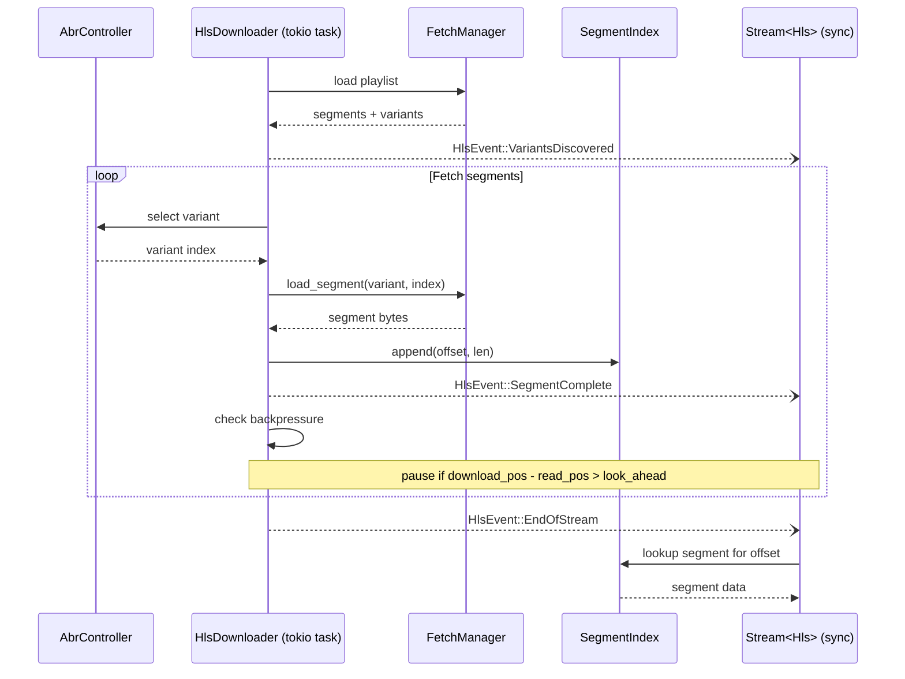

<div align="center">
  
</div>

# kithara-hls

HLS (HTTP Live Streaming) VOD orchestration with adaptive bitrate, persistent caching, and encryption key management. Implements `StreamType` for use with `Stream<Hls>`, coordinating playlist parsing, segment fetching, ABR decisions, and disk cache.

## Usage

```rust
use kithara_stream::Stream;
use kithara_hls::{Hls, HlsConfig};

let config = HlsConfig::new(url);
let stream = Stream::<Hls>::new(config).await?;
```

## Segment download flow



- **ABR**: `AbrController` selects variant (quality) based on throughput estimation and buffer state. Emits `HlsEvent::VariantApplied` on quality switch.
- **Virtual byte stream**: segments are indexed linearly. Reader sees a single contiguous byte stream via `SegmentIndex`.
- **Backpressure**: downloader waits when too far ahead of reader position (`look_ahead_bytes`).

## Integration

Depends on `kithara-net` for HTTP, `kithara-assets` for caching, and `kithara-abr` for ABR algorithm. Composes with `kithara-audio` as `Audio<Stream<Hls>>`. Emits `HlsEvent` via broadcast channel for monitoring.
