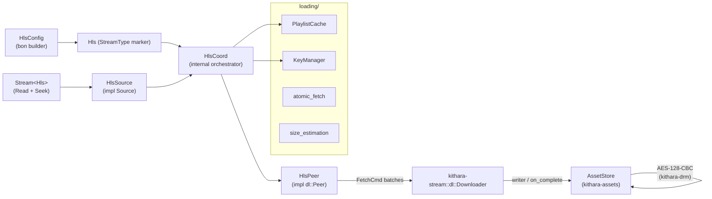

<div align="center">
  
</div>

<div align="center">

[](../../LICENSE-MIT)

</div>

# kithara-hls

HLS (HTTP Live Streaming) VOD orchestration: playlist parsing, segment fetching, adaptive-bitrate decisions, cross-codec variant switching, AES-128-CBC decryption, and persistent caching. Implements `kithara_stream::StreamType` for use with `Stream<Hls>`.

## Usage

```rust
use kithara_stream::Stream;
use kithara_hls::{Hls, HlsConfig};

let config = HlsConfig::new(master_playlist_url);
let stream = Stream::<Hls>::new(config).await?;
// `stream` implements Read + Seek; pass it into kithara-decode / kithara-audio.
```

`HlsConfig` is a [`bon`](https://crates.io/crates/bon) builder. Use `HlsConfig::new(url)` for the URL-only shortcut, or `HlsConfig::for_url(url)` to start a chained builder for non-default settings (`look_ahead_bytes`, key options, downloader, asset store, cancel token, event bus).

## Architecture


```mermaid
flowchart LR
    Cfg["HlsConfig<br/>(bon builder)"]
    Cfg --> Hls["Hls (StreamType marker)"]
    Hls --> Coord["HlsCoord<br/>(internal orchestrator)"]

    subgraph Loading["loading/"]
        PC["PlaylistCache"]
        KM["KeyManager"]
        AF["atomic_fetch"]
        SE["size_estimation"]
    end

    Coord --> Peer["HlsPeer<br/>(impl dl::Peer)"]
    Coord --> PC
    Coord --> KM
    Peer -- "FetchCmd batches" --> DL["kithara-stream::dl::Downloader"]
    DL -- "writer / on_complete" --> AS["AssetStore<br/>(kithara-assets)"]
    AS -- "AES-128-CBC<br/>(kithara-drm)" --> AS

    Source["HlsSource<br/>(impl Source)"] --> Coord
    Stream2["Stream&lt;Hls&gt;<br/>(Read + Seek)"] --> Source
```

The crate's public surface is `Hls`, `HlsConfig`, `HlsSource`, the playlist parser, and the cache/key helpers. `HlsCoord` and `HlsPeer` are the internal orchestration types and are not part of the contract.

## Public Items

<table>
<tr><th>Item</th><th>Kind</th><th>Role</th></tr>
<tr><td><code>Hls</code></td><td>struct (marker)</td><td>Zero-sized type implementing <code>kithara_stream::StreamType</code> for HLS streams</td></tr>
<tr><td><code>HlsConfig</code></td><td>struct (bon-builder)</td><td>HLS stream configuration — URL, ABR caps, key handling, downloader, asset store, cancel token, event bus</td></tr>
<tr><td><code>KeyOptions</code></td><td>struct</td><td>DRM key-resolution options consumed by <code>HlsConfig</code></td></tr>
<tr><td><code>HlsSource</code></td><td>struct</td><td><code>Source</code> implementation backed by <code>HlsCoord</code>; what <code>Stream&lt;Hls&gt;</code> wraps</td></tr>
<tr><td><code>HlsError</code> / <code>HlsResult</code></td><td>enum / alias</td><td>Crate-level error type and result alias</td></tr>
<tr><td><code>VariantIndex</code></td><td>type</td><td>Position of a variant in the master playlist</td></tr>
<tr><td><code>KeyManager</code></td><td>struct</td><td>Coordinates AES-128 key fetches and caches resolved keys</td></tr>
<tr><td><code>PlaylistCache</code></td><td>struct</td><td>In-memory cache of parsed playlists keyed by URL</td></tr>
<tr><td><code>MasterPlaylist</code>, <code>MediaPlaylist</code>, <code>VariantStream</code>, <code>VariantId</code></td><td>types</td><td>Parsed playlist representations from <code>parsing</code></td></tr>
<tr><td><code>parse_master_playlist</code>, <code>parse_media_playlist</code>, <code>variant_info_from_master</code></td><td>fns</td><td>Standalone playlist parsers usable without the rest of the stack</td></tr>
<tr><td><code>PlaylistState</code>, <code>SegmentState</code>, <code>VariantSizeMap</code>, <code>VariantState</code></td><td>types</td><td>Runtime view into playlist and segment state for the player / ABR</td></tr>
</table>

Re-exports: `AbrMode` from `kithara-abr`; `KeyProcessor`, `KeyProcessorRegistry`, `KeyProcessorRule` from `kithara-drm`.

## ABR and Variant Switching

- The peer asks `AbrController` for a decision per fetch (pull-driven, no separate scheduler thread).
- A cross-codec variant switch recreates the decoder; same-codec fMP4 switches refresh the init segment in place.
- Throughput samples are fed to ABR after each completed segment.
- Manual ABR (`AbrMode::Manual`) overrides automatic selection — the next fetch picks the requested variant immediately.

## Encryption (AES-128-CBC)

Encrypted segments parse `#EXT-X-KEY` from the media playlist; `KeyManager` resolves the key URL (with `KeyProcessorRule`-driven rewriting if configured) and the asset store decrypts on read. URIs in `#EXT-X-KEY` are resolved relative to the **segment** URL, not the media-playlist URL.

## Caching

Each segment is stored as its own `AssetResource` via `AssetStore` (`kithara-assets`). Encrypted segments are acquired with `acquire_resource_with_ctx(key, Some(DecryptContext))` so decryption is part of the resource lifecycle. The optional `#EXT-X-ALLOW-CACHE` tag is parsed into playlist metadata for compatibility; the current cache policy is not switched by this flag.

## Seek and wait_range Contract

- `Source::wait_range(start..end)` returns `Ready` only when the requested bytes are readable in the current virtual layout owned by `HlsCoord`.
- On a seek miss, the source enqueues an explicit on-demand segment fetch for the active variant and seek epoch.
- On a mid-stream ABR switch, stale metadata offsets are discarded — the source wakes the sequential downloader rather than trusting old offsets.
- `Eof` is returned only when the timeline is marked EOF and the requested range starts at or after the effective total bytes.

## Features

<table>
<tr><th>Feature</th><th>Default</th><th>Effect</th></tr>
<tr><td><code>probe</code></td><td>no</td><td>USDT probe points for tracing</td></tr>
<tr><td><code>perf</code></td><td>no</td><td>Hotpath instrumentation (also enables <code>kithara-net/perf</code>)</td></tr>
</table>

## Integration

Depends on `kithara-stream` (Peer/Downloader, Source, `MediaInfo`), `kithara-net` (HTTP), `kithara-assets` (segment cache via `AssetStore`), `kithara-abr` (ABR algorithm), `kithara-drm` (AES-128), `kithara-events` (HLS events). Composes with `kithara-audio` as `Audio<Stream<Hls>>` inside the decode pipeline. Emits `HlsEvent` via the shared `EventBus`.
