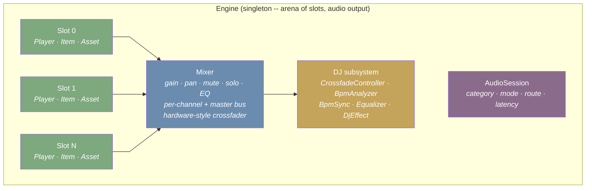

<div align="center">
  
</div>

<div align="center">

[](https://crates.io/crates/kithara-play)
[](https://crates.io/crates/kithara-play)
[](https://docs.rs/kithara-play)
[](../../LICENSE-MIT)

</div>

# kithara-play

Trait-based player architecture mirroring Apple AVPlayer API with DJ engine capabilities. Defines **traits only** (no implementations). All traits are independently mockable via `unimock` (behind `test-utils` feature) unless noted otherwise.

## Usage

```rust
use kithara_play::{Engine, Player, PlayerItem, CrossfadeConfig, PlayError};

// Engine lifecycle
engine.start()?;
let slot_a = engine.allocate_slot()?;

// Attach player to slot, load media
player.replace_current_item(Some(item));
player.play();

// Time observation
let id = player.add_periodic_time_observer(interval, Box::new(|time| {
    println!("position: {:?}", time);
}));

// Crossfade between two slots
let slot_b = engine.allocate_slot()?;
engine.crossfade(slot_a, slot_b, CrossfadeConfig::default())?;

// Cleanup
engine.release_slot(slot_a)?;
engine.stop()?;
```

## Architecture



## Key Types

### AVPlayer API surface

| Trait | AVPlayer equivalent | Key methods |
|-------|-------------------|-------------|
| `Asset` | `AVAsset` | `duration`, `is_playable`, `metadata`, `url` |
| `PlayerItem` | `AVPlayerItem` | `status`, `current_time`, `duration`, `loaded_time_ranges`, `seek`, buffering state |
| `Player` | `AVPlayer` | `play`, `pause`, `seek`, `rate`, `volume`, `replace_current_item`, time observers |
| `QueuePlayer` | `AVQueuePlayer` | `items`, `advance_to_next_item`, `insert`, `remove` |
| `AudioSession` | `AVAudioSession` | `category`, `mode`, `set_active`, `output_volume`, `current_route` |

`Player` and `QueuePlayer` use `Box<dyn Fn>` callbacks for time observers, which makes them unsuitable for unimock's matching ergonomics. They are tested through integration tests.

### Engine and mixing

| Trait | Role |
|-------|------|
| `Engine` | Singleton lifecycle, arena slot management, master output, crossfade delegation |
| `Mixer` | Per-channel gain/pan/mute/solo, master bus, per-channel 3-band EQ, hardware crossfader |

### DJ subsystem

| Trait | Role |
|-------|------|
| `CrossfadeController` | Start/cancel crossfade between two slots, curve control, progress |
| `BpmAnalyzer` | BPM detection, beat grid, tap tempo |
| `BpmSync` | Sync follower to leader BPM, phase offset, nudge, quantize |
| `Equalizer` | Per-slot 3-band EQ with kill switches, configurable frequencies |
| `DjEffect` | Pluggable effects (filter, echo, reverb, flanger, brake, etc.) |

### Identity and time

| Type | Role |
|------|------|
| `SlotId` | Arena position in the engine (opaque, `Copy`) |
| `ObserverId` | Time observer handle (opaque, `Copy`) |
| `MediaTime` | High-precision time with value/timescale (mirrors `CMTime`), supports arithmetic and `Ord` |

### Status enums

- `PlayerStatus` -- `Unknown | ReadyToPlay | Failed`
- `TimeControlStatus` -- `Paused | WaitingToPlay | Playing`
- `ItemStatus` -- `Unknown | ReadyToPlay | Failed`
- `WaitingReason` -- why playback is stalled
- `ActionAtItemEnd` -- `Advance | Pause | None`

### Audio session types

- `SessionCategory` -- `Ambient | SoloAmbient | Playback | Record | PlayAndRecord | MultiRoute`
- `SessionMode` -- `Default | VoiceChat | VideoChat | GameChat | Measurement | MoviePlayback | SpokenAudio`
- `SessionOptions` -- mix/duck/bluetooth/airplay flags
- `PortType`, `PortDescription`, `RouteDescription` -- audio routing

### DJ types

- `CrossfadeCurve` -- `EqualPower | Linear | SCurve | ConstantPower | FastFadeIn | FastFadeOut`
- `CrossfadeConfig` -- duration, curve, beat-aligned flag, cut points
- `BpmInfo` -- detected BPM, confidence, first beat offset
- `BeatGrid` -- BPM, offset, beats per bar
- `EqBand` -- `Low | Mid | High`
- `EqConfig` -- frequency and Q per band
- `DjEffectKind` -- `Filter | Echo | Reverb | Flanger | Phaser | Brake | Spinback | Backspin | Gate | BitCrusher`

## Event System

Events use `tokio::sync::broadcast`. Subscribe via `player.subscribe()` or `engine.subscribe()`.

| Enum | Scope |
|------|-------|
| `PlayerEvent` | Status, rate, volume, mute, current item changes |
| `ItemEvent` | Item status, buffering, seek, end-of-stream, stall |
| `EngineEvent` | Slot lifecycle, crossfade progress, master volume |
| `SessionEvent` | Interruption, route change, media services |
| `DjEvent` | BPM detection, beat tick, sync engage/disengage |

## Engine Lifecycle

1. `Engine::start()` -- activate audio output
2. `Engine::allocate_slot()` -> `SlotId` -- reserve arena position
3. Attach a `Player` to the slot (player holds `slot_id()`)
4. `Player::replace_current_item(Some(item))` -- load media
5. `Player::play()` -- engine begins pulling PCM from slot
6. For crossfade: allocate second slot, load second player, call `Engine::crossfade(from, to, config)`
7. `Engine::release_slot(id)` -- return arena position
8. `Engine::stop()` -- deactivate audio output

## Crossfade Flow

```mermaid
gantt
    title Crossfade Timeline
    dateFormat X
    axisFormat %s

    section Slot A
        Full volume   :a1, 0, 6
        Fade out      :a2, 6, 10

    section Slot B
        Fade in       :b1, 6, 10
        Full volume   :b2, 10, 16
```



`CrossfadeController::start(a, b, config)` initiates the transition. When `beat_aligned: true`, the controller waits for the next beat boundary before starting the fade.

## DJ Mixing Flow

1. Analyze both tracks: `BpmAnalyzer::analyze(slot_a)`, `BpmAnalyzer::analyze(slot_b)`
2. Sync tempos: `BpmSync::sync(follower: slot_b, leader: slot_a)`
3. Adjust phase: `BpmSync::set_phase_offset(slot_b, 0.0)` (align downbeats)
4. Shape sound: `Equalizer::set_gain(slot_b, EqBand::Low, -24.0)` (cut bass on incoming)
5. Crossfade: `CrossfadeController::start(slot_a, slot_b, config)`
6. During transition: gradually restore bass on incoming, cut bass on outgoing
7. Cleanup: `BpmSync::unsync(slot_b)`, release slot A

## Feature Flags

| Feature | Effect |
|---------|--------|
| `test-utils` | Mock trait generation via `unimock` |

## Invariants

- `SlotId` is only valid between `allocate_slot()` and `release_slot()`
- At most `Engine::max_slots()` slots may be allocated simultaneously
- Only one crossfade may be active at a time
- `Player::slot_id()` returns `None` until registered with the engine
- All `#[non_exhaustive]` enums and structs require builder or constructor
- `MediaTime::INVALID` has `timescale == 0`; all arithmetic on invalid times returns invalid

## Integration

Defines the public player API consumed by higher-level crates. All traits are `Send + Sync + 'static`. `PlayError` covers all failure modes. No `unwrap()`/`expect()` in production code -- implementations must propagate errors via `Result<T, PlayError>`.
