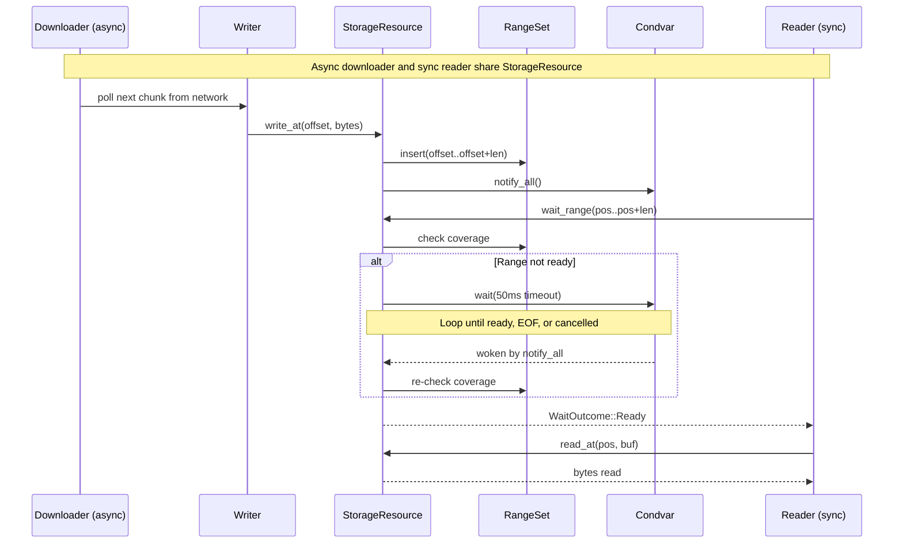

<div align="center">
  
</div>

<div align="center">

[](https://crates.io/crates/kithara-storage)
[](https://crates.io/crates/kithara-storage)
[](https://docs.rs/kithara-storage)
[](../../LICENSE-MIT)

</div>

# kithara-storage

Storage primitives for kithara. Provides a unified `StorageResource` enum (`Mmap` | `Mem`) with random-access `read_at`/`write_at`, blocking `wait_range`, and convenience `read_into`/`write_all`. `MmapResource` is file-backed via `mmap-io`; `MemResource` is fully in-memory. `OpenMode` controls file access for mmap: `Auto` (default), `ReadWrite`, or `ReadOnly`.

## Usage

```rust
use kithara_storage::{MmapResource, MmapOptions, OpenMode, StorageResource};

// File-backed (mmap)
let mmap = MmapResource::open(cancel_token, MmapOptions {
    path: path.into(),
    initial_len: None,
    mode: OpenMode::Auto,
})?;
let resource = StorageResource::from(mmap);
resource.write_at(0, &data)?;
let outcome = resource.wait_range(0..1024)?;
```

## Blocking coordination



`wait_range` blocks the calling thread via `parking_lot::Condvar` until the requested byte range is fully written, or the resource reaches EOF/error/cancellation.

## Key Types

<table>
<tr><th>Type</th><th>Role</th></tr>
<tr><td><code>ResourceExt</code> (trait)</td><td>Consumer-facing API: <code>read_at</code>, <code>write_at</code>, <code>wait_range</code>, <code>commit</code>, <code>fail</code></td></tr>
<tr><td><code>StorageResource</code></td><td>Enum dispatching to <code>MmapResource</code> or <code>MemResource</code></td></tr>
<tr><td><code>OpenMode</code></td><td>Access mode: <code>Auto</code>, <code>ReadWrite</code>, or <code>ReadOnly</code></td></tr>
<tr><td><code>ResourceStatus</code></td><td><code>Active</code>, <code>Committed { final_len }</code>, or <code>Failed(String)</code></td></tr>
<tr><td><code>WaitOutcome</code></td><td><code>Ready</code> or <code>Eof</code></td></tr>
<tr><td><code>Atomic&lt;R&gt;</code></td><td>Decorator for crash-safe writes via write-temp-rename</td></tr>
<tr><td><code>Coverage</code> (trait)</td><td>Tracks downloaded byte ranges via <code>MemCoverage</code></td></tr>
</table>

## Mmap vs Mem

<table>
<tr><th>Aspect</th><th>MmapDriver</th><th>MemDriver</th></tr>
<tr><td>Backing</td><td><code>mmap-io::MemoryMappedFile</code></td><td><code>Vec&lt;u8&gt;</code> behind <code>Mutex</code></td></tr>
<tr><td>Lock-free fast path</td><td>Yes (<code>SegQueue</code> for write notifications)</td><td>No</td></tr>
<tr><td>Auto-resize</td><td>2x growth on overflow</td><td>Extend on write</td></tr>
<tr><td><code>path()</code></td><td><code>Some</code></td><td><code>None</code></td></tr>
</table>

## Synchronization

Range tracking uses `RangeSet<u64>` (from `rangemap`) to record which byte ranges have been written. `wait_range` blocks via `parking_lot::Condvar` with a 50 ms timeout loop until the requested range is fully covered, or returns `Eof` when the resource is committed and the range starts beyond the final length. `CancellationToken` is checked at operation entry and during wait loops.

## Integration

Foundation layer for `kithara-assets`. Higher-level concerns (trees of resources, eviction, leases) are handled by `kithara-assets`.
