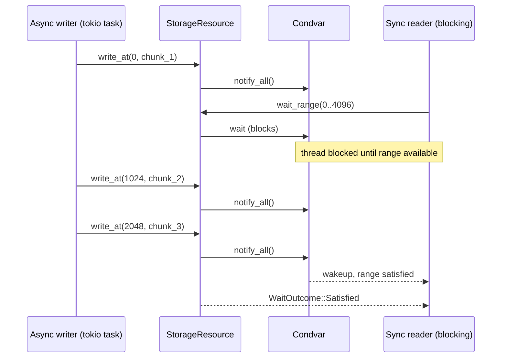

<div align="center">
  
</div>

# kithara-storage

Storage primitives for kithara. Provides a unified `StorageResource` backed by `mmap-io` with random-access `read_at`/`write_at`, blocking `wait_range`, and convenience `read_into`/`write_all`. `OpenMode` controls file access: `Auto` (default), `ReadWrite`, or `ReadOnly`.

## Usage

```rust
use kithara_storage::{StorageResource, StorageOptions, OpenMode};

let resource = StorageResource::open(StorageOptions {
    path: path.into(),
    initial_len: None,
    mode: OpenMode::Auto,
    cancel: cancel_token,
})?;
resource.write_at(0, &data)?;
let outcome = resource.wait_range(0..1024)?;
```

## Blocking coordination



`wait_range` blocks the calling thread via `parking_lot::Condvar` until the requested byte range is fully written, or the resource reaches EOF/error/cancellation.

## Integration

Foundation layer for `kithara-assets`. Higher-level concerns (trees of resources, eviction, leases) are handled by `kithara-assets`.
