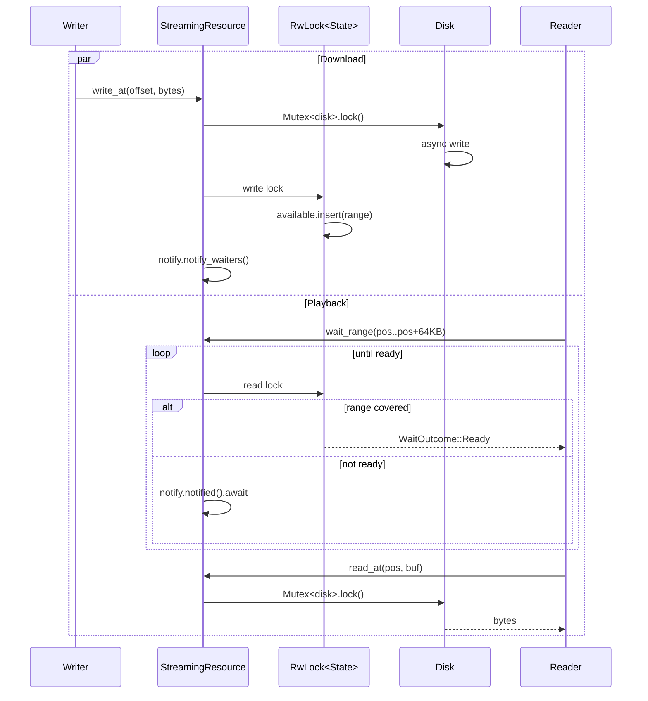
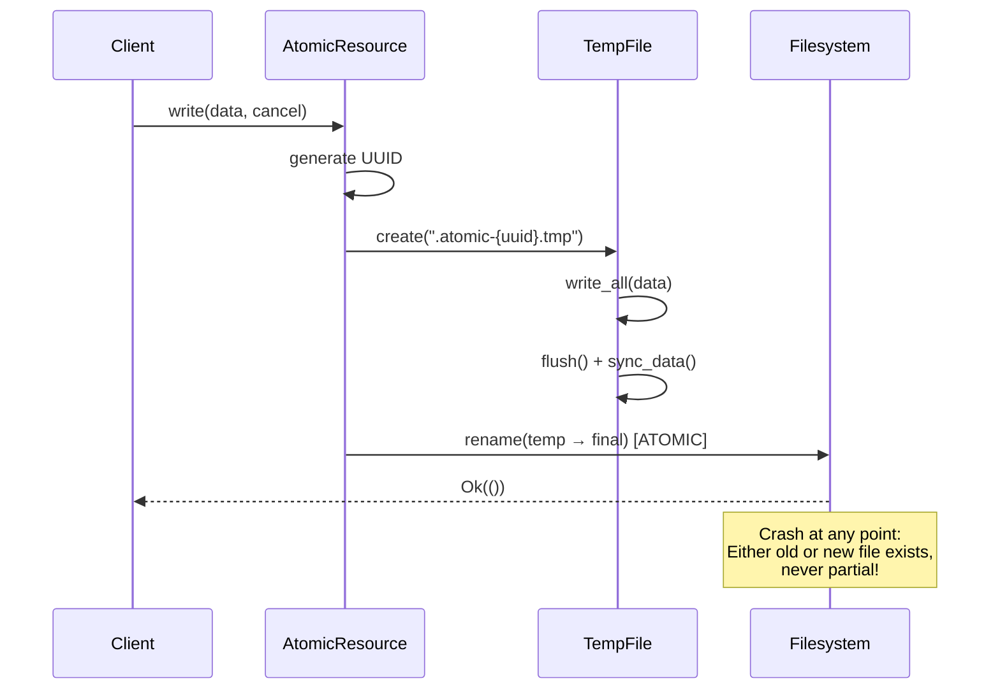

# `kithara-storage` — storage primitives for Kithara

`kithara-storage` provides the fundamental storage abstractions used throughout Kithara:
- **`StreamingResource`**: random-access storage for large media resources (segments, progressive downloads)
- **`AtomicResource`**: atomic whole-file operations for small metadata (playlists, keys, indexes)

This crate is intentionally minimal — it defines only the storage contracts and basic implementations.
Higher-level concerns (asset trees, eviction, leases, network orchestration) belong to other crates.

## Public contract (normative)

The public contract is expressed by the following items re-exported from `src/lib.rs`:

### Core abstractions
- `trait Resource` — Base contract for all storage resources
- `trait StreamingResourceExt` — Extension for random-access operations
- `trait AtomicResourceExt` — Marker trait for atomic resources

### Concrete implementations
- `struct StreamingResource` — Random-access storage with range waiting
- `struct AtomicResource` — Atomic whole-file storage

### Configuration and errors
- `struct DiskOptions` — Configuration for disk-backed resources
- `struct AtomicOptions` — Configuration for atomic resources
- `enum StorageError` — Error type for storage operations
- `type StorageResult<T> = Result<T, StorageError>` — Result alias

### Utilities
- `enum WaitOutcome` — Result of waiting for a range (Ready, Pending, Failed)

## Resource kinds and use cases

### `StreamingResource` — for large, progressive resources

Use when:
- Resource size is large (megabytes or more)
- Data arrives progressively (network downloads)
- Random access is needed (seek during playback)
- Consumers need to wait for specific ranges

Key operations:
- `write_at(offset, data)` — Write bytes at specific offset
- `read_at(offset, len)` — Read bytes from specific offset
- `wait_range(range)` — Wait for a range to become available
- `status()` — Get current resource status (Empty, Partial, Complete)

Typical usage in Kithara:
- Media segments in HLS/MP3 progressive downloads
- Large single-file assets

### `AtomicResource` — for small, atomic resources

Use when:
- Resource size is small (kilobytes or less)
- Whole-object semantics are required
- Crash-safe updates are needed
- No partial reads/writes are needed

Key operations:
- `write(data)` — Atomically replace entire resource
- `read()` — Read entire resource
- `commit()` — Finalize resource (mark as complete)
- `fail(error)` — Mark resource as failed

Typical usage in Kithara:
- Playlist files (.m3u8)
- Encryption keys
- Metadata indexes (pin tables, LRU indexes)
- Configuration files

## Core invariants

### For `StreamingResource`:
1. **No false EOF**: `read_at` returns `Ok(0)` only when the resource is complete and all data has been read
2. **Range waiting**: `wait_range` allows consumers to block until specific byte ranges are available
3. **Random access**: Supports reads/writes at arbitrary offsets
4. **Progressive filling**: Resource can be partially filled while being read

### For `AtomicResource`:
1. **Atomic updates**: `write` uses temp file → rename pattern for crash safety
2. **Whole-object**: Always reads/writes entire resource
3. **Lifecycle**: Resources have explicit `commit()` or `fail()` states

### For both resource types:
1. **Cancellation**: All async operations support cancellation via `CancellationToken`
2. **Error propagation**: Errors are typed and preserve context
3. **Thread safety**: All operations are `Send + Sync`

## Implementation details

### Disk-backed storage

Both resource types have disk-backed implementations:

- `StreamingResource` uses `random-access-disk` for efficient random access
- `AtomicResource` uses temporary files and atomic renames for crash safety

### Range waiting mechanism

`StreamingResource::wait_range` is essential for streaming playback:

```rust
// Consumer waits for specific range
match resource.wait_range(1024..2048, cancel).await {
    Ok(WaitOutcome::Ready) => {
        // Range is now available for reading
        let data = resource.read_at(1024, 1024).await?;
    }
    Ok(WaitOutcome::Pending) => {
        // Resource is still being filled, wait more
    }
    Ok(WaitOutcome::Failed) => {
        // Resource failed (e.g., download error)
    }
    Err(e) => {
        // Cancelled or other error
    }
}
```

This allows consumers to efficiently wait for data without busy polling.

## Integration with other Kithara crates

### `kithara-assets`
- Uses both `StreamingResource` and `AtomicResource` as building blocks
- `Assets` trait returns these resource types
- Implements asset-level semantics on top of storage primitives

### `kithara-stream`
- `Writer` writes to `StreamingResource` using `write_at`
- `Reader` reads from `StreamingResource` using `read_at` and `wait_range`
- Coordinates producer/consumer with storage as the buffer

### `kithara-hls` / `kithara-file`
- Use resources through `kithara-assets` abstraction
- Determine which resource type is appropriate for each file

## Error handling

`StorageError` covers all possible storage failures:

- `Io` — Underlying I/O error
- `Cancelled` — Operation was cancelled
- `InvalidRange` — Requested range is invalid
- `ResourceFailed` — Resource is in failed state
- `ResourceClosed` — Resource was closed
- `NotSupported` — Operation not supported by this resource type

## Configuration

### `DiskOptions`
- `path: PathBuf` — Filesystem path for the resource
- `cancel: CancellationToken` — Cancellation for all operations tied to this resource
- `initial_len: Option<u64>` — If `Some`, truncate/extend to that length; if `None` and the file exists, existing bytes are published as available (resource stays unsealed)

### `AtomicOptions`
- `path: PathBuf` — Filesystem path for the resource
- `temp_suffix: String` — Suffix for temporary files (default: `.tmp`)

## Example usage

### Creating and using a `StreamingResource`
```rust
use kithara_storage::{StreamingResource, DiskOptions};
use tokio_util::sync::CancellationToken;

let cancel = CancellationToken::new();
let options = DiskOptions::new("/path/to/resource", cancel.clone());

let resource = StreamingResource::open_disk(options).await?;

// Write data progressively
resource.write_at(0, b"hello").await?;
resource.write_at(5, b"world").await?;

// Read data back
let data = resource.read_at(0, 10).await?;

// Wait for a specific range
resource.wait_range(0..10).await?;
```

### Creating and using an `AtomicResource`
```rust
use kithara_storage::{AtomicResource, AtomicOptions};
use bytes::Bytes;
use tokio_util::sync::CancellationToken;

let options = AtomicOptions {
    path: "/path/to/metadata.json".into(),
    temp_suffix: ".tmp".to_string(),
};

let resource = AtomicResource::open(options).await?;
let cancel = CancellationToken::new();

// Write atomically
resource.write(Bytes::from("{\"key\": \"value\"}"), cancel.clone()).await?;
resource.commit().await?;

// Read back
let data = resource.read(cancel.clone()).await?;
```

## Data Flow Diagrams

### StreamingResource: Concurrent Read/Write



### AtomicResource: Crash-Safe Write



## Performance Characteristics

### Memory Usage

| Component | Per Instance | Notes |
|-----------|--------------|-------|
| StreamingResource (empty) | ~200-300 bytes | Arc + locks + empty RangeSet |
| StreamingResource (with ranges) | +24 bytes/range | BTreeMap nodes |
| AtomicResource | ~70-100 bytes | Minimal overhead |
| RangeSet (sequential writes) | ~24 bytes | 1 merged range regardless of size |
| RangeSet (sparse writes) | ~24 bytes × gaps | Worst case: 1 range per write |

**Best practice**: Sequential writes merge into single range → O(1) memory.

### CPU Efficiency

| Operation | Typical Duration | CPU vs I/O |
|-----------|------------------|------------|
| `write_at(64KB)` | 1-5ms | ~5% CPU, 95% I/O |
| `read_at(64KB)` | 1-3ms | ~5% CPU, 95% I/O |
| `wait_range` (hit) | <1μs | 100% CPU (RwLock read) |
| `wait_range` (miss) | 0ms | 0% CPU (suspended via Notify) |
| RangeSet `is_covered()` | O(log n + k) | n=ranges, k=overlapping |

**Key insight**: `wait_range` uses event-driven wakeup (NO polling/spin loops).

### Lock Contention

| Lock | Type | Held During | Contention Risk |
|------|------|-------------|-----------------|
| `disk: Mutex` | Exclusive | I/O operation (1-10ms) | ⚠️ Medium (read+write compete) |
| `state: RwLock` | Shared reads | Metadata access (<1μs) | ✅ Low (optimized for readers) |

**Mitigation**: Lock is NOT held across `.await` points in `wait_range` loop.

## Design philosophy

1. **Minimal core**: This crate does only storage, nothing else
2. **Clear contracts**: Traits define exactly what each resource type can do
3. **Composition over inheritance**: Resources are designed to be composed by higher layers
4. **Async-first**: All operations are async and support cancellation
5. **Crash safety**: Atomic operations ensure consistency across failures
6. **Lock-free readers**: `wait_range` uses event notification, not polling
7. **Bounded memory**: RangeSet grows only with gaps, not bytes written