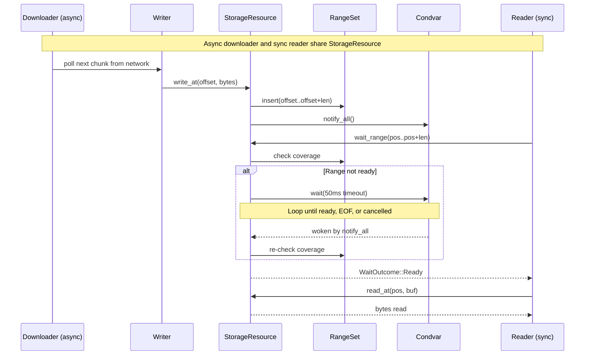

<div align="center">
  
</div>

# kithara-storage

Storage primitives for kithara. Provides a unified `StorageResource` enum (`Mmap` | `Mem`) with random-access `read_at`/`write_at`, blocking `wait_range`, and convenience `read_into`/`write_all`. `MmapResource` is file-backed via `mmap-io`; `MemResource` is fully in-memory. `OpenMode` controls file access for mmap: `Auto` (default), `ReadWrite`, or `ReadOnly`.

## Usage

```rust
use kithara_storage::{MmapResource, MmapOptions, OpenMode, StorageResource};

// File-backed (mmap)
let mmap = MmapResource::open(cancel_token, MmapOptions {
    path: path.into(),
    initial_len: None,
    mode: OpenMode::Auto,
})?;
let resource = StorageResource::from(mmap);
resource.write_at(0, &data)?;
let outcome = resource.wait_range(0..1024)?;
```

## Blocking coordination



`wait_range` blocks the calling thread via `parking_lot::Condvar` until the requested byte range is fully written, or the resource reaches EOF/error/cancellation.

## Key Types

| Type | Role |
|------|------|
| `ResourceExt` (trait) | Consumer-facing API: `read_at`, `write_at`, `wait_range`, `commit`, `fail` |
| `StorageResource` | Enum dispatching to `MmapResource` or `MemResource` |
| `OpenMode` | Access mode: `Auto`, `ReadWrite`, or `ReadOnly` |
| `ResourceStatus` | `Active`, `Committed { final_len }`, or `Failed(String)` |
| `WaitOutcome` | `Ready` or `Eof` |
| `Atomic<R>` | Decorator for crash-safe writes via write-temp-rename |
| `Coverage` (trait) | Tracks downloaded byte ranges via `MemCoverage` |

## Mmap vs Mem

| Aspect | MmapDriver | MemDriver |
|--------|-----------|-----------|
| Backing | `mmap-io::MemoryMappedFile` | `Vec<u8>` behind `Mutex` |
| Lock-free fast path | Yes (`SegQueue` for write notifications) | No |
| Auto-resize | 2x growth on overflow | Extend on write |
| `path()` | `Some` | `None` |

## Synchronization

Range tracking uses `RangeSet<u64>` (from `rangemap`) to record which byte ranges have been written. `wait_range` blocks via `parking_lot::Condvar` with a 50 ms timeout loop until the requested range is fully covered, or returns `Eof` when the resource is committed and the range starts beyond the final length. `CancellationToken` is checked at operation entry and during wait loops.

## Integration

Foundation layer for `kithara-assets`. Higher-level concerns (trees of resources, eviction, leases) are handled by `kithara-assets`.
