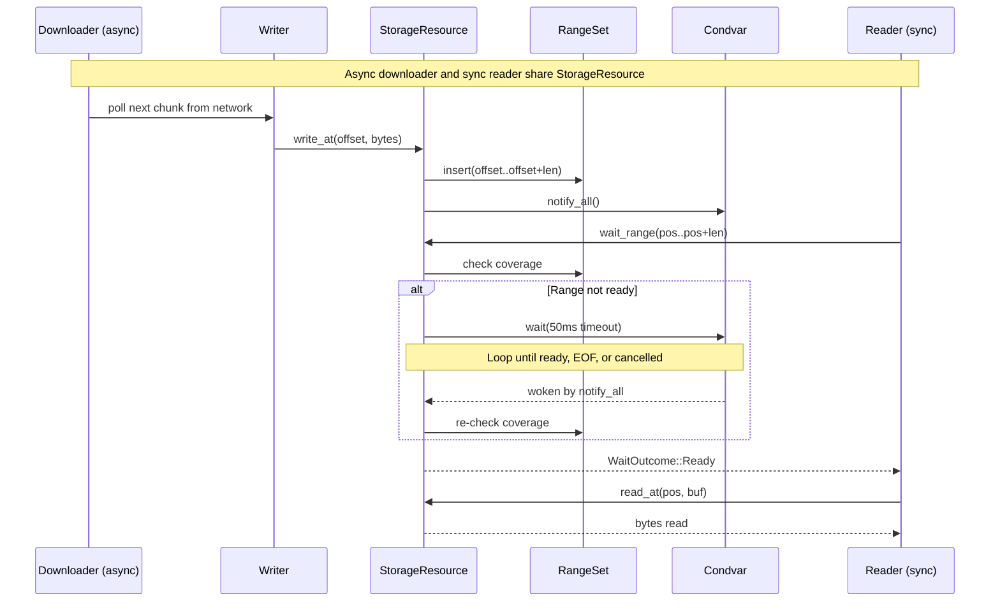

<div align="center">
  
</div>

<div align="center">

[](https://crates.io/crates/kithara-storage)
[](https://docs.rs/kithara-storage)
[](../../LICENSE-MIT)

</div>

# kithara-storage

Storage primitives for kithara. Provides a unified `StorageResource` enum (`Mmap` | `Mem`) with random-access `read_at`/`write_at`, blocking `wait_range`, and convenience `read_into`/`write_all`. `MmapResource` is file-backed via `mmap-io`; `MemResource` is fully in-memory. `OpenMode` controls file access for mmap: `Auto` (default), `ReadWrite`, or `ReadOnly`.

## Usage

```rust
use kithara_storage::{MmapResource, MmapOptions, OpenMode, StorageResource};

// File-backed (mmap)
let mmap = MmapResource::open(cancel_token, MmapOptions {
    path: path.into(),
    initial_len: None,
    mode: OpenMode::Auto,
})?;
let resource = StorageResource::from(mmap);
resource.write_at(0, &data)?;
let outcome = resource.wait_range(0..1024)?;
```

## Blocking coordination


```mermaid
sequenceDiagram
    participant DL as Downloader (async)
    participant W as Writer
    participant SR as StorageResource
    participant RS as RangeSet
    participant CV as Condvar
    participant R as Reader (sync)

    Note over DL,R: Async downloader and sync reader share StorageResource

    DL->>W: poll next chunk from network
    W->>SR: write_at(offset, bytes)
    SR->>RS: insert(offset..offset+len)
    SR->>CV: notify_all()

    R->>SR: wait_range(pos..pos+len)
    SR->>RS: check coverage
    alt Range not ready
        SR->>CV: wait(50ms timeout)
        Note over SR,CV: Loop until ready, EOF, or cancelled
        CV-->>SR: woken by notify_all
        SR->>RS: re-check coverage
    end
    SR-->>R: WaitOutcome::Ready

    R->>SR: read_at(pos, buf)
    SR-->>R: bytes read
```

`wait_range` blocks the calling thread via `parking_lot::Condvar` until the requested byte range is fully written, or the resource reaches EOF/error/cancellation.

## Key Types

<table>
<tr><th>Type</th><th>Role</th></tr>
<tr><td><code>ResourceExt</code> (trait)</td><td>Consumer-facing API: <code>read_at</code>, <code>write_at</code>, <code>wait_range</code>, <code>commit</code>, <code>fail</code></td></tr>
<tr><td><code>StorageResource</code></td><td>Enum dispatching to <code>MmapResource</code> or <code>MemResource</code></td></tr>
<tr><td><code>OpenMode</code></td><td>Access mode: <code>Auto</code>, <code>ReadWrite</code>, or <code>ReadOnly</code></td></tr>
<tr><td><code>ResourceStatus</code></td><td><code>Active</code>, <code>Committed { final_len }</code>, or <code>Failed(String)</code></td></tr>
<tr><td><code>WaitOutcome</code></td><td><code>Ready</code>, <code>Eof</code>, or <code>Interrupted</code> (seek/flush wakeup)</td></tr>
<tr><td><code>Atomic&lt;R&gt;</code></td><td>Decorator for crash-safe writes via write-temp-rename</td></tr>
<tr><td><code>AvailabilityObserver</code> (trait)</td><td>Hook for downstream layers (e.g. <code>kithara-assets</code>) to observe coverage changes as new ranges land</td></tr>
<tr><td><code>Driver</code> / <code>DriverIo</code> (traits)</td><td>Backend abstraction; <code>Resource&lt;D: DriverIo&gt;</code> is parameterised over them</td></tr>
</table>

## Mmap vs Mem

<table>
<tr><th>Aspect</th><th>MmapDriver</th><th>MemDriver</th></tr>
<tr><td>Backing</td><td><code>mmap-io::MemoryMappedFile</code></td><td><code>Vec&lt;u8&gt;</code> behind <code>Mutex</code></td></tr>
<tr><td>Lock-free fast path</td><td>Yes (<code>SegQueue</code> for write notifications)</td><td>No</td></tr>
<tr><td>Auto-resize</td><td>2x growth on overflow</td><td>Extend on write</td></tr>
<tr><td><code>path()</code></td><td><code>Some</code></td><td><code>None</code></td></tr>
</table>

## Chunked atomic claim

`AtomicChunked::open(canonical_path, factory)` opens a fresh chunked-atomic resource. The `factory` opens the inner resource at a given filesystem path; it is called once with the temp path during the constructor and once more with the canonical path after the atomic rename in `ResourceExt::commit`.

`open` atomically claims `<canonical>.tmp` via `OpenOptions::create_new`, so the filesystem rejects a second concurrent open of the same tmp path. It returns `StorageError::TmpClaimed` when another `AssetStore` instance (or process) is already writing the same canonical path; the caller should poll until the holder releases (commit or drop) and either retry or take a passthrough view once committed.

Stale temp left from a prior crashed run is not auto-wiped: liveness is signalled by tmp existence alone, so a leftover from `kill -9` blocks subsequent opens until cleaned up explicitly. The maintenance task is the caller's responsibility (a future enhancement may add PID-aware cleanup).

## Synchronization

Range tracking uses `RangeSet<u64>` (from `rangemap`) to record which byte ranges have been written. `wait_range` blocks via `parking_lot::Condvar` with a 50 ms timeout loop until the requested range is fully covered, returns `Eof` when the resource is committed and the range starts beyond the final length, and returns `Interrupted` when a seek/flush wakes the waiter. `CancellationToken` is checked at operation entry and during wait loops.

## Integration

Foundation layer for `kithara-assets`. Higher-level concerns (trees of resources, eviction, leases) are handled by `kithara-assets`.

## Notes on the `redundant_reexport` audit warning

`just audit kithara-storage` flags two `redundant_reexport` warnings — `MemOptions` and `MmapOptions` are surfaced *both* via `pub use` from `lib.rs` *and* via the `<Driver>::Options` associated type. The duplication is intentional and documented here per `AGENTS.md` ("if you must suppress, document why in the owning crate `README.md`"):

- `MmapOptions` / `MemOptions` are the canonical user-facing constructor types — every caller writes `MmapOptions { path, initial_len, mode }` reachable via `kithara_storage::MmapOptions`.
- The `Driver::Options` associated type is the binding that lets the generic `Resource::<D>::open(token, opts: D::Options)` constructor pick the right driver from the option struct's type alone (via type inference at the call site). Removing `Options` would force every caller to pre-qualify with the driver type alias (`MmapResource::open` / `MemResource::open`) — a wider API ripple than the duplicated path is worth.
- Dropping the `pub use` (the audit's literal suggested fix) would break ~15 external callers that rely on `kithara_storage::{MmapOptions, MemOptions}`.

The two warnings are stable across releases; no other audit warnings should appear.
