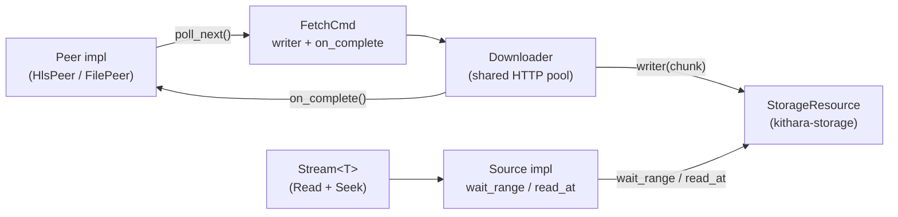

# kithara-stream — Context

Detailed contracts and invariants for the kithara-stream crate; the README is the overview.

## Architecture

- A protocol peer (`HlsPeer`, `FilePeer`) registers with the shared `Downloader` via `Downloader::register(peer)` and emits batches of `FetchCmd` from `Peer::poll_next()`.
- Each `FetchCmd` carries closures: a per-chunk `writer` that lands bytes into `StorageResource`, and an `on_complete` that lets the peer advance its state.
- The sync side reads through `Stream<T>`, which delegates to a `Source` implementation. `Source::wait_range` blocks (with a bounded retry budget) until the requested byte range is present in the underlying `StorageResource`.

## Key Public Items

<table>
<tr><th>Item</th><th>Kind</th><th>Role</th></tr>
<tr><td><code>Source</code></td><td>trait</td><td>Sync random-access surface for decoders. Drives <code>wait_range</code>, <code>read_at</code>, <code>position</code>, <code>len</code>, <code>media_info</code>, <code>byte_map</code>, plus adaptive handles (<code>variant_control</code>, <code>abr_handle</code>)</td></tr>
<tr><td><code>ByteMap</code></td><td>trait</td><td>Optional segment-aware view returned by <code>Source::byte_map()</code>: <code>init_segment_range</code>, <code>anchor_at_time</code>, <code>segment_at_byte</code>, <code>segment_after_byte</code>, <code>len</code></td></tr>
<tr><td><code>Stream&lt;T&gt;</code></td><td>struct</td><td><code>Read + Seek</code> wrapper around any <code>T: StreamType</code></td></tr>
<tr><td><code>StreamType</code></td><td>trait</td><td>Marker for protocol types (<code>File</code>, <code>Hls</code>) with associated <code>Config</code> and <code>Events</code></td></tr>
<tr><td><code>dl::Downloader</code></td><td>struct</td><td>Shared HTTP pool; <code>register(peer)</code> attaches a peer; spawns one async fetch task per active <code>FetchCmd</code></td></tr>
<tr><td><code>dl::Peer</code></td><td>trait</td><td>Pull-driven per-track API: <code>poll_next() -&gt; Poll&lt;Option&lt;Vec&lt;FetchCmd&gt;&gt;&gt;</code>, plus ABR-driven decisions</td></tr>
<tr><td><code>dl::PeerHandle</code></td><td>struct</td><td>Handle returned by <code>Downloader::register(peer)</code> for canceling and inspecting a peer's state</td></tr>
<tr><td><code>dl::FetchCmd</code></td><td>struct</td><td>HTTP GET/Head command with self-contained <code>writer</code> + <code>on_complete</code> closures and a <code>CancelToken</code></td></tr>
<tr><td><code>dl::DownloaderConfig</code></td><td>struct (bon-builder)</td><td>Pool sizing, retry, timeouts, cancel-token wiring</td></tr>
<tr><td><code>ReaderEventSink</code> / <code>BoxedEventSink</code></td><td>trait / alias</td><td>Single-owner reader-side event sink (<code>ReaderChunkSignal</code>, <code>ReaderSeekSignal</code>); the decoder owns the <code>Box&lt;dyn ReaderEventSink&gt;</code> and invokes it lock-free via <code>&amp;mut</code></td></tr>
<tr><td><code>ChunkPosition</code> / <code>PlayheadState</code></td><td>structs</td><td>Position bookkeeping exposed through the <code>PlayheadRead</code> / <code>PlayheadWrite</code> traits</td></tr>
</table>

## Canonical Media Types

Defined here as the single source of truth and re-exported by other crates:

- `AudioCodec` — codec identifier (`AacLc`, `Mp3`, `Flac`, …)
- `ContainerFormat` — container identifier (`Fmp4`, `MpegTs`, `Adts`, `Flac`, `Wav`, `Ogg`, …)
- `MediaInfo` — format metadata: channels, codec, container, sample rate, variant index

## Async-to-Sync Bridge

1. The `Downloader` is async; peers and `FetchCmd` callbacks run on the tokio runtime.
2. `FetchCmd.writer(chunk)` writes bytes directly into the `StorageResource` shared with the sync reader.
3. The sync reader inside `Stream<T>` calls `Source::wait_range(range)` as a single non-blocking readiness probe on the worker path: it returns `Ready`/`Eof`/`Interrupted` immediately, and on a not-yet-available range returns `WaitBudgetExceeded`, which `try_read` maps to `Pending(NotReady)` without sleeping. The backoff between probes lives in the audio scheduler's `Waiting` park (10ms), so the worker decode path never blocks on a syscall. The consumer-thread `Seek` path primes metadata through `Stream::prime_seek_range`, which calls `wait_range(_, None)` and parks event-driven until the range resolves, a segment fails, or cancellation fires.
4. `Source::read_at(offset, buf)` performs the actual sync copy once the range is present.
5. Cancellation flows top-down through the cancel-token hierarchy described in `crates/kithara-play/CONTEXT.md`.

### End-of-stream contract

`Stream::try_read` surfaces `StreamReadOutcome::Eof` only from a `Source` that proves the end is genuinely reached — `WaitOutcome::Eof` from `wait_range` or `ReadOutcome::Eof` from `read_at`. A `Source` must **never** mint `Eof` for an in-range range whose bytes have not yet arrived; that case is `WaitBudgetExceeded`/`Pending(NotReady)` so the reader holds at need-data. Per source:

- File (`FileSource`): EOF currently uses `FileCoord::total_bytes()` (seeded from the announced `Content-Length`) when available, otherwise the committed `AssetReader::len()`. Strict committed-length EOF is a planned hardening, not today's behavior.
- HLS (`HlsVariant`): EOF keys off the variant layout's published `total_bytes()` **gated by `sizes_complete()`** (every served segment's size known). While any served size is still unknown, `total_bytes()` is a lower bound and the gate holds `Pending`, not `Eof`. See `crates/kithara-hls/CONTEXT.md` "Seek and wait_range Contract".

A premature `Eof` for a withheld in-range segment latches the audio consumer into `AtEof` and drives the queue's silent auto-advance; the empty-buffer (`buf.is_empty()`) zero-length return is a distinct, non-terminal case. Pinned by `tests/tests/kithara_queue/early_seek_size_withheld_advance.rs` (`immediate_seek_size_and_body_withheld`).

## Features

<table>
<tr><th>Feature</th><th>Default</th><th>Effect</th></tr>
<tr><td><code>default</code></td><td>yes</td><td><code>client-reqwest</code> + <code>tls-rustls</code></td></tr>
<tr><td><code>probe</code></td><td>no</td><td>USDT probe points for tracing</td></tr>
<tr><td><code>mock</code></td><td>no</td><td><code>unimock</code>-generated mocks of the public traits</td></tr>
<tr><td><code>perf</code></td><td>no</td><td>Hotpath instrumentation</td></tr>
<tr><td><code>client-reqwest</code></td><td>yes</td><td>Forward the reqwest HTTP backend to <code>kithara-net</code>, <code>kithara-events</code>, and <code>kithara-abr</code></td></tr>
<tr><td><code>client-wreq</code></td><td>no</td><td>Forward the wreq HTTP backend to <code>kithara-net</code>, <code>kithara-events</code>, and <code>kithara-abr</code></td></tr>
<tr><td><code>client-apple</code></td><td>no</td><td>Forward the Apple HTTP backend to <code>kithara-net</code></td></tr>
<tr><td><code>tls-rustls</code></td><td>yes</td><td>Forward rustls TLS selection to network-reaching deps</td></tr>
<tr><td><code>tls-native</code></td><td>no</td><td>Forward native TLS selection to network-reaching deps</td></tr>
</table>

## Agent Guardrails

- Keep `kithara-stream` generic. Do not move HLS-, file-, or surface-specific policy into shared contracts.
- Treat `wait_range`, `read_at`, and the pull-driven `Peer` contract as the surface of this crate. Fix the owned invariant instead of papering over it with surface-specific hacks.
- Shared media vocabulary stays here. Reuse `AudioCodec`, `ContainerFormat`, and `MediaInfo` instead of creating parallel cross-crate types.

## Trait Bridges

- `AudioCodec` → `MediaInfo` (`From`) — codec-only media info, container inferred
- `AudioCodec` → `ContainerFormat` (`TryFrom`) — standalone container, ambiguous codecs fail
- `&[u8]` → `AudioCodec` (`TryFrom`) — codec detection from magic prefix
- `E: Into<SourceError>` → `StreamError` (`From`) — lift source errors into stream errors
- `Iterator<SlotEntry>` → `BatchGroup` (`FromIterator`) — group fetch slots by cancel epoch
- `NotReadyCause` / `PendingReason` (`Display`) — human-readable not-ready / pending reasons
- `StreamSeekPastEof` / `StreamReadError` / `StreamPending` / `VariantChangeError` (`Display`) — reader error rendering

## Integration

Central orchestration layer. Protocol crates (`kithara-file`, `kithara-hls`) implement `StreamType` and `dl::Peer`. `kithara-decode` consumes `Stream<T>`. The `Downloader` is owned at the consumer-crate top (`kithara-play::PlayerImpl`, `kithara-queue::Queue`, etc.) so all peers share one HTTP pool. Other crates re-export `AudioCodec`, `ContainerFormat`, `MediaInfo` from here.
