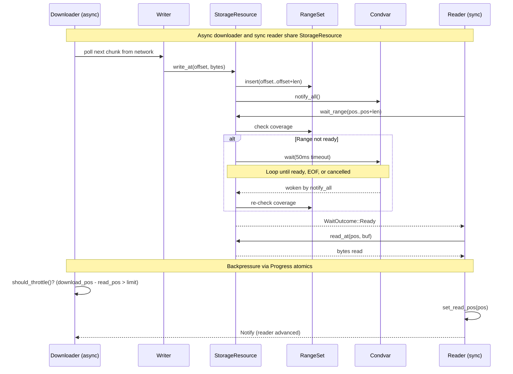

<div align="center">
  
</div>

# kithara-stream

Byte-stream orchestration bridging async producers (network, disk) to sync consumers (decoders). Provides sync `Source` trait, async `Downloader` trait, a generic `Backend` worker, and `Stream<T>` for sync `Read + Seek` access. Also defines canonical shared types: `AudioCodec`, `ContainerFormat`, `MediaInfo`.

## Usage

```rust
use kithara_stream::{Stream, StreamType};
use kithara_file::File;

// File and Hls implement StreamType
let stream = Stream::<File>::new(config).await?;
// stream implements Read + Seek
```

## Async-to-sync bridge



- **tokio task** (`Backend`): spawns the `Downloader` which writes bytes to `StorageResource` asynchronously. Cancelled via `CancellationToken` on drop.
- **sync reader** (`Stream<T>`): wraps `Source` with `Read + Seek`. Calls `wait_range` which blocks until the requested byte range is written by the downloader.

## Key Traits

| Trait | Role |
|-------|------|
| `Source` | Sync random-access interface: `wait_range`, `read_at`, `len`, `media_info` |
| `Downloader` | Async planner: `plan()` returns batches; `commit()` stores results; backpressure via `should_throttle()` |
| `DownloaderIo` | Pure I/O (network fetch), `Clone + Send`, stateless; runs multiple copies in parallel |
| `StreamType` | Marker trait for protocol types (`File`, `Hls`); associated types: `Config`, `Source`, `Error`, `Event` |

## Canonical Types

Defined here as the single source of truth and re-exported by other crates:

- `AudioCodec` — codec identifier (AacLc, Mp3, Flac, Vorbis, Opus, etc.)
- `ContainerFormat` — container identifier (Fmp4, MpegTs, Adts, Flac, Wav, Ogg, etc.)
- `MediaInfo` — format metadata: channels, codec, container, sample rate, variant index

## Async-to-Sync Bridge

The fundamental design pattern:

1. **Downloader** (async) writes data to `StorageResource` via `Writer`.
2. **Reader** (sync) calls `wait_range()`, which blocks until bytes are available.
3. `StorageResource` is the synchronization point — no channels between reader and downloader.
4. **Backpressure**: downloader pauses via `should_throttle()` when too far ahead of the reader.
5. **On-demand**: reader can request specific ranges (for seeks) that bypass backpressure.

## Integration

Central orchestration layer. Protocol crates (`kithara-file`, `kithara-hls`) implement `StreamType`. `kithara-decode` consumes `Stream<T>` for decoding. Other crates re-export `AudioCodec`, `ContainerFormat`, `MediaInfo` from here.
