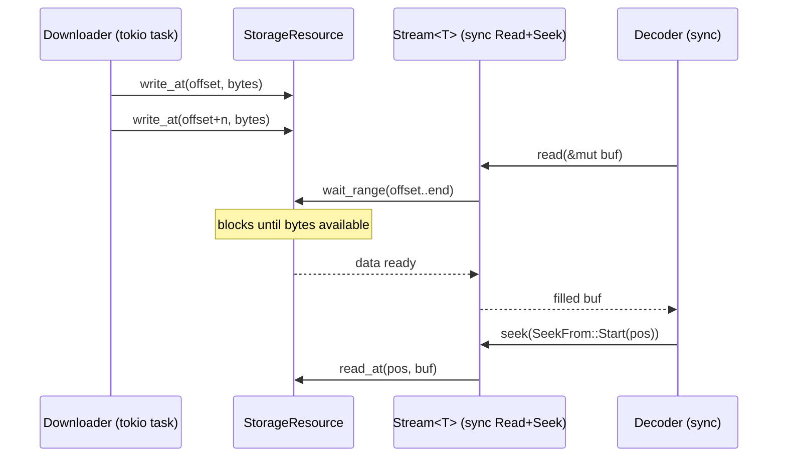

<div align="center">
  
</div>

# kithara-stream

Byte-stream orchestration bridging async producers (network, disk) to sync consumers (decoders). Provides sync `Source` trait, async `Downloader` trait, a generic `Backend` worker, and `Stream<T>` for sync `Read + Seek` access. Also defines canonical shared types: `AudioCodec`, `ContainerFormat`, `MediaInfo`.

## Usage

```rust
use kithara_stream::{Stream, StreamType};
use kithara_file::File;

// File and Hls implement StreamType
let stream = Stream::<File>::new(config).await?;
// stream implements Read + Seek
```

## Async-to-sync bridge



- **tokio task** (`Backend`): spawns the `Downloader` which writes bytes to `StorageResource` asynchronously. Cancelled via `CancellationToken` on drop.
- **sync reader** (`Stream<T>`): wraps `Source` with `Read + Seek`. Calls `wait_range` which blocks until the requested byte range is written by the downloader.

## Integration

Central orchestration layer. Protocol crates (`kithara-file`, `kithara-hls`) implement `StreamType`. `kithara-decode` consumes `Stream<T>` for decoding. Other crates re-export `AudioCodec`, `ContainerFormat`, `MediaInfo` from here.
