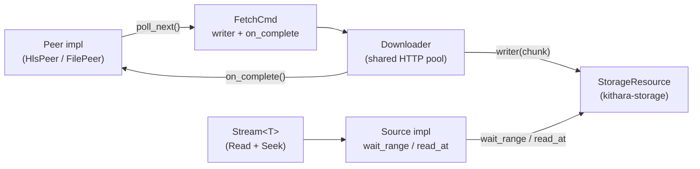

<div align="center">
  
</div>

<div align="center">

[](https://crates.io/crates/kithara-stream)
[](https://docs.rs/kithara-stream)
[](../../LICENSE-MIT)

</div>

# kithara-stream

Bridges async producers (network) to sync consumers (decoders). Exposes:

- the sync `Source` trait that decoders read through;
- the `Stream<T>` wrapper that gives `Source` a `Read + Seek` shape;
- the pull-driven `Downloader` (struct) and `Peer` (trait) — the workspace's unified HTTP transport;
- the canonical media vocabulary: `AudioCodec`, `ContainerFormat`, `MediaInfo`, used by every crate that talks about codecs or containers.

## Usage

```rust
use kithara_stream::{Stream, StreamType};
use kithara_file::File;

// `File` and `Hls` implement `StreamType`.
let stream = Stream::<File>::new(config).await?;
// `stream` implements `Read + Seek` via the underlying `Source`.
```

## Architecture


```mermaid
flowchart LR
    Peer["Peer impl<br/>(HlsPeer / FilePeer)"]
    DL["Downloader<br/>(shared HTTP pool)"]
    FC["FetchCmd<br/>writer + on_complete"]
    SR["StorageResource<br/>(kithara-storage)"]
    Stream["Stream&lt;T&gt;<br/>(Read + Seek)"]
    Source["Source impl<br/>wait_range / read_at"]

    Peer -- "poll_next()" --> FC
    FC --> DL
    DL -- "writer(chunk)" --> SR
    DL -- "on_complete()" --> Peer
    Stream --> Source
    Source -- "wait_range / read_at" --> SR
```

- A protocol peer (`HlsPeer`, `FilePeer`) registers with the shared `Downloader` via `Downloader::register(peer)` and emits batches of `FetchCmd` from `Peer::poll_next()`.
- Each `FetchCmd` carries closures: a per-chunk `writer` that lands bytes into `StorageResource`, and an `on_complete` that lets the peer advance its state.
- The sync side reads through `Stream<T>`, which delegates to a `Source` implementation. `Source::wait_range` blocks (with a bounded retry budget) until the requested byte range is present in the underlying `StorageResource`.

## Key Public Items

<table>
<tr><th>Item</th><th>Kind</th><th>Role</th></tr>
<tr><td><code>Source</code></td><td>trait</td><td>Sync random-access surface for decoders. Drives <code>wait_range</code>, <code>read_at</code>, <code>position</code>, <code>len</code>, <code>media_info</code>, <code>timeline</code>, plus adaptive hooks (<code>current_variant</code>, <code>abr_handle</code>, <code>has_variant_change_pending</code>, …)</td></tr>
<tr><td><code>SegmentLayout</code></td><td>trait</td><td>Optional segment-aware extension on top of <code>Source</code>: <code>init_segment_range</code>, <code>segment_after_byte</code>, <code>len</code></td></tr>
<tr><td><code>Stream&lt;T&gt;</code></td><td>struct</td><td><code>Read + Seek</code> wrapper around any <code>T: StreamType</code></td></tr>
<tr><td><code>StreamType</code></td><td>trait</td><td>Marker for protocol types (<code>File</code>, <code>Hls</code>) with associated <code>Config</code> and <code>Events</code></td></tr>
<tr><td><code>dl::Downloader</code></td><td>struct</td><td>Shared HTTP pool; <code>register(peer)</code> attaches a peer; spawns one async fetch task per active <code>FetchCmd</code></td></tr>
<tr><td><code>dl::Peer</code></td><td>trait</td><td>Pull-driven per-track API: <code>poll_next() -&gt; Poll&lt;Option&lt;Vec&lt;FetchCmd&gt;&gt;&gt;</code>, plus ABR-driven decisions</td></tr>
<tr><td><code>dl::PeerHandle</code></td><td>struct</td><td>Handle returned by <code>Downloader::register(peer)</code> for canceling and inspecting a peer's state</td></tr>
<tr><td><code>dl::FetchCmd</code></td><td>struct</td><td>HTTP GET/Head command with self-contained <code>writer</code> + <code>on_complete</code> closures and a <code>CancellationToken</code></td></tr>
<tr><td><code>dl::DownloaderConfig</code></td><td>struct (bon-builder)</td><td>Pool sizing, retry, timeouts, cancel-token wiring</td></tr>
<tr><td><code>DecoderHooks</code> / <code>SharedHooks</code></td><td>structs</td><td>Reader-side signal channels (<code>ReaderChunkSignal</code>, <code>ReaderSeekSignal</code>)</td></tr>
<tr><td><code>Timeline</code> / <code>ChunkPosition</code></td><td>structs</td><td>Position bookkeeping consumed by the player and ABR</td></tr>
</table>

## Canonical Media Types

Defined here as the single source of truth and re-exported by other crates:

- `AudioCodec` — codec identifier (`AacLc`, `Mp3`, `Flac`, …)
- `ContainerFormat` — container identifier (`Fmp4`, `MpegTs`, `Adts`, `Flac`, `Wav`, `Ogg`, …)
- `MediaInfo` — format metadata: channels, codec, container, sample rate, variant index

## Async-to-Sync Bridge

1. The `Downloader` is async; peers and `FetchCmd` callbacks run on the tokio runtime.
2. `FetchCmd.writer(chunk)` writes bytes directly into the `StorageResource` shared with the sync reader.
3. The sync reader inside `Stream<T>` calls `Source::wait_range(range)`, which polls the underlying storage with a bounded spin budget (`MAX_WAIT_SPINS × WAIT_RANGE_TIMEOUT`) before returning `Pending(NotReady)`.
4. `Source::read_at(offset, buf)` performs the actual sync copy once the range is present.
5. Cancellation flows top-down through the cancel-token hierarchy described in `crates/kithara-play/README.md`.

## Features

<table>
<tr><th>Feature</th><th>Default</th><th>Effect</th></tr>
<tr><td><code>probe</code></td><td>no</td><td>USDT probe points for tracing</td></tr>
<tr><td><code>mock</code></td><td>no</td><td><code>unimock</code>-generated mocks of the public traits</td></tr>
<tr><td><code>perf</code></td><td>no</td><td>Hotpath instrumentation</td></tr>
</table>

## Agent Guardrails

- Keep `kithara-stream` generic. Do not move HLS-, file-, or surface-specific policy into shared contracts.
- Treat `wait_range`, `read_at`, and the pull-driven `Peer` contract as the surface of this crate. Fix the owned invariant instead of papering over it with surface-specific hacks.
- Shared media vocabulary stays here. Reuse `AudioCodec`, `ContainerFormat`, and `MediaInfo` instead of creating parallel cross-crate types.

## Trait Bridges

- `AudioCodec` → `MediaInfo` (`From`) — codec-only media info, container inferred
- `AudioCodec` → `ContainerFormat` (`TryFrom`) — standalone container, ambiguous codecs fail
- `&[u8]` → `AudioCodec` (`TryFrom`) — codec detection from magic prefix
- `E: Into<SourceError>` → `StreamError` (`From`) — lift source errors into stream errors
- `Iterator<SlotEntry>` → `BatchGroup` (`FromIterator`) — group fetch slots by cancel epoch
- `NotReadyCause` / `PendingReason` (`Display`) — human-readable not-ready / pending reasons
- `StreamSeekPastEof` / `StreamReadError` / `StreamPending` / `VariantChangeError` (`Display`) — reader error rendering

## Integration

Central orchestration layer. Protocol crates (`kithara-file`, `kithara-hls`) implement `StreamType` and `dl::Peer`. `kithara-decode` consumes `Stream<T>`. The `Downloader` is owned at the consumer-crate top (`kithara-play::PlayerImpl`, `kithara-queue::Queue`, etc.) so all peers share one HTTP pool. Other crates re-export `AudioCodec`, `ContainerFormat`, `MediaInfo` from here.
