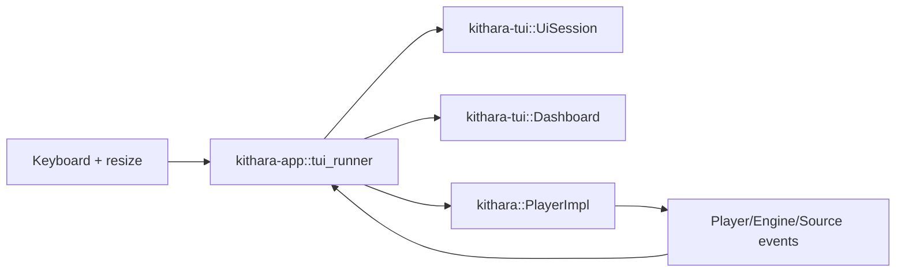

<div align="center">
  
</div>

<div align="center">

[](https://github.com/zvuk/kithara/actions/workflows/ci.yml)
[](../../LICENSE-MIT)

</div>

# kithara-tui

Workspace TUI crate (`publish = false`) for terminal playback control and diagnostics.

## Responsibilities

- Terminal session lifecycle (`UiSession`) with raw mode + inline viewport
- Dashboard rendering (`Dashboard`) with queue/progress/volume/crossfade status
- Tracing initialization adapted for raw-mode terminals (`init_tracing`)

## Run

```bash
cargo run -p kithara-app --bin kithara-tui -- <TRACK_URL_1> <TRACK_URL_2>
```

## Control flow



## Integration

Used by `kithara-app` in TUI mode. This crate is intentionally UI-only: playback state, seek, volume, and track switching are delegated to `kithara` player APIs.
