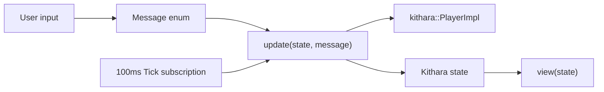

<div align="center">
  
</div>

<div align="center">

[](https://github.com/zvuk/kithara/actions/workflows/ci.yml)
[](../../LICENSE-MIT)

</div>

# kithara-ui

Workspace GUI crate (`publish = false`) implementing the desktop player UI with `iced`.

## Responsibilities

- GUI state model (`state.rs`) and message protocol (`message.rs`)
- Elm-style update loop (`update.rs`)
- Declarative widget tree and styling (`view.rs`, `theme.rs`, `icons.rs`)
- Playlist controls + seek/volume/EQ/crossfade UI over shared `PlayerImpl`

## Run

```bash
cargo run -p kithara-app --bin kithara-gui -- <TRACK_URL_1> <TRACK_URL_2>
```

## Data flow



## Integration

- Consumed by `kithara-app` GUI binary.
- Uses `kithara` (file/hls playback) and `iced`.
- Shares playback behavior with TUI/WASM because control operations are delegated to `PlayerImpl`.
