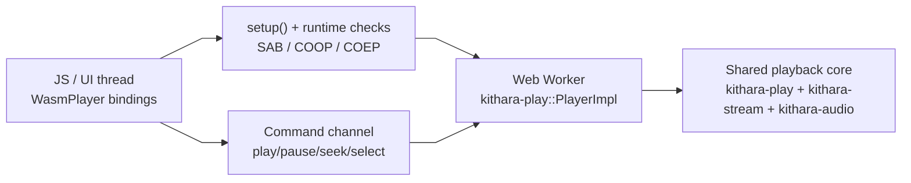

<div align="center">
  
</div>

<div align="center">

[](../../LICENSE-MIT)

</div>

# kithara-wasm

Workspace-only (`publish = false`) wasm-bindgen bindings and demo player for browser playback on top of the shared `kithara-play` engine.

## Usage

The crate exports a singleton player (a Rust `static Player` + `wasm_bindgen` shim generated by `kithara-wasm-macros`). JS interacts with it either through free functions named `player_<method>` or through the generated `Player` JS class that wraps them.

```js
import init, { setup, player_new, player_play, player_pause, player_seek, player_select_track }
    from "kithara-wasm";

await init();
setup();
await player_new();                            // resolves once the audio worker is ready
await player_select_track("https://example.com/track.mp3");
player_play();
```

Each `#[export] fn name(...)` on the internal `impl Player` becomes a `#[wasm_bindgen] pub fn player_name(...)` free function. The full set is:

- Lifecycle: `setup`, `player_new`, `build_info`
- Transport: `player_play`, `player_pause`, `player_stop`, `player_seek(position_ms)`, `player_select_track(url)`, `player_tick`, `player_warm_up_audio`
- Inspection: `player_is_playing`, `player_get_position_ms`, `player_get_duration_ms`, `player_process_count`, `player_take_events`
- Crossfade / volume: `player_get_crossfade_seconds`, `player_set_crossfade_seconds`, `player_get_volume`, `player_set_volume`
- EQ: `player_eq_band_count`, `player_eq_gain(band)`, `player_set_eq_gain(band, gain_db)`, `player_reset_eq`
- Session: `player_get_session_ducking`, `player_set_session_ducking(mode)`

`wasm-bindgen` also synthesises a `Player` JS class whose methods (`play()`, `pause()`, `seek(position_ms)`, …) delegate to the free functions above. There is no `add_track` / playlist concept at this layer — the JS host owns the queue and calls `player_select_track(url)` per track.

## Architecture

`kithara-wasm` is the **browser/wasm platform shim**. All wasm32-only sources live under `src/wasm/{bindings,commands,js,player,worker}.rs` behind a single `#[cfg(target_arch = "wasm32")] mod wasm;` gate in `lib.rs`. The `arch.no-target-os-outside-platform` ast-grep rule is configured to skip this shim entry point because it is exactly the kind of "thin platform shim with a `mod` cfg gate" the rule itself authorises. All deeper modules under `src/wasm/` are unconditional (they only ever compile on wasm32) and need no further gates.



## Features

This crate has no Cargo features. Runtime behaviour is controlled entirely by the target (`wasm32-unknown-unknown`) and the `kithara-play` features it pulls in (`backend-web-audio`, `wasm-bindgen`).

## Browser requirements

The player uses shared-memory threading and requires:

- secure context (`https:` or localhost)
- `SharedArrayBuffer`
- `crossOriginIsolated === true`

For production hosting, configure:

- `Cross-Origin-Opener-Policy: same-origin`
- `Cross-Origin-Embedder-Policy: require-corp`
- for Netlify/Cloudflare Pages, `_headers` file is included in this crate root

`Trunk.toml` already sets these headers for `trunk serve`.

For `gh-pages`, response headers are not reliably configurable for this case. Use one of:

- host the demo behind a proxy/CDN that injects COOP/COEP
- use `coi-serviceworker` fallback for demo-only scenarios (already wired in `index.html`)

This crate ships `coi-serviceworker.js` and includes:

```html
<script src="./coi-serviceworker.js"></script>
```

`index.html` loads wasm via a relative path (`./kithara-wasm.js`), so it works under `https://<user>.github.io/<repo>/`.

At runtime, the demo checks these requirements and prints a clear error in the event log if isolation is missing.

## Integration

`kithara-wasm` enables `kithara-play` with `backend-web-audio` and `wasm-bindgen` features, so browser and desktop flows use the same playback pipeline, queueing logic, crossfade, and EQ behavior.

## Testing

WASM tests run in headless Chrome via `wasm-bindgen-test`. The custom `wasm_test_runner` binary auto-starts the fixture server before delegating to `wasm-bindgen-test-runner`.

```bash
# Recommended entrypoint (handles everything)
just wasm test

# Manual run (fixture server starts automatically)
cargo +nightly test --target wasm32-unknown-unknown -p kithara-integration-tests
```

Test categories running on `cargo +nightly test --target wasm32-unknown-unknown`:

- **`kithara_hls/`** — HLS integration tests marked `browser` (50+ tests via fixture server)
- **`kithara_hls/abr_integration`** — pure ABR logic tests marked `wasm`

`tests/tests/kithara_wasm/stress.rs` currently holds ignored regression specs:
`Audio::new` stalls in the `wasm-bindgen-test` headless runner during bootstrap.
`tests/tests/kithara_file/live_stress_real_mp3.rs` is also ignored on `wasm32`
for the same bootstrap limitation.

Exported player scenarios that rely on the real `kithara-wasm.js` shim run in
the ignored Selenium suite under [`tests/tests/kithara_wasm/selenium.rs`](../../tests/tests/kithara_wasm/selenium.rs).

The fixture server provides dynamic HLS/ABR session management via HTTP API. On native, tests use in-process axum servers; on WASM, the same test code sends config to the external fixture server and gets back a `base_url`.

## Build

```bash
bash crates/kithara-wasm/build-wasm.sh
```

## WASM Size Budget (CI)

`kithara-wasm` has `wasm-slim` budget configuration in `crates/kithara-wasm/.wasm-slim.toml`.

Run the same check as CI:

```bash
just wasm size-check
```

This check runs with nightly toolchain (`WASM_SLIM_TOOLCHAIN=nightly`) because `kithara-wasm` uses shared-memory wasm target features (`build-std` + atomics).
