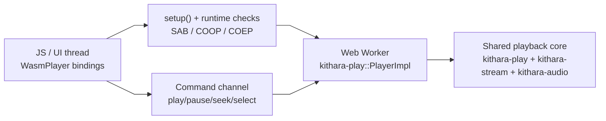

<div align="center">
  
</div>

<div align="center">

[](https://github.com/zvuk/kithara/actions/workflows/ci.yml)
[](../../LICENSE-MIT)

</div>

# kithara-wasm

Workspace-only (`publish = false`) wasm-bindgen bindings and demo player for browser playback on top of the shared `kithara-play` engine.

## Usage

```js
import init, { setup, WasmPlayer } from "kithara-wasm";

await init();
setup();

const player = new WasmPlayer();
const index = player.add_track("https://example.com/track.mp3");
await player.select_track(index); // starts playback with crossfade
```

## Key API surface

- `WasmPlayer::add_track(url)`
- `WasmPlayer::select_track(index)`
- `WasmPlayer::play()`, `pause()`, `stop()`, `seek(ms)`
- `WasmPlayer::get_position_ms()`, `get_duration_ms()`
- `WasmPlayer::set_eq_gain(band, db)`, `reset_eq()`
- `setup()`
- `build_info()`

## Architecture



## Features

<table>
<tr><th>Feature</th><th>Default</th><th>Enables</th></tr>
<tr><td><code>default</code></td><td>yes</td><td>No extra flags; runtime behavior comes from target + dependencies</td></tr>
<tr><td><code>internal</code></td><td>no</td><td>Internal-only exports for workspace testing/debug</td></tr>
</table>

## Browser requirements

The player uses shared-memory threading and requires:

- secure context (`https:` or localhost)
- `SharedArrayBuffer`
- `crossOriginIsolated === true`

For production hosting, configure:

- `Cross-Origin-Opener-Policy: same-origin`
- `Cross-Origin-Embedder-Policy: require-corp`
- for Netlify/Cloudflare Pages, `_headers` file is included in this crate root

`Trunk.toml` already sets these headers for `trunk serve`.

For `gh-pages`, response headers are not reliably configurable for this case. Use one of:

- host the demo behind a proxy/CDN that injects COOP/COEP
- use `coi-serviceworker` fallback for demo-only scenarios (already wired in `index.html`)

This crate ships `coi-serviceworker.js` and includes:

```html
<script src="./coi-serviceworker.js"></script>
```

`index.html` loads wasm via a relative path (`./kithara-wasm.js`), so it works under `https://<user>.github.io/<repo>/`.

At runtime, the demo checks these requirements and prints a clear error in the event log if isolation is missing.

## Integration

`kithara-wasm` enables `kithara-play` with `backend-web-audio` and `wasm-bindgen` features, so browser and desktop flows use the same playback pipeline, queueing logic, crossfade, and EQ behavior.

## Testing

WASM tests run in headless Chrome via `wasm-bindgen-test`. The custom `wasm_test_runner` binary auto-starts the fixture server before delegating to `wasm-bindgen-test-runner`.

```bash
# Recommended entrypoint (handles everything)
bash scripts/ci/wasm-test.sh

# Manual run (fixture server starts automatically)
cargo +nightly test --target wasm32-unknown-unknown -p kithara-integration-tests
```

Test categories running on WASM:

- **`kithara_wasm/`** — WASM player unit tests (AudioWorklet, threading)
- **`kithara_hls/`** — HLS integration tests marked `browser` (50+ tests via fixture server)
- **`kithara_file/`** — live stream stress tests marked `browser`
- **`kithara_hls/abr_integration`** — pure ABR logic tests marked `wasm`

The fixture server provides dynamic HLS/ABR session management via HTTP API. On native, tests use in-process axum servers; on WASM, the same test code sends config to the external fixture server and gets back a `base_url`.

## Build

```bash
bash crates/kithara-wasm/build-wasm.sh
```

## WASM Size Budget (CI)

`kithara-wasm` has `wasm-slim` budget configuration in `crates/kithara-wasm/.wasm-slim.toml`.

Run the same check as CI:

```bash
bash scripts/ci/wasm-slim-check.sh
```

This check runs with nightly toolchain (`WASM_SLIM_TOOLCHAIN=nightly`) because `kithara-wasm` uses shared-memory wasm target features (`build-std` + atomics).
