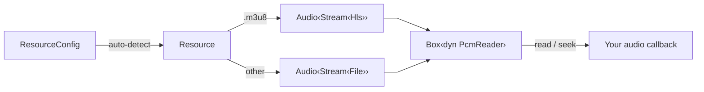

# kithara — Architecture

Architecture, contracts, and invariants for the kithara facade crate; the README is the overview.

## Architecture

PCM flows straight from the decoder to your callback through `read()`. The
optional `EventBus` (`resource.event_bus()`) is a side-channel for
observability — decode progress, buffering, HLS variant switches — and never
sits in the audio path.

## Features

<table>
<tr><th>Feature</th><th>Default</th><th>Enables</th></tr>
<tr><td><code>file</code></td><td>yes</td><td>Progressive pipeline (<code>kithara-file</code>, <code>kithara-assets</code>, <code>kithara-net</code>)</td></tr>
<tr><td><code>hls</code></td><td>yes</td><td>HLS pipeline (<code>kithara-hls</code>, <code>kithara-abr</code>, <code>kithara-assets</code>, <code>kithara-net</code>, <code>kithara-drm</code>)</td></tr>
<tr><td><code>symphonia</code></td><td>yes</td><td>Symphonia software decoder (<code>kithara-audio/symphonia</code>, <code>kithara-decode/symphonia</code>) plus queue decode forwarding when <code>queue</code> is enabled</td></tr>
<tr><td><code>fdk-aac</code></td><td>no</td><td>FDK-AAC decoder override across decode/audio and queue when <code>queue</code> is enabled</td></tr>
<tr><td><code>apple</code></td><td>no</td><td>Apple AudioToolbox hardware decoder (<code>kithara-audio/apple</code>, <code>kithara-decode/apple</code>, <code>kithara-play/apple</code>) plus queue forwarding when <code>queue</code> is enabled</td></tr>
<tr><td><code>android</code></td><td>no</td><td>Android <code>MediaCodec</code> hardware decoder (<code>kithara-audio/android</code>, <code>kithara-decode/android</code>)</td></tr>
<tr><td><code>client-reqwest</code> / <code>client-wreq</code></td><td>reqwest yes</td><td>HTTP backend selection forwarded to all public facade crates that can reach the network</td></tr>
<tr><td><code>tls-rustls</code> / <code>tls-native</code></td><td>rustls yes</td><td>TLS backend selection forwarded to all public facade crates that can reach the network</td></tr>
<tr><td><code>assets</code></td><td>no</td><td>Asset/storage modules (<code>kithara-assets</code>, <code>kithara-storage</code>)</td></tr>
<tr><td><code>net</code></td><td>no</td><td>Network module (<code>kithara-net</code>)</td></tr>
<tr><td><code>bufpool</code></td><td>no</td><td>Aggregator flag used by <code>full</code>; the <code>kithara::bufpool</code> module is always re-exported</td></tr>
<tr><td><code>queue</code></td><td>no</td><td>Queue module (<code>kithara-queue</code>) exposed as <code>kithara::queue</code></td></tr>
<tr><td><code>backend-cpal</code></td><td>no</td><td>Native CPAL backend forwarded to play and queue when <code>queue</code> is enabled</td></tr>
<tr><td><code>backend-web-audio</code></td><td>no</td><td>Wasm WebAudio backend forwarded to play and queue when <code>queue</code> is enabled</td></tr>
<tr><td><code>flash</code></td><td>no</td><td>Virtual-time test/platform mode forwarded to <code>kithara-platform</code> and test macro utilities</td></tr>
<tr><td><code>tokio-net</code></td><td>no</td><td>Tokio networking helpers forwarded to <code>kithara-platform</code></td></tr>
<tr><td><code>tokio-rt-multi-thread</code></td><td>no</td><td>Tokio multi-thread runtime builder support forwarded to <code>kithara-platform</code>; used by tests that opt into <code>#[kithara::test(..., multi_thread)]</code></td></tr>
<tr><td><code>full</code></td><td>no</td><td>Shortcut for <code>file + hls + assets + net + bufpool</code></td></tr>
<tr><td><code>probe</code></td><td>no</td><td>USDT probes forwarded across all public facade crates that expose probes</td></tr>
<tr><td><code>mock</code></td><td>no</td><td><code>unimock</code>-generated mocks forwarded across all public facade crates that expose mocks</td></tr>
<tr><td><code>perf</code></td><td>no</td><td>Hotpath instrumentation across sub-crates</td></tr>
</table>

## Key Types

<table>
<tr><th>Type</th><th>Role</th></tr>
<tr><td><code>Resource</code></td><td>Type-erased <code>Box&lt;dyn PcmReader&gt;</code> — the single entry point for PCM reads</td></tr>
<tr><td><code>ResourceConfig</code></td><td>Builder for source, network, ABR, decoder backend, and cache options</td></tr>
<tr><td><code>ResourceSrc</code></td><td>Source: <code>Url(Url)</code> or <code>Path(PathBuf)</code></td></tr>
<tr><td><code>SourceType</code></td><td>Auto-detection result: <code>HlsStream(Url)</code>, <code>RemoteFile(Url)</code>, or <code>LocalFile(PathBuf)</code></td></tr>
<tr><td><code>ReadOutcome</code></td><td>Result of a read: <code>Frames { count, position }</code>, <code>Pending { reason, position }</code>, or <code>Eof { position }</code></td></tr>
<tr><td><code>EventBus</code></td><td>Broadcast publisher for the unified <code>Event</code> stream (observability only)</td></tr>
</table>

## Re-exports

Each engine layer is re-exported as a module: `kithara::audio`, `kithara::bufpool`,
`kithara::decode`, `kithara::events`, `kithara::platform`, `kithara::play`,
`kithara::stream`. The `file`/`hls`/`assets`/`net`/`storage`/`queue` modules are
feature-gated. For advanced control — multi-slot engine, crossfade, EQ — reach
into `kithara::play` (`Engine`, `Player`, `CrossfadeConfig`, `Equalizer`). Test
macros are re-exported as `kithara::test`, `kithara::fixture`, `kithara::flash`,
and `kithara::mock`; the facade `flash` macro emits `kithara::platform::flash`
paths so integration tests do not need a direct `kithara-platform` dependency.
The `prelude` collects the everyday types.

## Integration

Most consumers depend on `kithara` with default features and call
`Resource::new(ResourceConfig::new(url)?).await?`. For wasm or embedded builds,
disable defaults and pick a minimal feature set (e.g. `file` + `symphonia`).
