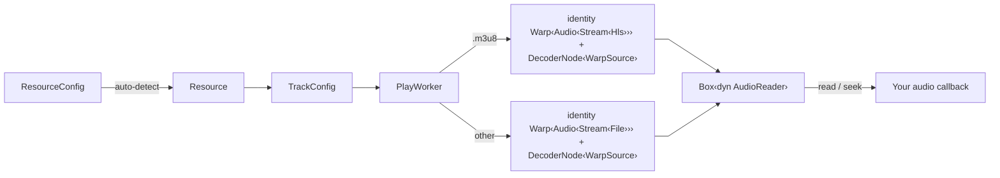

# kithara — Architecture

Architecture, contracts, and invariants for the kithara facade crate; the README is the overview.

## Architecture

```mermaid
%%{init: {"flowchart": {"curve": "linear"}} }%%
flowchart LR
    RC[ResourceConfig] -->|auto-detect| R[Resource]
    R --> TC[TrackConfig]
    TC --> PW[PlayWorker]
    PW -->|".m3u8"| AH["identity Warp‹Audio‹Stream‹Hls››› + DecoderNode‹WarpSource›"]
    PW -->|other| AF["identity Warp‹Audio‹Stream‹File››› + DecoderNode‹WarpSource›"]
    AH --> PR["Box‹dyn AudioReader›"]
    AF --> PR
    PR -->|"read / seek"| APP[Your audio callback]
```

`kithara-signal` owns decoded-audio values and checked layout/time conversion;
`kithara-audio` prepares the decoded source, while `kithara-analysis` owns the
progressive source-analysis pass and its artifacts.
`kithara-play` owns the Player/deck, `PlayWorker` scheduler, per-track node,
ordinary post-Warp effects, and final output admission before `read()` reaches
the callback. It composes the resident `Warp<S>` and synchronous
`kithara-warp::WarpRenderer`; `kithara-warp` owns the Warp protocol and
time-stretch stage, while `kithara-stretch` supplies its backend engines. R7
does not yet drive `WarpMap` progress or presentation acknowledgement. The
optional `EventBus` (`resource.event_bus()`) is a side-channel for observability — decode
progress, buffering, HLS variant switches — and never sits in the audio path.

## Features

Every normal dependency of the facade is optional. With
`--no-default-features`, `kithara` is an empty facade; consumers enable the
modules they import and the backend features those modules need. `default`
preserves the desktop facade, while `all` selects every facade domain with one
compatible native software stack.

<table>

<tr><th>Feature</th><th>Default</th><th>Enables</th></tr>

<tr><td><code>file</code></td><td>yes</td><td>Progressive pipeline (<code>kithara-file</code>, <code>kithara-assets</code>, <code>kithara-net</code>)</td></tr>

<tr><td><code>hls</code></td><td>yes</td><td>HLS pipeline (<code>kithara-hls</code>, <code>kithara-abr</code>, <code>kithara-assets</code>, <code>kithara-net</code>, <code>kithara-drm</code>)</td></tr>

<tr><td><code>audio</code> / <code>bufpool</code> / <code>decode</code> / <code>events</code> / <code>host</code> / <code>platform</code> / <code>play</code> / <code>resampler</code> / <code>signal</code> / <code>stream</code> / <code>test-utils</code> / <code>warp</code></td><td>yes</td><td>Enables the matching facade module or support crate; <code>signal</code> also enables process signals in <code>kithara-platform</code></td></tr>

<tr><td><code>abr</code> / <code>drm</code> / <code>storage</code> / <code>stretch</code></td><td>via composite features</td><td>Enables the matching facade module independently; <code>hls</code>, <code>assets</code>, and stretch backend features select them as needed</td></tr>

<tr><td><code>symphonia</code></td><td>yes</td><td>Symphonia software decoder (<code>kithara-audio/symphonia</code>, <code>kithara-decode/symphonia</code>) plus queue decode forwarding when <code>queue</code> is enabled</td></tr>

<tr><td><code>fdk-aac</code></td><td>no</td><td>FDK-AAC decoder override across decode/audio and queue when <code>queue</code> is enabled</td></tr>

<tr><td><code>resample-rubato</code></td><td>yes</td><td>Default fixed-ratio Rubato backend for playback decode adapters and beat analysis in default builds</td></tr>

<tr><td><code>resample-glide</code></td><td>no</td><td>Glide resampler backend for explicit playback/decode config selection without Rubato</td></tr>

<tr><td><code>analysis-beat</code></td><td>yes</td><td>Beat-analysis pass in <code>kithara-analysis</code>; the mono resampler backend comes from <code>BeatAnalysisConfig</code>. Apple FFI device sets omit this feature.</td></tr>

<tr><td><code>analysis-waveform</code></td><td>yes</td><td>RealFFT waveform analyzer in <code>kithara-analysis</code>; waveform/blob types remain unconditional</td></tr>

<tr><td><code>analysis</code></td><td>via analyzer defaults</td><td>Analysis module without selecting an analyzer backend</td></tr>

<tr><td><code>stretch-signalsmith</code></td><td>yes</td><td>Feature forwarded by <code>kithara-play</code> to the <code>kithara-warp</code> renderer; the Signalsmith engine lives in <code>kithara-stretch</code></td></tr>

<tr><td><code>stretch-bungee</code></td><td>no</td><td>Feature forwarded by <code>kithara-play</code> to the <code>kithara-warp</code> renderer; the Bungee engine lives in <code>kithara-stretch</code></td></tr>

<tr><td><code>beat-nn</code></td><td>no</td><td>NN beat/downbeat detector through <code>kithara-analysis</code> / <code>kithara-beat</code></td></tr>

<tr><td><code>apple</code></td><td>no</td><td>Apple AudioToolbox hardware decoder (<code>kithara-audio/apple</code>, <code>kithara-decode/apple</code>, <code>kithara-play/apple</code>) plus queue forwarding when <code>queue</code> is enabled; does not imply Rubato</td></tr>

<tr><td><code>apple-fused-src</code></td><td>no</td><td>Apple AudioToolbox fused decode+SRC through decoder-embedded resampler placement</td></tr>

<tr><td><code>apple-net</code></td><td>no</td><td>Apple HTTP backend forwarding (<code>kithara-net?/client-apple</code>, <code>kithara-stream/client-apple</code>)</td></tr>

<tr><td><code>android</code></td><td>no</td><td>Android <code>MediaCodec</code> hardware decoder (<code>kithara-audio/android</code>, <code>kithara-decode/android</code>) plus <code>kithara-net?/client-wreq</code></td></tr>

<tr><td><code>client-reqwest</code> / <code>client-wreq</code></td><td>reqwest yes</td><td>HTTP backend selection forwarded to all public facade crates that can reach the network</td></tr>

<tr><td><code>tls-rustls</code> / <code>tls-native</code></td><td>rustls yes</td><td>TLS backend selection forwarded to all public facade crates that can reach the network</td></tr>

<tr><td><code>assets</code></td><td>no</td><td>Asset/storage modules (<code>kithara-assets</code>, <code>kithara-storage</code>)</td></tr>

<tr><td><code>net</code></td><td>no</td><td>Network module (<code>kithara-net</code>)</td></tr>

<tr><td><code>queue</code></td><td>no</td><td>Queue module (<code>kithara-queue</code>) exposed as <code>kithara::queue</code></td></tr>

<tr><td><code>encode</code> / <code>ffmpeg</code></td><td>no</td><td>Encoding API exposed as <code>kithara::encode</code>; FFmpeg remains opt-in</td></tr>

<tr><td><code>ui</code> / <code>ui-iced</code> / <code>ui-masonry</code> / <code>ui-capture</code></td><td>no</td><td>UI document and renderer APIs exposed as <code>kithara::ui</code></td></tr>

<tr><td><code>worker</code></td><td>no</td><td>Prioritized worker API exposed as <code>kithara::worker</code></td></tr>

<tr><td><code>backend-cpal</code></td><td>no</td><td>Native CPAL backend forwarded to play and queue when <code>queue</code> is enabled</td></tr>

<tr><td><code>flash</code></td><td>no</td><td>Virtual-time test/platform mode forwarded to <code>kithara-platform</code> and test macro utilities</td></tr>

<tr><td><code>tokio-net</code></td><td>no</td><td>Tokio networking helpers forwarded to <code>kithara-platform</code></td></tr>

<tr><td><code>tokio-rt-multi-thread</code></td><td>no</td><td>Tokio multi-thread runtime builder support forwarded to <code>kithara-platform</code>; used by tests that opt into <code>#[kithara::test(..., multi_thread)]</code></td></tr>

<tr><td><code>full</code></td><td>no</td><td>The former always-present core plus <code>file + hls + offline + record</code>, including with <code>--no-default-features</code></td></tr>

<tr><td><code>all</code></td><td>no</td><td>Every facade domain with CPAL, Symphonia, FDK-AAC, Rubato, Signalsmith, reqwest, and rustls; mutually exclusive alternative backends stay off</td></tr>

<tr><td><code>probe</code></td><td>no</td><td>USDT probes forwarded across all public facade crates that expose probes</td></tr>

<tr><td><code>mock</code></td><td>no</td><td><code>unimock</code>-generated mocks forwarded across all public facade crates that expose mocks</td></tr>

<tr><td><code>perf</code></td><td>no</td><td>Hotpath instrumentation across sub-crates</td></tr>

</table>

## Key Types

<table>

<tr><th>Type</th><th>Role</th></tr>

<tr><td><code>Resource</code></td><td>Type-erased <code>Box&lt;dyn AudioReader&gt;</code> — the single entry point for PCM reads</td></tr>

<tr><td><code>ResourceConfig</code></td><td>Builder for source, network, ABR, decoder backend, and cache options</td></tr>

<tr><td><code>ResourceSrc</code></td><td>Source: <code>Url(Url)</code> or <code>Path(PathBuf)</code></td></tr>

<tr><td><code>SourceType</code></td><td>Auto-detection result: <code>HlsStream(Url)</code>, <code>RemoteFile(Url)</code>, or <code>LocalFile(PathBuf)</code></td></tr>

<tr><td><code>ReadOutcome</code></td><td>Result of a read: <code>Frames { count, position }</code>, <code>Pending { reason, position }</code>, or <code>Eof { position }</code></td></tr>

<tr><td><code>EventBus</code></td><td>Broadcast publisher for the unified <code>Event</code> stream (observability only)</td></tr>

<tr><td><code>PlayWorker</code></td><td>Owner of the shared playback worker and registered per-track producer chains</td></tr>

<tr><td><code>EngineLoadSnapshot</code></td><td>Copyable view of the play-owned producer-chain cost meter</td></tr>

</table>

## Re-exports

Every re-exported crate module is gated by its same-named feature. Composite
features keep their existing convenience: `file` also selects `assets` and
`net`; `hls` selects `abr`, `assets`, `drm`, and `net`; `assets` selects
`storage`; stretch backend features select `stretch`. For
advanced control — multi-slot engine, crossfade, EQ — reach into
`kithara::play` (`Engine`, `Player`, `CrossfadeConfig`, `Equalizer`). The
speed-control type `StretchControls` is re-exported even when no stretch backend
is compiled; the flat `StretchKind` re-export and
`kithara::warp::WarpRenderer` are gated on a native stretch backend.
`mock` and `no_block` macros are gated by `test-utils`; `test`, `fixture`, and
`flash` are gated by `probe`. The facade `flash` macro emits `kithara::platform::flash`
paths so integration tests do not need a direct `kithara-platform` dependency.
The `prelude` collects the everyday types.

## Integration

Most consumers depend on `kithara` with default features. Narrow consumers
disable defaults, enable each facade module they import, and add one compatible
HTTP, TLS, decoder, resampler, and stretch stack where their selected domains
need them.
