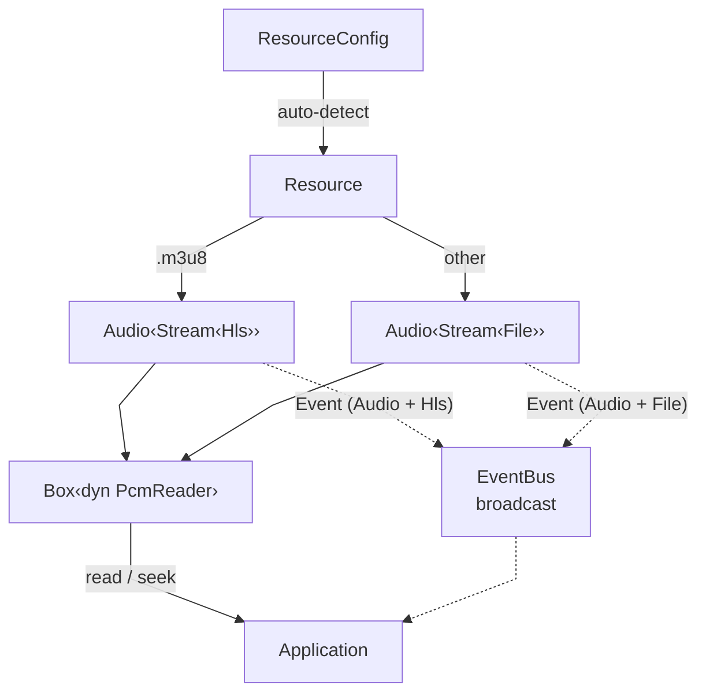

<div align="center">
  
</div>

<div align="center">

[](https://crates.io/crates/kithara)
[](https://crates.io/crates/kithara)
[](https://docs.rs/kithara)
[](../../LICENSE-MIT)

</div>

# kithara

Facade crate for the kithara audio engine. Auto-detects source type from URL (`.m3u8` = HLS, everything else = progressive file) and exposes a type-erased `Resource` with a simple `read()`/`seek()` interface. Re-exports all sub-crates as modules for convenient access to the full stack.

## Usage

```rust
use kithara::prelude::*;

// Auto-detect from URL
let config = ResourceConfig::new("https://example.com/song.mp3")?;
let mut resource = Resource::new(config).await?;

let spec = resource.spec();
let mut buf = [0.0f32; 1024];
while !resource.is_eof() {
    let n = resource.read(&mut buf);
    play(&buf[..n]);
}
```

## Architecture



`Resource` wraps `Box<dyn PcmReader>` with a shared `EventBus` for all events (audio, stream, HLS).

## Features

<table>
<tr><th>Feature</th><th>Enables</th></tr>
<tr><td><code>file</code></td><td>Progressive file download (<code>kithara-file</code>)</td></tr>
<tr><td><code>hls</code></td><td>HLS streaming + ABR (<code>kithara-hls</code>, <code>kithara-abr</code>)</td></tr>
<tr><td><code>rodio</code></td><td><code>rodio::Source</code> adapter for direct playback</td></tr>
<tr><td><code>assets</code></td><td>Re-export <code>kithara-assets</code></td></tr>
<tr><td><code>net</code></td><td>Re-export <code>kithara-net</code></td></tr>
<tr><td><code>bufpool</code></td><td>Re-export <code>kithara-bufpool</code></td></tr>
</table>

## Key Types

<table>
<tr><th>Type</th><th>Role</th></tr>
<tr><td><code>Resource</code></td><td>Type-erased wrapper over <code>Box&lt;dyn PcmReader&gt;</code> — single entry point for PCM reading</td></tr>
<tr><td><code>ResourceConfig</code></td><td>Builder holding URL/path, network, ABR, and cache options</td></tr>
<tr><td><code>ResourceSrc</code></td><td>Source enum: <code>Url(Url)</code> or <code>Path(PathBuf)</code></td></tr>
<tr><td><code>SourceType</code></td><td>Auto-detection result: <code>RemoteFile</code>, <code>LocalFile</code>, or <code>HlsStream</code></td></tr>
<tr><td><code>Event</code></td><td>Unified event enum: <code>Audio(AudioEvent)</code>, <code>File(FileEvent)</code>, <code>Hls(HlsEvent)</code></td></tr>
<tr><td><code>EventBus</code></td><td>Clonable event publisher — publish any event type, subscribe for unified <code>Event</code> stream</td></tr>
</table>

## Re-exports

The crate re-exports all sub-crates as public modules (`kithara::audio`, `kithara::decode`, `kithara::stream`, `kithara::file`, `kithara::hls`, `kithara::abr`, `kithara::net`, etc.) and provides a `prelude` module with the most commonly used types.

## Integration

Re-exports all sub-crates as modules. The `prelude` module aggregates the most common types: `Resource`, `ResourceConfig`, `Audio`, `AudioConfig`, `Stream`, `PcmReader`, etc.
