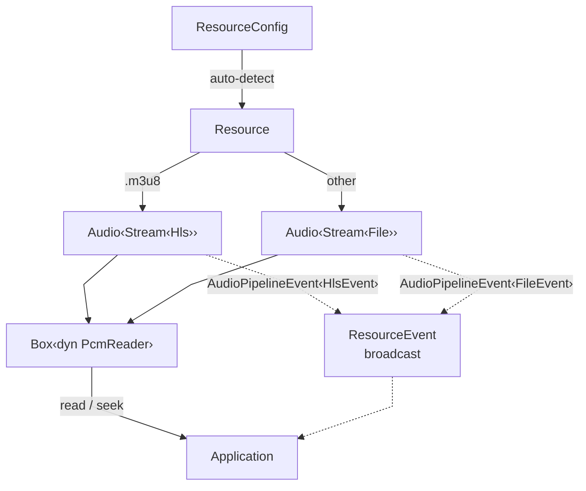

<div align="center">
  
</div>

# kithara

Facade crate providing a unified API for audio streaming, decoding, and playback. Auto-detects source type from URL (`.m3u8` = HLS, everything else = progressive file) and exposes a type-erased `Resource` with a simple `read()`/`seek()` interface.

## Usage

```rust
use kithara::prelude::*;

// Auto-detect from URL
let config = ResourceConfig::new("https://example.com/song.mp3")?;
let mut resource = Resource::new(config).await?;

let spec = resource.spec();
let mut buf = [0.0f32; 1024];
while !resource.is_eof() {
    let n = resource.read(&mut buf);
    play(&buf[..n]);
}
```

## Architecture



`Resource` wraps `Box<dyn PcmReader>` and spawns tokio tasks to forward typed `AudioPipelineEvent<E>` into unified `ResourceEvent` broadcast channel.

## Features

| Feature | Enables |
|---------|---------|
| `file` | Progressive file download (`kithara-file`) |
| `hls` | HLS streaming + ABR (`kithara-hls`, `kithara-abr`) |
| `rodio` | `rodio::Source` adapter for direct playback |
| `assets` | Re-export `kithara-assets` |
| `net` | Re-export `kithara-net` |
| `bufpool` | Re-export `kithara-bufpool` |

## Key Types

| Type | Role |
|------|------|
| `Resource` | Type-erased wrapper over `Box<dyn PcmReader>` — single entry point for PCM reading |
| `ResourceConfig` | Builder holding URL/path, network, ABR, and cache options |
| `ResourceSrc` | Source enum: `Url(Url)` or `Path(PathBuf)` |
| `SourceType` | Auto-detection result: `RemoteFile`, `LocalFile`, or `HlsStream` |
| `ResourceEvent` | Unified event enum aggregating all upstream events |

## Re-exports

The crate re-exports all sub-crates as public modules (`kithara::audio`, `kithara::decode`, `kithara::stream`, `kithara::file`, `kithara::hls`, `kithara::abr`, `kithara::net`, etc.) and provides a `prelude` module with the most commonly used types.

## Integration

Re-exports all sub-crates as modules. The `prelude` module aggregates the most common types: `Resource`, `ResourceConfig`, `Audio`, `AudioConfig`, `Stream`, `PcmReader`, etc.
